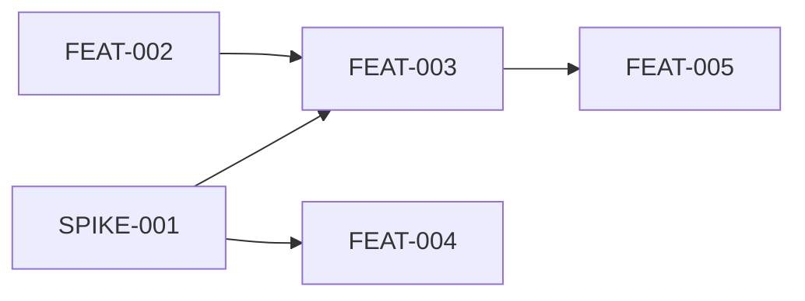

# Implementation Planning Skill — Project Plan

**Issue:** #16 (reframed from "release planning" to "implementation planning")
**Goal:** A skill that takes a product goal and a context library, has a planning
conversation with the user (resolving decisions inline, proposing success outcomes,
tiering scope), and produces dependency-ordered tickets and outcomes as markdown
files plus a release summary doc.

---

## Reframing from LifeBuild

The LifeBuild release planning skill (Conan Job 10) is deeply product-specific: Three Ladders,
arc structures, LifeBuild maturity levels. The methodology is valuable but the framing needs
to change:

| LifeBuild concept | Generalized concept |
|-------------------|---------------------|
| Three Ladders (strategic bets with maturity levels) | Goal-driven: user states what they want to build |
| Factory stations (Decide/Patch/Shape/Make) | Decisions resolved inline; card updates automatic; tickets are just tickets |
| Release (version boundary) | Implementation plan (a set of tickets toward a goal) |
| George (factory foreman) | Out of scope — separate factory integration |
| Propagation Maps | Dependency graph (DAG) in ticket frontmatter |
| Builder Experience Checkpoint | Acceptance criteria on individual tickets |

---

## Core Concept

The context library describes what the product IS today. The user describes what they WANT.
The **gap** between these two IS the implementation plan. Every ticket traces back to a
context library card — either a card that needs to change or a card that's missing.

The implementation planner doesn't read cards directly. It asks **Conan** to assemble a
context briefing for the goal area, then reasons about the gap from that briefing.

**Decisions are made during the planning conversation, not deferred as tickets.** The skill
is a planning partner — it surfaces ambiguity, asks the user, and resolves decisions inline.
If a decision is too big to resolve in conversation, it becomes an **enabler** (a spike or
prototype ticket that must complete before dependent work can proceed).

**Card updates happen automatically after the plan is approved.** During planning, the skill
tracks which cards need updating (new knowledge surfaced, decisions made, scope clarified).
Once the user approves the plan, card updates execute as a side effect — not as tickets.

---

## Key Concepts

### Success Outcomes

Success outcomes are the intermediate layer between the user's goal and tickets. Each
outcome is an observable product change that, together with other outcomes, constitutes
achieving the goal.

Outcomes are **first-class objects** with their own markdown files:

```yaml
---
id: O-1
title: Tenants are fully isolated at the data layer
tier: must
cards: [System Design, Product Entities]
---

## Validation Criteria
- [ ] Query as Tenant A returns zero Tenant B data
- [ ] Row-level security policies pass audit review

## Why This Matters
[Motivation — what user need or strategic goal this serves]
```

Every ticket traces to at least one outcome. The DAG tool detects orphans — tickets
without outcomes and outcomes without tickets.

### Scope Tiers (Must / Should / Could)

Every outcome gets a tier:
- **Must** — without these outcomes, the goal is not meaningfully achieved
- **Should** — significantly improves the result but could be deferred
- **Could** — rounds out the vision, first to cut when squeezed

Tickets **inherit** their tier from their outcome by default. The skill can suggest
overrides: "This ticket serves a Must outcome but is a polish pass — mark as Should?"

The gap analysis produces the tiers. Required gaps → Must. Presumptive gaps the user
promotes → Should/Could. Presumptive gaps the user agrees to defer → documented in
the release doc's Deferred section (not ticketed).

### Tickets and Enablers

There are no special ticket types. There are just **tickets** — each representing a piece
of shippable value or necessary enabling work.

**Feature tickets** — user-visible work, vertically sliced. Each delivers something a
user or operator can observe.

**Enabler tickets** — work that enables feature tickets but isn't directly user-visible:
- **Technical Spike** — investigate a technical question before committing to an approach.
  Has a time-box. Output is a decision/recommendation, not code.
- **Prototype** — explore a design/product question by building something throwaway.
  Output is knowledge (updated cards) and possibly refined tickets.

Before creating an enabler, apply the **"imagine the refactoring" gut-check**: "If we skip
this and just build with approach A, how expensive would it be to refactor to approach B
later?" If cheap — skip the enabler, ship the feature, refactor if needed. If expensive —
the enabler is justified.

### Planning Principles

**Vertical slicing** — each ticket delivers the smallest user-visible piece of shippable
value. Prefer "users can set a display name" (touches DB + API + UI) over "build the user
profile database layer" (horizontal slice, no user value).

**End-to-end first** — get the thinnest path working across all layers before deepening
any single layer. This is a strong default, not an absolute rule. When the skill builds
the dependency graph, it should naturally sequence tickets so that a thin end-to-end path
ships first, then subsequent tickets deepen each layer.

**Roller-skate staging** — when a feature is large or risky, the skill proposes: "Can we
deliver the value with a simpler implementation first?" Each stage delivers full user
value — it's the implementation sophistication that increases. This is a conversational
decomposition strategy, not a formal ticket type. Stage 1 ships and provides value even
if Stage 2 never happens.

---

## The Skill

### Name and location

`skills/implementation-planning/SKILL.md`

Not bound to any specific agent (Conan, Sam, etc.) since agents are being reworked. The
skill references Conan for context briefings and may reference Bob (future codebase
assessment agent) for technical context.

### Input

The user describes a goal:
- "I want to add multi-tenant support"
- "We need to implement the payment system"
- "Break down the Q2 dashboard redesign into tickets"

### Process

When a step has a finite set of valid responses, the skill should use Claude Code's
multi-choice question UI (`AskUserQuestion`, or the host-equivalent choice UI) rather
than relying on free-form replies. Only fall back to plain text when the host cannot
render choices or when the user chooses a revision path that requires custom input.

#### Step 1: Understand the Goal

Have a conversation with the user to understand:
- **What** they want to exist that doesn't exist yet
- **Why** (strategic context, user need, deadline)
- **Scope boundaries** (what's explicitly out of scope)
- **Constraints** (tech stack, timeline, dependencies on other work)

Check for prior plans with unresolved deferred items (from `/complete-plan`). Surface
them: "Your previous plan deferred X and Y. Should this plan pick them up?"

Don't assume — ask. This is a planning conversation, not a ticket generator.

#### Step 2: Context Gathering (via Bridget / Conan)

Request a **context briefing** for the goal area. The briefing (assembled by Bridget
using the context-briefing skill) provides the planner's understanding of "what exists
today." One briefing per release, covering the full scope of the goal.

The briefing provides:

- **Primary cards** (full content) — the systems, entities, capabilities, and rooms
  the goal directly touches. Includes all 5 dimensions (WHAT/WHERE/WHY/WHEN/HOW).
- **Supporting cards** (summaries) — related principles, decisions, standards, and
  anti-patterns. One-line insights relevant to the goal.
- **Relationship map** — typed edges showing how affected areas connect (depends-on,
  implements, constrained-by, invokes, etc.)
- **Gap manifest** — what the library *doesn't know* that the goal needs. Dimensions
  where cards are missing or incomplete. This is critical input to Step 4.
- **Anti-patterns** — extracted from card HOW sections. Constraints the plan must
  respect.
- **Persona/user cards** — when available, for guiding vertical slicing.

Present the key findings to the user: "Here's what I understand about the current state.
Is this accurate? Anything missing?"

During later steps (ticket decomposition), the planner may make **targeted follow-up
queries** to the library when encountering specific uncertainty — following the 5-Signal
Decision Matrix pattern. The initial briefing covers the broad context; follow-ups
drill into specifics.

**Future: codebase context.** When Bob the Builder agent exists, the skill will also
request a codebase assessment for the goal area (health, tech debt, test coverage).
Until then, the skill can ask the user directly about known codebase concerns.

#### Step 3: Propose Success Outcomes

Based on the goal and context briefing, the skill proposes 3-5 success outcomes —
observable, validatable statements about what will be true when the goal is achieved.

> "Based on your goal and the current product state, here are the outcomes I'd propose:
>
> - O-1 (Must): Tenants are fully isolated at the data layer
> - O-2 (Must): Users can switch tenants without re-authenticating
> - O-3 (Should): New tenants can self-service onboard
> - O-4 (Could): Admin dashboard for tenant management
>
> Confirm using multi-choice options:
> - Accept outcomes as proposed
> - Re-tier outcomes
> - Add, remove, or rewrite outcomes
>
> If the user chooses a revision path, follow up in free-form, then re-confirm."

The user confirms, edits, or re-tiers. Outcomes are locked before ticket decomposition
begins.

#### Step 4: Gap Analysis & Decision Resolution

Compare the goal (desired state) against the context briefing (current state).

Start with the **gap manifest** from the context briefing — it already identifies
dimensions where cards are missing or incomplete. Then go further:
- What cards describe things that need to change? (WHEN sections that will become stale)
- What knowledge is missing entirely? (gap manifest + new concepts the goal introduces)
- What existing cards will need updating? (decisions made, scope clarified)
- What anti-patterns from the briefing constrain our approach?

Classify each gap:
- **Required for an outcome** → will become Must/Should/Could tickets (inherits tier)
- **Presumptive** ("while we're in there...") → proposed as Should/Could or deferred

Present presumptive gaps to the user: "I also noticed [X] is related but not strictly
required. Include as Should/Could, or defer?"

**Surface decisions as they arise.** When the planner encounters ambiguity or a fork
in approach, present it to the user immediately:

> "To implement multi-tenant support, we need to decide on isolation strategy."
>
> Present a multi-choice question with:
> - Schema-per-tenant — stronger isolation, more ops complexity
> - Row-level security — simpler ops, requires careful query discipline
> - Defer to enabler
> - Already resolved by existing context

Each decision has three possible dispositions:

1. **Decide now** → make it, record it in the decisions table, track any resulting
   card updates (new anti-patterns, decision records, WHEN updates). Move on.

2. **Defer to an enabler** → the decision is too big to make during planning. Reasons:
   - Technical uncertainty that needs investigation (→ spike enabler)
   - Deep product/design question that needs exploration (→ prototype enabler)
   - Right stakeholders aren't available for this decision
   - Decision depends on learning from earlier implementation work

   Create an enabler ticket. Dependent tickets are blocked until the enabler
   completes and the decision is made. The `/revise-plan` skill handles this:
   after enablers complete, it reviews findings, documents the decision, and
   adjusts remaining tickets.

3. **Not actually a decision** → what looked like ambiguity is resolved by the
   context briefing (an existing decision card already covers it, or a principle
   constrains the choice). Record why and move on.

For disposition 2, apply the "imagine the refactoring" gut-check: "If we skip this
investigation and just build with approach A, how expensive would it be to change
later?" If cheap → lean toward deciding now. If expensive → the enabler is justified.

**Surface risks and assumptions.** Alongside decisions, note:
- Risks: "This third-party API may not handle our rate requirements"
- Assumptions: "We're assuming users will have SSO configured"
- External dependencies: "Waiting on design team's mockups"

These go to the Risks and Assumptions table in the release doc, linked to affected tickets.

**Track card updates as a running list.** Throughout the planning conversation, decisions
produce knowledge that belongs in the library — new cards, updated WHEN sections,
decision records, anti-patterns. Track these as a running list but don't apply them
yet. They accumulate during Steps 3-6 and get presented as a batch in Step 8:

- New entity cards (e.g., Tenant entity discovered during planning)
- Decision records (e.g., chose RLS over schema-per-tenant)
- Anti-pattern cards (e.g., "never query without tenant scope guard")
- WHEN section updates on existing cards (e.g., Workflow Engine now has multi-tenant planned)
- Gap manifest items resolved (knowledge the library was missing, now documented)

#### Step 5: Ticket Decomposition

Break the gap into tickets following the planning principles (vertical slicing,
end-to-end first, roller-skate staging, INVEST criteria).

Each ticket traces to an outcome. Tickets inherit scope tier from their outcome but
can be overridden: "This ticket serves a Must outcome but is polish — mark as Should?"

Each ticket gets a **context summary** drawn from the briefing — enough for the
implementer to understand the landscape without re-deriving it:
- Specific card references relevant to this ticket (by name, pointing to files)
- Key insights from those cards (not pasted content — the specific thing that matters)
- Anti-patterns that apply to this ticket's scope
- Pointer to the full briefing in release.md for deeper context

Reference relevant personas when available. Use personas to guide vertical slicing —
you slice along user journeys.

When decomposing, make **targeted follow-up queries** to the library if specific
uncertainty arises (following the 5-Signal Decision Matrix). The initial briefing
covers the broad context; follow-ups drill into specifics for individual tickets.

For each proposed enabler, apply the "imagine the refactoring" gut-check with the user.

#### Step 6: Dependency Graph

Structure tickets as a DAG:
- Enablers block the feature tickets that depend on their findings
- Feature tickets form dependency chains based on technical ordering
- Sequence for end-to-end first (thin path across all layers before deepening)
- Identify which tickets can proceed in parallel

Phases are **computed from the DAG** (topological layers) and expressed only in the
release doc — not in individual ticket frontmatter, to avoid stale data. Tickets
only know their local edges (`blocked-by`, `blocks`).

Plant **re-planning triggers** for the `/revise-plan` skill: every enabler
completion is a trigger, plus any user-specified events.

#### Step 7: Write Output

Write to the user's specified directory (default: `docs/implementation-plans/<plan-name>/`).

**Directory structure:**

```
docs/implementation-plans/<plan-name>/
  release.md              # summary (assembled from outcomes + tickets)
  outcomes/
    O-1.md
    O-2.md
    O-3.md
  tickets/
    SPIKE-001.md
    FEAT-002.md
    FEAT-003.md
    ...
```

**Release doc** (`release.md`) — the human-consumable summary. Point-in-time snapshot
that will become stale. Tickets and outcomes are the source of truth.

```markdown
# [Plan Name]: [Goal]

## Goal
[What we're building and why — 2-3 sentences]

## Scope
**In scope:** [what's included]
**Out of scope:** [what's explicitly excluded and why]

## Success Outcomes

| ID | Outcome | Tier | Tickets |
|----|---------|------|---------|
| O-1 | Tenants fully isolated at data layer | Must | SPIKE-001, FEAT-002, FEAT-003 |
| O-2 | Users can switch tenants without re-auth | Must | FEAT-004 |
| O-3 | New tenants can self-service onboard | Should | FEAT-005, FEAT-006 |

## Context Summary (from Bridget's context briefing)
**Primary cards:** [list with relevance notes]
**Key relationships:** [typed edges between affected systems]
**Gap manifest:** [what the library doesn't know that this goal needs]
**Anti-patterns:** [constraints from card HOW sections]

## Decisions Made During Planning
| Decision | Options Considered | Chosen | Rationale |
|----------|-------------------|--------|-----------|
| Tenant isolation | Schema-per-tenant, row-level security | Row-level | Simpler ops; re-evaluate at 1000+ tenants |

## Risks and Assumptions
| Type | Description | Mitigation | Tickets Affected |
|------|-------------|-----------|-----------------|
| Risk | API rate limit unknown | SPIKE-001 includes rate testing | FEAT-003, FEAT-004 |
| Assumption | Users have SSO configured | Confirm before Phase 2 | FEAT-005 |

## Execution Phases

Phase 1 (can start immediately):
- SPIKE-001: Evaluate tenant isolation strategies
- FEAT-002: Add tenant model to database schema

Phase 2 (after Phase 1):
- FEAT-003: Implement tenant context middleware
- FEAT-004: Add tenant switcher UI

Phase 3 (after Phase 2):
- FEAT-005: Migrate existing data

Critical path: SPIKE-001 → FEAT-003 → FEAT-005



## Re-planning Triggers
Re-evaluate this plan after:
- SPIKE-001 completes (findings may reshape FEAT-003, FEAT-004)
- O-1 is validated (confirms approach works at scale)

## Ticket Index

| ID | Title | Enabler | Tier | Outcome | Blocked By | Blocks |
|----|-------|---------|------|---------|------------|--------|
| SPIKE-001 | Evaluate isolation | spike | Must | O-1 | — | 003, 004 |
| FEAT-002 | Add tenant model | — | Must | O-1 | — | 003 |
| FEAT-003 | Tenant middleware | — | Must | O-1 | 001, 002 | 005 |
| FEAT-004 | Tenant switcher UI | — | Must | O-2 | 001 | — |
| FEAT-005 | Migrate data | — | Should | O-3 | 003 | — |

## Alexandria Updates (pending approval)
- Update: System Design (add tenant isolation section)
- Update: Product Entities (add Tenant entity)
- Create: Decision - Tenant Isolation Strategy
- Create: Anti-Pattern - Cross-tenant query without scope

## Deferred
[Populated by /complete-plan after execution. Lists Should/Could items
that didn't ship, for future plans to pick up.]
```

**Outcome files** (`outcomes/<id>.md`): see Success Outcomes section above.

**Ticket files** (`tickets/<id>.md`): in the user's chosen format (see Ticket Format).

#### Step 8: Document Library Updates

**Planning and the library are discrete systems.** The planner produces plans; the
library manages itself through its own agents (Conan reviews, Sam writes). The
planner does NOT write to the context library directly.

Write the card updates accumulated during Steps 3-7 to
`docs/implementation-plans/<plan-name>/library-updates.md`:

```markdown
# Library Updates from [Plan Name]

Ask Conan to review this list and produce a transient surgery plan for Sam in the conversation, not as a checked-in file.

| Action | Card | What Changed | Source |
|--------|------|-------------|--------|
| Create | Artifact - Decision: Tenant Isolation | Chose RLS | Step 4 |
| Create | Product Entities - Tenant | New entity | Step 4 gap |
| Update | System - Workflow Engine (WHEN) | Multi-tenant planned | Step 5 |
| Create | Artifact - Anti-Pattern: Cross-tenant query | Constraint | Step 4 |
```

Tell the user:

> "This plan implies N library updates. I've written them to library-updates.md.
> To apply: ask Conan to review the list and produce a transient surgery plan for Sam in the conversation, not as a checked-in file."

This separation ensures that library updates go through Conan's quality review and
Sam's card-writing expertise, rather than being mechanically applied by the planner.
`library-updates.md` is the durable artifact; Conan's downstream surgery handoff is
transient and should not be checked in as `surgery-plan.md`.
Decisions become Decision cards (Artifact type). New concepts become entity/system
cards. Anti-patterns become Anti-Pattern cards. WHEN sections get updated. But the
planner only *documents* what should change — the library agents *execute* it.

#### Step 9: Present Summary

```
Implementation plan: [goal]
[O] outcomes | [N] tickets ([E] enablers, [F] features)
Written to docs/implementation-plans/[plan-name]/

Must: [outcomes]
Should: [outcomes]
Could: [outcomes]

Critical path: [ticket] → [ticket] → [ticket]
[C] context library cards updated

See release.md for full phasing, risks, and dependency graph.

Next steps:
  1. Review release.md and tickets
  2. Use /gh-issue-writer to push to GitHub (optional)
  3. Start with Phase 1 tickets
```

---

## Ticket Format

### Default fields (always present)

Every ticket has YAML frontmatter and a markdown body. Tickets own their local
dependency edges. Phasing is computed from the DAG and lives only in the release doc.

```yaml
---
id: <plan-name>-<NNN>
title: <ticket title>
outcome: <outcome-id>      # which success outcome this serves
tier: must | should | could # inherited from outcome, can override
enabler: false              # or "spike" or "prototype"
blocked-by: []              # list of ticket ids this depends on
blocks: []                  # list of ticket ids that depend on this
cards: []                   # context library cards this ticket traces to
---
```

### Format options

The skill asks the user which format to use (or reads from config):

**Minimal** — title, description, acceptance criteria
```markdown
## Description
[What to build and why]

## Acceptance Criteria
- [ ] [criterion]
- [ ] [criterion]
```

**Standard** — adds motivation, context, and implementation notes
```markdown
## Motivation
[Why this ticket exists — the gap it fills, the user need it serves]

## Description
[What to build]

## Context
[Relevant context from the library — cards, patterns, constraints, personas.
Points to files rather than pasting content. Includes relevant risks from
the Risks and Assumptions table with mitigation notes.]

## Acceptance Criteria
- [ ] [criterion]

## Implementation Notes
[Suggested approach, files likely touched, patterns to follow]
```

**BDD** — adds Gherkin scenarios as acceptance criteria
```markdown
## Motivation
[Why this ticket exists]

## Description
[What to build]

## Context
[Relevant context from the library]

## Acceptance Criteria

\```gherkin
Scenario: [name]
  Given [precondition]
  When [action]
  Then [expected outcome]
\```

## Implementation Notes
[Suggested approach]
```

**Custom** — user provides a template file at a configured path. The skill fills in
sections using `{{placeholders}}`:
- `{{frontmatter}}` — YAML frontmatter block
- `{{motivation}}` — why this ticket exists
- `{{description}}` — what to build
- `{{context}}` — relevant library context
- `{{acceptance_criteria}}` — criteria (checklist or Gherkin depending on format)
- `{{implementation_notes}}` — suggested approach
- `{{dependencies}}` — what this blocks/is blocked by

### Configuration (persisted in context library settings)

Ticket format preference is saved to `docs/alexandria/wizard-config.json` in the
target project — the same file the wizard already writes.

```json
{
  "implementation_planning": {
    "ticket_format": "standard",
    "custom_template": null,
    "output_dir": "docs/implementation-plans"
  }
}
```

**First run:** If no `implementation_planning` config exists, the skill uses a
multi-choice question to offer `Minimal`, `Standard`, `BDD`, or `Custom`, saves the
choice, and proceeds. If the user chooses `Custom`, it asks a free-form follow-up
for the template path.

**Subsequent runs:** The skill reads the saved format and confirms it with a
multi-choice question: `Keep saved format`, `Switch to Minimal`, `Switch to Standard`,
`Switch to BDD`, or `Switch to Custom`.

---

## DAG Computation (Software, Not LLM)

Dependency graph computation and verification is deterministic work — it must be done
by software, not by an LLM. A CLI tool handles this:

### `bin/alxndr dag`

A shell/Python script that takes a plan directory and produces structured DAG output.

**Input:** Path to a plan directory containing outcome and ticket markdown files with
YAML frontmatter.

**Operations:**
1. **Parse** — read all `*.md` files in `outcomes/` and `tickets/`, extract frontmatter
2. **Validate consistency** — if ticket A lists B in `blocks`, verify B lists A in
   `blocked-by` (and vice versa). Report mismatches.
3. **Detect orphans** — tickets without an outcome, outcomes without tickets
4. **Detect cycles** — topological sort; if a cycle exists, report the cycle path
5. **Compute phases** — topological layers: Phase 1 = tickets with no unresolved blockers,
   Phase 2 = tickets blocked only by Phase 1 tickets, etc.
6. **Compute critical path** — longest path through the DAG (by ticket count)

**Output modes:**
- `--format text` (default) — human-readable phases and critical path, suitable for
  pasting into the release doc's Execution Phases section
- `--format json` — machine-readable DAG with phases, critical path, validation results
- `--format mermaid` — Mermaid diagram for embedding in the release doc
- `--validate` — exit 0 if valid, exit 1 with error details if cycles or inconsistencies

**Usage by the skill:**
The implementation planning skill calls `alxndr dag` after writing ticket files,
uses the text output to populate the release doc's Execution Phases section and the
mermaid output for the visual graph. If validation fails (cycle, inconsistency, orphan),
the skill fixes the tickets before finalizing.

**Usage by adapters:**
`/gh-issue-writer` and similar adapters call `alxndr dag --format json` to get
the structured DAG for creating issues in the right order.

**Usage by humans:**
Users can run `bin/alxndr dag docs/implementation-plans/<plan-name>/` after
manually editing tickets to re-compute phases and validate consistency.

### Tests

`tests/test-dag.sh` — unit tests for the DAG tool:
- Valid DAG → correct phases and critical path
- Cycle detection → reports the cycle
- Inconsistent edges → reports mismatches (A blocks B but B doesn't list A)
- Orphan detection → tickets without outcomes, outcomes without tickets
- Single ticket (no dependencies) → Phase 1, trivial critical path
- Linear chain → N phases, critical path = entire chain
- Diamond dependency → correct phase computation
- Disconnected subgraphs → each subgraph phased independently
- Mermaid output → valid mermaid syntax

---

## Composability: Related Skills

### Core (this release)

**`/implementation-planning`** — create the plan (this skill)

### Companion Skills

**`/revise-plan`** — mid-flight review when re-planning triggers fire. Reads the
release doc's triggers, checks enabler status, identifies tickets needing revision,
updates affected tickets and the release doc.

**`/complete-plan`** — close out a plan after execution. Captures: what shipped, what
didn't (→ Deferred section), decisions made during execution, retrospective learnings.
Future plans scan prior Deferred sections. Implemented as a follow-up skill after the
core planning release.

### Future (separate issues)

**`/suggest-release`** — reads the context library and roadmap cards, identifies
opportunities for implementation plans. Outputs suggestions, not tickets.

**`/gh-issue-writer`** — takes markdown ticket files and creates GitHub issues. Handles
parent issue creation, sub-issue linking, label application.

**`/linear-issue-writer`** — same pattern for Linear.

### Future Agents

**Bob the Builder** — codebase assessment agent. Provides technical context (code health,
test coverage, tech debt) to the planning skill. Also executes technical spikes that
require codebase investigation. Separate from Conan (product knowledge) and Sam (card
authoring).

### Future Planning Modes

The skill currently supports goal-driven planning. Future modes:
- **Bet/hypothesis-driven** — plan frames outcomes as testable hypotheses
- **Roadmap-driven** — break down a roadmap item into tickets
- **Gap-driven** — wizard gap analysis identifies knowledge areas that need work

---

## Relationship to Alexandria

The implementation planner is deeply integrated with the context library:

**Reads from the library (via Conan context briefings):**
- Product entities, systems, and their current state
- Settled decisions and known constraints
- Anti-patterns to avoid
- Journey maps and interaction patterns
- Roadmap context
- Persona / user type cards (when available)

**Writes to the library (automatic, after plan approval):**
- Decision records for decisions made during planning
- Updated cards reflecting new knowledge from planning
- New cards for concepts/systems introduced by the plan
- Anti-pattern cards for approaches explicitly rejected

**The feedback loop:**
```
Goal → Context briefing → Outcomes → Gap → Tickets + Card updates → Better briefings next time
```

Each implementation plan makes the library more complete, which makes the next plan better.

---

## What This Does NOT Include

- **Factory integration** — no George, no Symphony wiring, no automated execution
- **Maturity ladders** — no Three Ladders, no product-specific strategic bets
- **Arc narrative** — no thematic grouping of releases
- **Propagation Maps** — simplified to dependency DAG
- **Tracker integration** — markdown only; GitHub/Linear adapters are separate skills
- **Capacity/estimation** — no velocity tracking, story points, or team sizing
  (deferred until team context integration exists)
- **Execution methodology** — no sprint planning, flow management, or iteration cadence
  (the skill produces plans, not project management)

---

## QA Plan (uses eval harness from Release 1)

This release assumes the eval harness from Release 1 (Eval Infrastructure + Wizard Evals)
exists. All evaluation uses the same harness: multi-turn transcript recording, structural
checks, LLM-as-Judge.

### Adaptive Eval: LLM-as-User (ticket 15)

The implementation planning skill is fundamentally interactive — it proposes outcomes,
surfaces decisions, applies gut-checks, and the user's responses shape the plan. Unlike
the wizard (predictable questions in a fixed order), the planning conversation is dynamic.

Pre-scripted turns are too brittle. The eval harness needs **LLM-as-user** support:
a second Claude instance plays the user role, given a persona with a goal and decision
preferences. Turn 1 is pre-scripted (the goal statement). Subsequent turns: the runner
sends the skill's response to the "user" LLM, which generates a contextual reply.

Each eval case defines a `persona.md` alongside `inputs.md`. The persona constrains
behavior enough for structural checks to be consistent while allowing natural dialogue.
See ticket IMPL-015 for full design.

### Eval Cases

Uses context library fixtures produced by Release 1's wizard eval runs, seeded with
sample cards to simulate partially-built libraries.

**Case A: "Add real-time collaboration" against TaskFlow fixture (Factory × High × High)**
- Tests: full 22-area library, complex goal, multiple outcomes, enablers needed

**Case B: "Add user authentication" against empty fixture (No/Low AI × Low × Low)**
- Tests: minimal library, graceful degradation, working with little context

**Case C: "Redesign the dashboard" against MediConnect fixture (Pair Programmer × High × Mod)**
- Tests: realistic middle, persona-guided slicing, regulatory constraints, risk identification

### Structural Checks (deterministic)

Run by the eval harness + `bin/alxndr dag`:
- Outcome files have valid YAML frontmatter
- Ticket files have valid frontmatter with outcome references
- DAG is valid (no cycles, consistent edges)
- No orphans (tickets ↔ outcomes)
- Release doc contains all required sections
- Mermaid diagram is valid syntax
- Card updates are tracked

### Quality Criteria (LLM-as-Judge)

1. Did the skill ask clarifying questions before decomposing?
2. Were success outcomes proposed and confirmed before tickets?
3. Are outcomes observable and validatable (not vague)?
4. Were scope tiers assigned at the outcome level?
5. Did the skill surface decisions and resolve them inline?
6. Was the "imagine the refactoring" gut-check applied to enablers?
7. Were risks and assumptions identified?
8. Are tickets vertically sliced (user-visible value each)?
9. Did the skill sequence end-to-end first?
10. Were roller-skate alternatives proposed for large features?
11. Do ticket context sections reference library cards + personas?
12. Is the release doc complete (all sections including mermaid graph)?
13. Were re-planning triggers planted for enablers?
14. Are card updates documented in library-updates.md for Conan/Sam?
15. Free of product-specific terminology (generalization rule)

### Edge Cases

- Goal with no relevant context library cards → should note gaps, still produce plan
- Goal that's entirely covered by existing cards → minimal tickets
- Goal requiring many enablers → enabler-heavy plan with clear dependency chains
- All outcomes are Must → no scope flexibility (skill should note this)
- Prior plan has deferred items → should surface them in Step 1

---

## Implementation Tickets

**Assumes Release 1 (eval infrastructure + wizard evals) is complete.**

| # | Title | Blocked By | Tier | Notes |
|---|-------|------------|------|-------|
| 1 | DAG tool: core (parse, validate, cycles, phases, critical path) | — | Must | Deterministic, testable independently |
| 2 | DAG tool: orphan detection (outcomes ↔ tickets) | 1 | Must | |
| 3 | DAG tool: mermaid output | 1 | Must | |
| 4 | DAG tool: test suite | 1, 2, 3 | Must | |
| 5 | Skill: Steps 1-3 (goal + context + propose outcomes) | — | Must | Conversational — hard to split further |
| 6 | Eval run: verify Steps 1-3 quality | 5 | Must | Uses Release 1 harness |
| 7 | Skill: Steps 4-6 (gap analysis + decomposition + DAG) | 4, 6 | Must | |
| 8 | Eval run: verify Steps 4-6 quality | 7 | Must | |
| 9 | Skill: Steps 7-9 (output + card updates + summary) | 8 | Must | |
| 10 | Eval run: full end-to-end across all 3 fixtures | 9 | Must | |
| 11 | Ticket format options + config persistence | 9 | Must | |
| 12 | Check in eval baselines | 10 | Must | |
| 13 | Create companion skill issues (/revise-plan, /complete-plan) | — | Should | |
| 14 | Update issue #16 title + description | — | Should | |
| 15 | Eval harness: LLM-as-user adaptive turn support | — | Must | Prerequisite for eval tickets 6, 8, 10 |

---

## Files to Create/Modify

- `bin/alxndr dag` — DAG computation and validation tool
- `tests/test-dag.sh` — DAG tool unit tests
- `skills/implementation-planning/SKILL.md` — the skill
- `tests/eval-cases/implementation-planning/` — eval case inputs
- `tests/evals/implementation-planning/` — eval run baselines
- Issue #16 — update title and description to reflect reframing

---

## Status

- [x] Plan written
- [x] Plan reviewed (dialogue with user, 24 recommendations triaged)
- [x] Research recommendations documented
- [x] Release 1 complete (eval infrastructure + wizard evals + multi-turn)
- [x] LLM-as-user eval support (ticket 15) — PR #50
- [x] DAG tool + tests (tickets 1-4) — PR #49
- [x] Skill Steps 1-3 + eval (tickets 5-6) — PR #51
- [x] Skill Steps 4-9 + evals (tickets 7-10) — PR #52
- [x] Format options + config (ticket 11)
- [x] Baselines checked in (ticket 12) — in PR #52
- [x] Companion skill issues (ticket 13) — #54, #55
- [x] Issue #16 updated (ticket 14)

---

## Release Completion

**Completed:** 2026-03-27
**Duration:** 2 days (planning + implementation across a single extended session)

### What Shipped

| Ticket | PR | Status |
|--------|----|--------|
| IMPL-000: Context library card updates | — | Deferred (agent rework) |
| IMPL-001-004: DAG tool + tests | #49 | Shipped |
| IMPL-015: LLM-as-user adaptive eval | #50 | Shipped |
| IMPL-005/006: Skill Steps 1-3 + eval | #51 | Shipped |
| IMPL-007-010: Skill Steps 4-9 + evals | #52 | Shipped |
| IMPL-011: Ticket format templates | #56 | Shipped |
| IMPL-012: Eval baselines | #52 | Shipped |
| IMPL-013: Companion skill issues | #56 | Shipped (#54, #55) |
| IMPL-014: Update issue #16 | #56 | Shipped |

### What Didn't Ship

| Item | Why | Follow-up |
|------|-----|-----------|
| IMPL-000: Context library card updates | Deferred to avoid conflict with agent rework | Separate task: ask Conan to update library |

### Eval Progression

| Stage | Judge | Key Observation |
|-------|-------|----------------|
| Steps 1-3 only | 9/12 binary | Great conversation quality but no formal output structure |
| Steps 4-6 added | 8 good/excellent, 4 adequate | Better structure but skill wrote code instead of tickets |
| Full skill (Steps 1-9) | 3 excellent, 5 good, 4 adequate | Formal outcomes + tickets produced. No weak or poor scores. |

**Best scores:** Conversation quality (excellent), Decision resolution (excellent),
Roller-skate staging (excellent)

**Growth areas:** Vertical slicing (adequate), Scope tier discipline (adequate),
Ticket sizing (adequate), Enabler discipline (adequate)

### What We Learned

1. **Conversation quality was excellent from the start.** Steps 1-3 nailed the dialogue.
   What improved with later steps was output *structure*, not *thinking quality*.

2. **The skill initially wrote code instead of tickets.** Adding "IMPORTANT: This skill
   produces PLANNING ARTIFACTS, not code" was necessary. LLMs default to implementing
   when they see a technical goal.

3. **Planning and library must be discrete.** The original plan had the skill writing
   directly to the library. User feedback corrected this: the planner documents updates
   in library-updates.md, and Conan/Sam process them through their own quality pipeline.

4. **Decision cards belong in Artifact type.** Decisions made during planning become
   `Artifact - Decision: [name]` cards, processed through Conan's surgery workflow.

5. **The DAG tool is the most testable piece.** 24 deterministic tests, zero flakiness.
   Pure software > LLM-evaluated output for reliability.

6. **Eval-per-ticket works.** Running evals after each skill increment caught issues
   early (code output, missing structure) and showed quality progression.

7. **LLM-as-user adaptive eval is essential for interactive skills.** Pre-scripted
   turns couldn't test the planning conversation meaningfully. The persona-based
   adaptive mode produced realistic back-and-forth.

8. **Categorical judge scoring is clearer than numerical.** "Excellent/good/adequate"
   with per-level descriptions produces more interpretable results than 1-5 scores.

9. **Branch management matters.** Accidentally committing to wrong branches caused
   merge conflicts. Worktrees help for parallel work.

### Retrospective

**Planned tickets:** 16 (IMPL-000 through IMPL-015)
**Shipped tickets:** 15
**Deferred:** 1 (IMPL-000, library card updates)
**PRs merged:** 7 (#49, #50, #51, #52, #56, #57, plus this one)
**Devin bugs caught:** ~15 across all PRs (all fixed before merge)
**Eval runs:** 3 (Steps 1-3, Steps 4-6, full end-to-end)

### Deferred

[To be populated by future `/complete-plan` runs or manual review]
