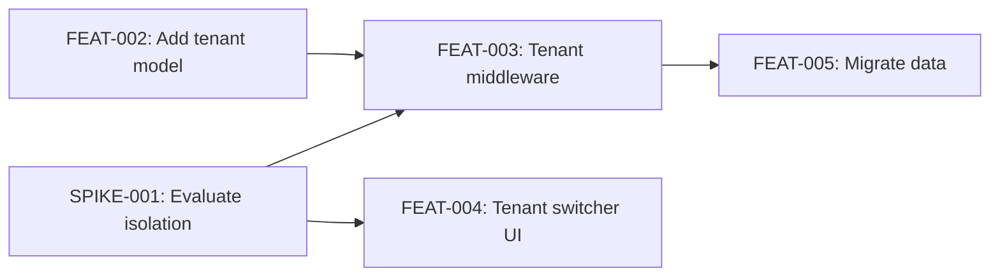

## Motivation

A visual dependency graph in the release doc makes the plan's structure immediately
scannable. Mermaid renders natively in GitHub markdown — no external tools needed.

## Description

Add `--format mermaid` output mode to `bin/alxndr dag`.

**Output example:**

**Formatting rules:**
- Node labels: `ID: short title` (truncated to ~40 chars if needed)
- Edge direction: `blocked-by` becomes a left-to-right arrow
- Enablers get a different node shape (e.g., `([SPIKE-001])` for rounded)
- Critical path edges could be styled bold (optional, nice-to-have)

**Usage by the skill:**
The implementation planning skill calls `alxndr dag --format mermaid` and
embeds the output directly in the release doc inside a mermaid code fence.

## Acceptance Criteria

- [ ] `--format mermaid` produces valid mermaid syntax
- [ ] All tickets appear as nodes with ID + title
- [ ] All dependency edges appear as arrows
- [ ] Enablers visually distinguished from feature tickets
- [ ] Output renders correctly in GitHub markdown preview
- [ ] Handles special characters in titles (quotes, colons) without breaking syntax
- [ ] Empty plan produces empty/minimal valid mermaid graph

## Implementation Notes

- Mermaid node IDs can't have special characters — use the ticket ID as the node ID
  and put the label in quotes
- Test by pasting output into a GitHub markdown file and verifying it renders
- Keep it simple — the graph is for orientation, not detailed project management
