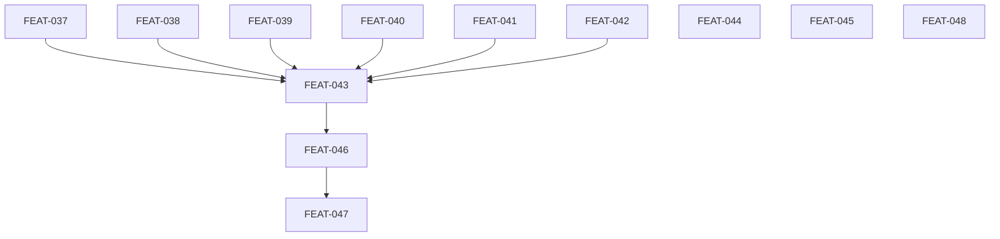

## Completion Status

All 12 planned tickets (FEAT-037 through FEAT-048) shipped via PRs #337–#348, merged 2026-04-10/11. All 6 outcomes met:

- **O-1 (must) — met.** All mechanical lint checks are deterministic CLI commands; play/agent references rewritten from Nit dispatch to `alxndr lint` — FEAT-043, FEAT-044.
- **O-2 (must) — met.** `alxndr lint` covers all six deterministic L6 cross-system checks (grade-evidence, briefings, doc counts, conformance, internal consistency, downstream sync) — FEAT-037 through FEAT-042.
- **O-3 (should) — met.** `/wizard` collapsed into `/library`; renamed to `initialize` as an internal sub-procedure triggered by missing `alexandria-config.json` — FEAT-045.
- **O-4 (should) — met.** Nit agent retired; agent file and skill directory deleted with no dispatch references remaining — FEAT-046.
- **O-5 (could) — met.** All five remaining agent files standardized to a canonical format — FEAT-047.
- **O-6 (could) — met.** Health Check and Quality Cycle unified as one play in the playbook — FEAT-048.

## Decisions Made During Execution

| Decision | What Changed | Why |
|----------|--------------|-----|
| Co-execute with nit-cli-hardening | FEAT-037 through FEAT-048 landed interleaved with nit-cli-hardening tickets across PRs #337–#348 | Both plans touched the same CLI surface, agent files, and playbook. Sequencing them serially would have forced a second doc-update pass and duplicated blast-radius work on Nit references |
| Rename `/wizard` → `initialize` | FEAT-045 renamed the surface in addition to collapsing it | Once `/wizard` became an internal sub-procedure of `/library`, "wizard" no longer named the user's intent — "initialize" describes what the sub-procedure does |
| Treat agent file standardization as a single slice | FEAT-047 shipped audit + proposal + application in one PR rather than three | Bridget had flagged this as underspecified; execution showed the five agents were similar enough that dividing the work added overhead without value |

## Retrospective

**Planned vs actual.** All 12 tickets shipped on the intended dependency order: L6 lint checks (FEAT-037–042) landed first, then Nit dispatch rewrites (FEAT-043), then Nit retirement (FEAT-046), then agent standardization (FEAT-047). The parallel lane (FEAT-044 terminology, FEAT-045 wizard, FEAT-048 play unification) landed alongside. No scope expansion; no deferrals.

**What we learned:**
- **Parallel plans that share a surface should be co-executed.** This plan and nit-cli-hardening both touched the CLI, agent files, and playbook. Interleaving PRs let one doc-update pass cover both. Future plans that share surface area should be identified up front and sequenced together.
- **Retiring a role wants a same-slice standardization pass.** Dropping from 6 agents to 5 made the remaining format drift across the surviving agents visible. Doing FEAT-047 (standardize the remaining 5) immediately after FEAT-046 (retire Nit) kept the surface coherent rather than leaving known drift.
- **"Collapse and rename" is cheaper than "collapse, then rename later."** FEAT-045 did both in one slice. Splitting them would have required two doc-update passes and left a window where the name didn't match the new behavior.

**What future plans should absorb:**
- When two plans have overlapping blast radius (same agents, same playbook, same CLI), plan their execution together — even if scoping them separately makes sense for clarity.
- A plan that removes an agent should budget for standardizing the survivors in the same slice.

## Deferred

Nothing deferred from this plan. All scoped tickets shipped. Architecture-review items explicitly scoped out up front (persisted quality state, source freshness tracking, incremental assessment, central event log, comprehensive data modeling, linting library evaluation) remain deferred to the forthcoming data architecture conversation.

# Architecture Review Hardening

## Goal

Harden Alexandria's infrastructure based on findings from the April 10, 2026 architecture review. Move mechanical checks from agentic to deterministic software, simplify the agent team, and clean up accumulated drift.

## Scope

**In scope:**
- Expanding `alxndr lint` CLI with 6 new L6 check families
- Updating all play/agent references from Nit dispatch to CLI calls
- Fixing terminology drift in `docs/design/alexandria.md`
- Collapsing `/wizard` into `/library` as a single entry point
- Retiring the Nit agent (absorbed into CLI)
- Standardizing agent file format
- Unifying Health Check and Quality Cycle documentation

**Out of scope:**
- Persisted quality state (grades.json, run log) — deferred to data architecture conversation
- Source freshness tracking — deferred to data architecture conversation
- Incremental assessment — deferred to data architecture conversation
- Central event log — deferred to data architecture conversation
- Comprehensive data modeling — deferred to data architecture conversation
- Linting library evaluation (whether existing libraries could replace hand-coded checks)

## Success Outcomes

| ID | Outcome | Tier | Tickets |
|----|---------|------|---------|
| O-1 | All mechanical lint checks are deterministic CLI commands called by agents during plays | Must | FEAT-043, FEAT-044 |
| O-2 | Lint CLI covers all deterministic L6 cross-system checks | Must | FEAT-037, FEAT-038, FEAT-039, FEAT-040, FEAT-041, FEAT-042 |
| O-3 | /library is the single user entry point with automatic first-time setup | Should | FEAT-045 |
| O-4 | Nit agent retired; all play references changed from agent dispatch to CLI calls | Should | FEAT-046 |
| O-5 | Agent files follow a consistent canonical format | Could | FEAT-047 |
| O-6 | Health Check and Quality Cycle documented as one unified play | Could | FEAT-048 |

## Context Summary

See [CONTEXT_BRIEFING.md](CONTEXT_BRIEFING.md) for the full briefing from Bridget.

Key findings: Nit appears in ~20 play steps across the playbook. All of Nit's work is deterministic and most is already implemented in `alxndr lint`. The remaining L6 checks (grade-evidence, briefing compliance, doc counts, conformance, internal consistency, downstream sync) are all countable/boolean and should be software. Once they are, Nit has no agentic job left.

Bridget flagged two concerns: (1) Nit retirement blast radius is larger than expected (~20 play references), and (2) agent file standardization is underspecified (audit → propose → apply is three steps).

## Decisions Made During Planning

| Decision | Options Considered | Chosen | Rationale |
|----------|-------------------|--------|-----------|
| Lint execution model | CI hooks, orchestrator triggers, agent CLI calls | Agent CLI calls | We don't control user's machine/CI. Agents are the orchestrator — they call CLI tools at play steps. |
| Nit retirement approach | Keep Nit, replace references, gradual deprecation | Replace all references with CLI calls, then delete | Once all checks are software, the agent adds only dispatch overhead and confusion. |
| Wizard collapse approach | Keep both, redirect, merge | `/wizard` becomes internal sub-procedure of `/library` | Detected by absence of alexandria-config.json. One door, not two. |

## Risks and Assumptions

| Type | Description | Mitigation | Tickets Affected |
|------|-------------|-----------|-----------------|
| Assumption | All L6 manual checks are truly deterministic | Review each check against rubrics before implementing | FEAT-037 through FEAT-042 |
| Risk | Nit references in plays may have nuances beyond find-and-replace | Map every reference and its context before changing | FEAT-043 |
| Risk | Removing /wizard may break existing user workflows or documentation | Grep for all /wizard references, update docs in same PR | FEAT-045 |
| Assumption | No external systems depend on Nit agent file existing | Check plugin registration and any CI that references agents/nit.md | FEAT-046 |

## Execution Phases

Phase 1 (parallelizable): FEAT-037, FEAT-038, FEAT-039, FEAT-040, FEAT-041, FEAT-042, FEAT-044, FEAT-045, FEAT-048
- All lint CLI additions + terminology fix + wizard collapse + play unification. Independent of each other. Can run in parallel.

Phase 2 (sequential, depends on Phase 1 lint tickets): FEAT-043
- Update all play/agent references from Nit to CLI. Requires FEAT-037–042 (lint checks) to exist first.

Phase 3 (depends on Phase 2): FEAT-046
- Retire Nit agent. Requires all Nit dispatch references replaced first.

Phase 4 (depends on Phase 3): FEAT-047
- Agent file standardization. Depends on Nit being retired (5 agents, not 6).

## Re-planning Triggers

- If any L6 check turns out to NOT be deterministic (requires LLM judgment), re-evaluate that ticket and potentially keep that check as agentic
- If Nit reference count is significantly higher than ~20, re-estimate FEAT-043
- If the data architecture conversation produces a grade persistence format, FEAT-037 may need revision to output compatible data

## Ticket Index

| ID | Title | Enabler | Tier | Outcome | Blocked By | Blocks |
|----|-------|---------|------|---------|------------|--------|
| FEAT-037 | Add grade-evidence reconciliation to lint L6 | false | must | O-2 | — | FEAT-043 |
| FEAT-038 | Add briefing compliance check to lint L6 | false | must | O-2 | — | FEAT-043 |
| FEAT-039 | Add design doc count verification to lint L6 | false | must | O-2 | — | FEAT-043 |
| FEAT-040 | Add conformance checking to lint | false | must | O-2 | — | FEAT-043 |
| FEAT-041 | Add internal consistency checks to lint L6 | false | must | O-2 | — | FEAT-043 |
| FEAT-042 | Add downstream sync deviation detection to lint | false | must | O-2 | — | FEAT-043 |
| FEAT-043 | Update all play/agent refs from Nit to CLI | false | must | O-1 | FEAT-037–042 | FEAT-046 |
| FEAT-044 | Fix terminology drift in alexandria.md | false | must | O-1 | — | — |
| FEAT-045 | Collapse /wizard into /library | false | should | O-3 | — | — |
| FEAT-046 | Retire Nit agent | false | should | O-4 | FEAT-043 | FEAT-047 |
| FEAT-047 | Standardize agent file format | false | could | O-5 | FEAT-046 | — |
| FEAT-048 | Unify Health Check + Quality Cycle play | false | could | O-6 | — | — |

## Library Updates

Applied. Seven of eight proposed Updates already landed via PR #398 (Capability - Linting, Capability - Health Check, Governance - Agent Capability Matrix, Artifact - Decision 5, Artifact - Play Definition, Artifact - Play Pattern, Agent - Solomon the Sorter). Remaining: Agent - Raven the Maven updated with sole-entry-point language and Decision card backlink; stale "wizard-mode capability" future-scope flag retired. One new Decision card created: `Artifact - Decision: Single Entry Point` with reciprocal backlinks to `Agent - Raven the Maven`, `Capability - Health Check`, `Artifact - Decision: alxndr Unified CLI`, `Artifact - Decision 9: Plays as Team Coordination`, and `Artifact - Decision 5: Four Agents, Not One`. The two other Creates originally proposed (Retire Nit Agent, Lint Execution Model) were dropped as not worth tracking.

## Deferred (from planning)

See `## Deferred` at the top of this file for the close-out summary.
