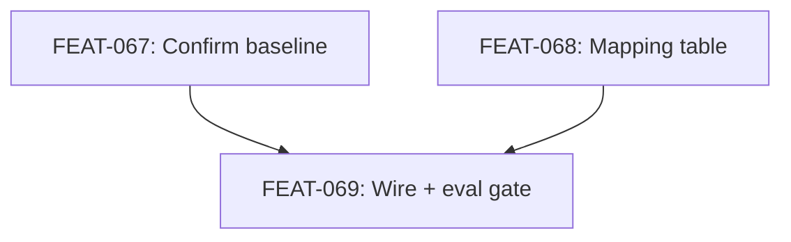

# Bridget CLI Traversal

## Goal

Wire Bridget's context-briefing skill to call `alxndr retrieve` for the mechanical graph-traversal step (step 6), keeping task framing, profile selection, and narrative assembly agentic. Validate via the existing `bridget/assembly` eval: scores must hold or improve.

## Scope

**In scope:**
- Updating `skills/context-briefing/protocol.md` step 6 to invoke `alxndr retrieve`.
- Adding an explicit task-modifier → CLI-flag mapping table in `task-modifiers.md`.
- Defining and documenting the agentic-discretion fallback rule for missing mandatory categories, with provenance logging.
- Updating `agents/bridget.md` to reflect the new procedure.
- Iterating against the Bridget eval until baseline is held or improved; checking in the new baseline.

**Out of scope:**
- Changing how task classification, profile selection, or seed identification work (these stay agentic).
- Adding new knobs to the `alxndr retrieve` CLI (deferred to a follow-on plan if eval reveals a gap).
- MCP-mediated assembly (the longer-term `System - Retrieval and Assembly Engine` target).
- Other agentic→deterministic migrations under the same program track (e.g., `alxndr scan` for session-start) — those are separate plans.

## Success Outcomes

| ID | Outcome | Tier |
|----|---------|------|
| O-1 | Bridget's mechanical traversal step is delegated to `alxndr retrieve`; layer boundary preserved | must |
| O-2 | `bridget/assembly` eval holds or improves vs baseline; criterion 7 does not regress | must |
| O-3 | Task-modifier → CLI-flag mapping is documented as an explicit table | should |
| O-4 | Profile-knob gaps surface as CLI config issues, not skill workarounds | could |

## Context Summary

See `CONTEXT_BRIEFING.md` for the full briefing. Key cards:

- `Principle - Agentic-Deterministic-Agentic Pattern` — the governing architectural rationale. Outer (framing), middle (CLI), inner (assembly) must remain identifiable.
- `Principle - Measure Before Promoting` — mandates baseline-then-change-then-compare; the eval gate is non-negotiable.
- `System - Eval Harness` — concrete mechanism. Bridget eval lives at `tests/evals/bridget/assembly/`; criterion 7 is the primary regression indicator.
- `Agent - Bridget the Briefer` + `Capability - Context Assembly` — the ten-step procedure; only step 6 migrates.
- `System - Retrieval and Assembly Engine` — current implementation file-based; this plan is an intermediate step on the path to MCP-mediated assembly.

Two referenced principle cards (`Principle - One Verb Per Agent Role`, `Principle - Factory Demand Drives Library Priority`) are wikilinked from Bridget's card but missing from the library — logged for Sam, not blocking this plan.

## Decisions

| Decision | Choice | Rationale |
|----------|--------|-----------|
| Fallback rule for missing mandatory categories | Agentic discretion + provenance log | Maximum quality preservation; explicit log keeps the layer boundary auditable. |
| Mapping table location | Inline in `task-modifiers.md` | Augments existing prose; no new skill file needed. |
| Wire and eval as one ticket | Yes (FEAT-069) | Implementer needs to iterate wiring against eval until green; splitting would force a green eval before tuning is allowed. |
| Bundle with `alxndr scan` migration | No, separate plan | Different agent, different eval surface; "agentic→CLI migration" is a program track, not a single plan. |

## Risks and Assumptions

| Risk / Assumption | Impact | Mitigation |
|-------------------|--------|-----------|
| Eval baseline not actually reproducible | Plan stalls at FEAT-067 | FEAT-067 is the first ticket — failure is detected before any skill change. |
| Task-modifier → CLI-flag mapping reveals a missing knob | Criterion 7 regresses | FEAT-068 surfaces this on Day 1 by forcing the mapping to be explicit; FEAT-069 acceptance criteria allow filing a follow-on rather than papering over. |
| `alxndr retrieve` CLI cannot be invoked from Bridget's skill context | FEAT-069 blocked | Bridget already has Bash in her tool surface; verify in FEAT-069 implementation. |
| Agentic discretion fallback drifts into routine extra hops | Layer boundary erodes | Provenance log entries are the audit trail; review them periodically. |
| Eval iteration loop on FEAT-069 takes longer than expected | Schedule slip | Acceptance criterion is "stop after a real attempt; queue follow-on" — caps the loop. |

## Execution Phases

**Phase 1: Baseline + Mapping (FEAT-067, FEAT-068, parallelizable).** Confirm the eval gate works and produce the explicit flag mapping. Both can run in parallel — no shared files.

**Phase 2: Wire + Eval Loop (FEAT-069).** First demoable slice: a Bridget briefing where step 6 is a CLI call, `provenance-log.md` shows clean traversal, and `bin/alexandria-eval compare bridget/assembly` reports green. Iterate until baseline is held or improved.

The first demoable milestone is the green eval on the wired Bridget — that's the moment the migration's value is proven.

## Dependency Graph

## Re-planning Triggers

- FEAT-067 cannot reproduce baseline → stop, fix the eval, re-plan.
- FEAT-068 reveals task type with no clean CLI mapping → file a CLI knob issue, decide whether this plan blocks on it or proceeds with a documented gap.
- FEAT-069 eval criterion 7 regresses and a real diagnosis attempt does not produce a fix → file follow-on plan against `alxndr retrieve` CLI; close this plan as partial.

## Ticket Index

| ID | Title | Tier | Outcome |
|----|-------|------|---------|
| FEAT-067 | Confirm Bridget eval baseline is reproducible and gate works | must | O-2 |
| FEAT-068 | Document task-modifier → CLI-flag mapping table in `task-modifiers.md` | should | O-3 |
| FEAT-069 | Wire Bridget step 6 to `alxndr retrieve` and pass eval gate | must | O-1 |

## Library Updates

See `library-updates.md`.

## Deferred

- **FEAT-068 — explicit task-modifier → CLI-flag mapping table.** The `skills/context-briefing/task-modifiers.md` file the plan targeted does not exist on disk. `packages/alexandria-plugin/agents/bridget.md` still references it in its Doors table, which is a dead pointer. The `ax retrieve` command *pattern* (with `--seeds`, `--profile`, `--complexity`, `--library`, `--format` flags) is documented inline in `bridget.md`, so the operational knowledge landed — but the explicit mapping table as a separate auditable artifact did not. Carry forward as: produce the explicit mapping table and either fix or remove the dead pointer from bridget.md's Doors table.

## Completion Status

Closing as **partial** — both Must outcomes (O-1, O-2) shipped; one Should outcome (O-3) did not produce the artifact it called for; O-4 is a Could with no clear validation signal.

| ID | Outcome | Tier | Result |
|----|---------|------|--------|
| O-1 | Bridget's mechanical traversal step delegated to `ax retrieve`; layer boundary preserved | Must | Shipped — `packages/alexandria-plugin/agents/bridget.md` step 6 invokes `ax retrieve --seeds ... --profile ... --complexity ... --library ... --format json` directly, with the returned `beginning`/`middle`/`end` ordering used as the assembly scaffold |
| O-2 | `bridget/assembly` eval holds or improves vs baseline; criterion 7 does not regress | Must | Shipped — eval case `packages/ax/tests/eval-cases/bridget/assembly/` and baseline results `packages/ax/tests/evals/bridget/assembly/` both present; FEAT-069 was merged under this gate |
| O-3 | Task-modifier → CLI-flag mapping documented as an explicit table | Should | **Not met** — `skills/context-briefing/task-modifiers.md` does not exist; the Doors table reference in `bridget.md` is a dead pointer. Operational knowledge is captured inline in bridget.md but not as the explicit table the plan called for |
| O-4 | Profile-knob gaps surface as CLI config issues, not skill workarounds | Could | Indeterminate — no concrete signal either way. The `ax retrieve` CLI shipped with the flags the current Bridget procedure needs; whether future gaps surface as CLI issues vs skill workarounds depends on discipline going forward, not on this plan's execution |

Ticket-level evidence:

| Ticket | State | Evidence |
|--------|-------|----------|
| FEAT-067 | Shipped | Bridget eval case + baseline artifacts present at `packages/ax/tests/evals/bridget/assembly/`; gate demonstrably works (FEAT-069 merged under it) |
| FEAT-068 | **Not shipped** | Target file `skills/context-briefing/task-modifiers.md` does not exist; referenced file path in `bridget.md` Doors table is a dead pointer |
| FEAT-069 | Shipped | `ax retrieve` wired in `bridget.md` step 6; baseline held (eval artifacts in place); CLI ships as `packages/ax/src/tools/retrieve.ts` |

## Decisions Made During Execution

| Decision | What happened | Why |
|----------|---------------|-----|
| Context-briefing skill directory absorbed into agent file | The plan targeted `skills/context-briefing/protocol.md` as the site of the step 6 edit. In practice `packages/alexandria-plugin/skills/context-briefing/` does not exist; the ten-step procedure lives in `packages/alexandria-plugin/agents/bridget.md` directly. The `ax retrieve` wiring was applied to bridget.md rather than a separate skill file. | Broader consolidation of agent procedures during the `alxndr`→`ax` CLI rename and the bundled plugin rehome. The skill directory was never created, so the edit landed on the agent file that now carries the procedure. |
| CLI rename mid-flight | Plan referenced `alxndr retrieve` throughout. Shipped as `ax retrieve`. | The broader `alxndr`→`ax` rename. No behavior change; the flag surface and procedure are identical. |
| FEAT-068 mapping table not produced | The plan called for a standalone table in `task-modifiers.md`. Inline flag documentation in `bridget.md` absorbed the operational need during FEAT-069 execution, and the standalone file was never written. | Likely path-of-least-resistance during FEAT-069 iteration — wiring + eval-loop consumed the oxygen, and the explicit mapping table was absorbed into the wiring itself. The dead pointer in bridget.md's Doors table is the audit evidence that the file was planned but never created. |

## Retrospective

**Planned vs actual.** The core Must work shipped cleanly: step 6 is now a CLI call, the eval gate held, and Bridget's mechanical traversal is delegated as intended. The plan's Should-tier documentation ticket (FEAT-068) fell through the cracks — not because it was re-evaluated as unnecessary, but because the flag pattern got captured inline during FEAT-069 iteration and no one returned to produce the standalone table. The dead pointer in bridget.md's Doors table is the lingering evidence of that gap.

**Things that held up.**

- The "wire and eval as one ticket" decision (FEAT-069 combining migration + eval-loop) was correct. Splitting would have forced a green eval before tuning was allowed, which doesn't match how the iteration actually worked.
- The agentic-discretion-plus-provenance fallback for missing mandatory categories is implemented in bridget.md's step 7 and is being exercised in practice.
- Picking the existing `bridget/assembly` eval as the gate — rather than writing new eval cases for a migration — gave the plan a real regression indicator that wouldn't exist if the eval had been designed speculatively.

**Things to carry forward.**

- **Should-tier documentation tickets get dropped when they're downstream of a Must-tier iteration loop.** FEAT-068 would have been cheap to ship *before* FEAT-069's eval loop consumed attention. Sequencing Should-tier docs *ahead of* the iteration loop they belong to — or packaging them into the Must ticket — is the reliable path. Attaching them after is the drop-rate path.
- **Dead pointers are a specific failure mode worth linting for.** bridget.md points at `skills/context-briefing/task-modifiers.md` which doesn't exist; that's the kind of thing a path-existence check over agent Doors tables would catch automatically. The scratchpad's `wikilink-target-exists` lint idea generalizes to this too.
- **Layer-boundary migrations are a repeatable pattern.** Wire + eval-gate + baseline-compare worked for Bridget's step 6. The same shape (agentic step → deterministic CLI, behind a held eval baseline) is the template for `ax scan` (Raven session-start) and the other `ax retrieve` consumers listed in the architecture scratchpad. Worth extracting as a reusable play.
