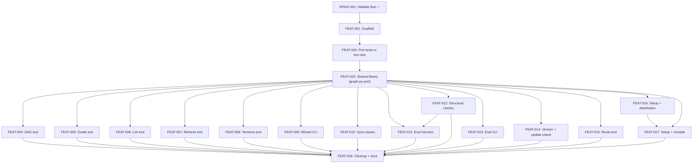

# Bun/TypeScript Tooling Migration

## Goal

Migrate Alexandria's tooling from Python and bash scripts to a unified
TypeScript codebase running on Bun. This gives the project type safety, a real
test runner (`bun test`), shared modules, ESLint + Prettier + type checking, and
compiled binary distribution. Agents, skills, templates, and docs remain as
markdown — only the CLI tools, shared libraries, test suites, eval harness, and
setup script migrate.

## Completion Status

**Released as v0.6.0 on 2026-04-01. All 19 tickets closed. All 5 outcomes met.**

| Outcome | Status | Evidence |
|---------|--------|----------|
| O-1: All 11 CLI tools in TypeScript | ✅ Met | 11 TS tools in `src/tools/`, bash shims in `bin/` delegate to compiled binaries or `bun run` |
| O-2: All tests under bun test | ✅ Met | 521 tests across 22 files, `bun test` passes in 35s |
| O-3: Eval harness in TypeScript | ✅ Met | `src/tools/eval-harness.ts` (1,213 lines), all 3 modes working |
| O-4: Shared TS graph library | ✅ Met | `src/lib/graph.ts` (625 lines) replaces `lib/graph.py`, all tests pass |
| O-5: Compiled binary distribution | ✅ Met | `setup` script runs `bun build --compile`, produces standalone binaries |

### What shipped

- **1,229 lines** of shared library code (`src/lib/`)
- **6,508 lines** of tool implementations (`src/tools/`)
- **5,669 lines** of tests (`src/tools/\*.test.ts` + `tests/\*.test.ts`)
- **11 bash shim wrappers** in `bin/` (three-tier: compiled binary → bun run → error)
- **All legacy Python and bash scripts removed** (`lib/graph.py`, `tests/\*.sh`, `tests/lib/`)
- **CI migrated** to `bun run check && bun test`
- **VERSION bumped** to 0.6.0

### Execution timeline

The first factory run (2026-03-30) violated dependency order — FEAT-002 failed
but downstream tickets ran anyway. A reconciliation assessment was performed
but downstream tickets ran anyway. A reconciliation assessment was performed.
The factory then completed all remaining tickets
in a second pass. Total wall-clock time: ~2 days from plan merge to v0.6.0.

## Scope

**In scope:**
- All CLI tools in `bin/` (11 tools: 7 Python, 4 bash)
- Shared graph library (`lib/graph.py` — card parser, wikilink graph, traversal)
- All test suites in `tests/` (16 scripts, 6,286 lines)
- Eval harness (`tests/run-eval.sh`) and per-skill structural checks (9 scripts)
- Setup script adaptation for `bun build --compile`
- Project scaffolding (package.json, tsconfig, ESLint, Prettier)

**Out of scope:**
- Agent definitions (`agents/*.md`) — remain as markdown
- Skill files (`skills/**/*.md`) — remain as markdown
- Templates, docs, context library cards — untouched
- Plugin manifest, wizard engine YAML — unchanged
- Model routing config (`config/model-routing.yaml`) — stays as YAML, only the reader migrates

## Success Outcomes

| ID | Outcome | Tier | Tickets |
|----|---------|------|---------|
| O-1 | All 11 CLI tools run from compiled TypeScript via Bun | Must | FEAT-001, FEAT-004..010, FEAT-013..015, FEAT-018 |
| O-2 | All tests run under bun test with equivalent or better coverage | Must | FEAT-002, FEAT-003, FEAT-018 |
| O-3 | Eval harness runs in TypeScript with identical behavior across all 3 modes | Must | FEAT-011, FEAT-012 |
| O-4 | Shared TS graph library replaces lib/graph.py with equivalent functionality | Must | FEAT-003 |
| O-5 | Setup and distribution work via compiled binaries | Should | FEAT-016, FEAT-017 |

## Context Summary

See [CONTEXT_BRIEFING.md](CONTEXT_BRIEFING.md) for the full briefing.

Key findings:
- **~12,900 lines** across 11 CLI tools, 1 shared library, 16 test suites, 9 structural checks
- **Python is the dominant tooling language** — 7 Python CLIs + `lib/graph.py` (535 lines shared graph parser)
- **170+ existing tests all pass** — integration-style, calling tools as black-box executables
- **Test-first migration strategy**: port test suites to bun test first (still calling Python/bash), then rewrite tools with tests as safety net
- **gstack validates the Bun pattern** — similar Claude Code skill pack, `bun build --compile`
- **SPIKE-001 validated** Bun.spawn, bun test, gray-matter (PR #132)

## Decisions

| # | Decision | Options Considered | Chosen | Rationale |
|---|----------|-------------------|--------|-----------|
| 1 | Runtime | Node.js + tsx, Bun, Deno | Bun | **Validated by SPIKE-001.** Native TS, built-in test runner, `bun build --compile`. |
| 2 | tsconfig.json | Full, minimal, none | Yes (for tsc --noEmit) | Need type checking in CI; also improves IDE support |
| 3 | Test framework | vitest, jest, bun test | bun test | **Validated by SPIKE-001.** Caveat: live `claude` tests need longer timeouts. |
| 4 | Migration strategy | Big bang, tool-first, test-first | **Test-first** | Port tests to bun test while they still call Python/bash. Then rewrite tools — tests are the safety net. |
| 5 | Structural checks | Keep bash, centralize, colocated TS | Colocated TS | Better discoverability — checks live next to eval cases |
| 6 | Distribution | Require Bun, require Node, compiled binaries | Compiled binaries | gstack pattern — end users don't need any JS runtime |
| 7 | Linting/formatting | None, ESLint only, all three | ESLint + Prettier + typecheck | Full dev tooling from the start |
| 8 | YAML parser | js-yaml, gray-matter, custom | gray-matter | **Validated by SPIKE-001.** Caveat: throws on malformed YAML — must use try/catch. |
| 9 | Graph library port | Faithful port, redesign from scratch | Systematic port with TS improvements | `lib/graph.py` has 43 passing tests. Port test-by-test, preserve behavior, add type safety. |
| 10 | `requires:` frontmatter | Ignore, parse separately, include in shared parser | Include in shared parser | Model routing added `requires:` to all skill files — parser must handle it |

## Risks and Assumptions

| Type | Description | Mitigation | Tickets |
|------|-------------|------------|---------|
| ~~Risk~~ | ~~Bun child process spawning~~ | **Resolved by SPIKE-001.** Caveat: `await proc.exited` before trusting exitCode. | SPIKE-001 |
| ~~Risk~~ | ~~bun test patterns~~ | **Resolved by SPIKE-001.** Caveat: longer timeouts for live claude tests. | SPIKE-001 |
| ~~Assumption~~ | ~~YAML parsing via Bun~~ | **Resolved by SPIKE-001.** gray-matter works with try/catch. | SPIKE-001 |
| Risk | Eval harness migration is complex (1,000 lines, 3 modes) | Migrate last, keep bash harness during transition, test side-by-side | FEAT-011 |
| Risk | `lib/graph.py` port may have subtle behavior differences | 43 existing tests ported first as safety net; run both implementations side-by-side | FEAT-002, FEAT-003 |
| Risk | `bun build --compile` binary size may be large | Acceptable per gstack precedent; investigate `--minify` | FEAT-017 |
| Assumption | Bun is stable enough for production CLI tools | gstack ships compiled Bun binaries to production | All |

## Execution Phases (actual)

**Phase 1: Spike (SPIKE-001)** ✅ PR #132
Validated Bun for child process spawning, test patterns, and YAML parsing.

**Phase 2: Scaffold (FEAT-001)** ✅ PR #142
Scaffolded package.json, tsconfig, ESLint, Prettier. First factory-executed ticket.

**Phase 3: Test-first (FEAT-002)** ✅ PR #164 (after reconciliation)
Failed on first factory attempt (watchdog stall). Completed after reconciliation.
The test-first strategy was partially undermined — Phases 4-5 ran before this
completed. See Retrospective below.

**Phase 4: Shared library (FEAT-003)** ✅ PR #143
Ported `lib/graph.py` → `src/lib/graph.ts` (625 lines). Also built frontmatter
parser, markdown reader, CLI helpers. 1,229 lines of shared code.

**Phase 5: Tool rewrites (FEAT-004..010)** ✅ PRs #144-149, #167
All 7 tools rewritten. Ran in parallel as planned. sync-issues (#167) required
a second attempt after initial watchdog stall.

**Phase 6: Eval infrastructure (FEAT-011, FEAT-012)** ✅ PRs #171, #172
Structural checks ported first, then eval harness. Eval harness (1,213 lines)
was the most complex single migration — completed cleanly.

**Phase 7: Remaining tools (FEAT-013..017)** ✅ PRs #151, #152, #168, #170, #174
Eval CLI, route tool, version/update-check, setup with `bun build --compile`.

**Phase 8: Cleanup (FEAT-018)** ✅ PR #175
Deleted all legacy Python/bash scripts. CI migrated. VERSION bumped to 0.6.0.

**Critical path (actual):** SPIKE-001 → FEAT-001 → FEAT-003 → FEAT-012 → FEAT-011 → FEAT-018
(FEAT-002 completed out of order — see Retrospective)

## Re-planning Triggers

- If test porting (FEAT-002) reveals that bun test can't call Python executables reliably, adjust to shell-based test wrappers
- If `lib/graph.py` port (FEAT-003) takes significantly longer than expected, consider splitting into sub-tickets (parser, graph, traversal)
- If eval harness migration (FEAT-011) proves harder than estimated, split by execution mode
- After Phase 4 (shared library), evaluate whether the pattern is sound before committing to Phase 5

## Ticket Index

| ID | Title | Enabler | Tier | Outcome | Blocked By | Blocks |
|----|-------|---------|------|---------|------------|--------|
| SPIKE-001 | Validate Bun runtime | spike | must | O-1 | — | FEAT-001 |
| FEAT-001 | Scaffold Bun/TypeScript project | false | must | O-1 | SPIKE-001 | FEAT-002 |
| FEAT-002 | Port all test suites to bun test | false | must | O-2 | FEAT-001 | FEAT-003 |
| FEAT-003 | Port lib/graph.py + shared TS modules | false | must | O-4 | FEAT-002 | FEAT-004..017 |
| FEAT-004 | Rewrite DAG tool | false | must | O-1 | FEAT-003 | FEAT-018 |
| FEAT-005 | Rewrite grade tool | false | must | O-1 | FEAT-003 | FEAT-018 |
| FEAT-006 | Rewrite lint tool | false | must | O-1 | FEAT-003 | FEAT-018 |
| FEAT-007 | Rewrite retrieve tool | false | must | O-1 | FEAT-003 | FEAT-018 |
| FEAT-008 | Rewrite tensions tool | false | must | O-1 | FEAT-003 | FEAT-018 |
| FEAT-009 | Rewrite wizard CLI | false | must | O-1 | FEAT-003 | FEAT-018 |
| FEAT-010 | Rewrite sync-issues | false | must | O-1 | FEAT-003 | FEAT-018 |
| FEAT-011 | Migrate eval harness | false | must | O-3 | FEAT-003, FEAT-012 | FEAT-018 |
| FEAT-012 | Migrate structural checks | false | must | O-3 | FEAT-003 | FEAT-011, FEAT-018 |
| FEAT-013 | Rewrite eval CLI | false | must | O-1 | FEAT-003 | FEAT-018 |
| FEAT-014 | Rewrite version + update-check | false | must | O-1 | FEAT-003 | FEAT-018 |
| FEAT-015 | Rewrite route tool | false | must | O-1 | FEAT-003 | FEAT-018 |
| FEAT-016 | Rewrite setup script | false | must | O-1 | FEAT-003 | FEAT-017 |
| FEAT-017 | Setup + bun build --compile distribution | false | should | O-5 | FEAT-003, FEAT-016 | FEAT-018 |
| FEAT-018 | Remove legacy scripts + finalize tooling + docs | false | must | O-1 | FEAT-004..017 | — |

## Decisions Made During Execution

These decisions were NOT in the original plan — they emerged during implementation.

| # | Decision | What happened | Rationale |
|---|----------|--------------|-----------|
| E1 | Three-tier bin wrapper pattern | Bin scripts are bash shims: prefer compiled binary → fall back to `bun run` → error with install instructions | Solves distribution without requiring Bun at runtime while preserving dev ergonomics |
| E2 | `src/lib/structural-checks.ts` shared framework | Structural checks got a shared TS framework, not just per-skill files | Reduced duplication across 9 check scripts; harness imports one module |
| E3 | `src/lib/bun-runtime.ts` | Small module for Bun-specific runtime detection | Needed for tests to detect whether running under Bun vs Node |
| E4 | `structural-check-parity.json` fixture | Golden-file parity testing for structural checks | Ensures TS structural checks produce identical results to deleted bash versions |
| E5 | Factory ran out of dependency order | FEAT-002 failed, downstream tickets ran anyway | Symphony used priority labels not DAG dependencies; led to reconciliation assessment |
| E6 | `lib/graph.py` already existed before plan v2 | Plan v1 assumed no shared library; Danvers shipped graph.py + 5 Python tools between v1 and v2 | Forced plan reassessment — scope grew from 5 to 11 tools, ~8,800 to ~12,900 lines |

## Retrospective

### Planned vs actual

| Aspect | Planned | Actual |
|--------|---------|--------|
| Test-first strategy | Port tests → rewrite tools | FEAT-002 failed, tools rewrote first, tests ported after |
| Ticket count | 12 (v1) → 19 (v2) | 19 — v2 was accurate |
| Total lines migrated | ~12,900 | ~13,400 (tools grew slightly during rewrite) |
| Test count | 170+ | 521 (3x growth — TS tests are more granular) |
| Duration | Not estimated | ~2 days (plan merge to v0.6.0) |
| Factory dependency ordering | Assumed DAG-aware | Label-driven — violated dependency order |

### What was learned

1. **Label-driven queuing is not dependency-aware.** Symphony picked up P2 tickets
   even when their P1 prerequisite (FEAT-002) had failed. The factory needs a
   DAG-aware promoter that derives `symphony:ready` from dependency metadata.
   This is a factory orchestration concern tracked in symphony-ts.

2. **Test-first works but is fragile to execution order.** The strategy was sound —
   port tests, verify green against old code, rewrite tool, verify green against new
   code. But when the factory ran tools before tests, the safety net wasn't there.
   The tools still shipped correctly (verified after the fact), but the *process
   guarantee* was lost.

3. **Reconciliation is a real workflow.** When a factory run goes sideways, you need
   a structured process: audit what merged, assess against acceptance criteria,
   decide what to keep/reopen/follow-up. This is a factory orchestration
   concern — later formalized by `/revise-plan` (#54).

4. **Spikes should gate everything.** SPIKE-001 worked perfectly — validated Bun
   before committing the plan. The three caveats it surfaced (`await proc.exited`,
   gray-matter try/catch, longer timeouts) were all relevant during implementation.

5. **Scope changes during execution are real.** Between plan v1 and v2, Danvers
   shipped 5 new Python tools + a shared graph library. The plan grew from 12 to
   19 tickets. `/reassess-plan` would have been useful here.

6. **The bin wrapper pattern was not planned.** The three-tier shim (compiled →
   bun run → error) emerged during implementation and is now a durable distribution
   pattern. Future plans should account for "decisions made during execution" as a
   first-class output.

## Library Updates

See [library-updates.md](library-updates.md).

## Deferred

No Should/Could outcomes were descoped. All 5 outcomes shipped, including O-5 (Should).

Items that are adjacent but out of scope for this release:
- **Eval baseline refresh** — eval baselines were not re-run after migration. TS tools
  should produce identical results, but baselines haven't been formally re-validated.
- **Performance benchmarks** — no comparison of TS tool performance vs Python/bash
  originals. Anecdotally faster, but not measured.
- **`bun build --compile` size audit** — compiled binary sizes not documented or optimized.
