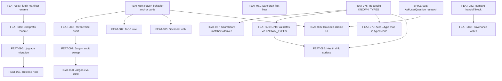

# Release: Field Hardening

## Goal

Close the gap between what Alexandria's field reports show (Bryan Helmkamp @ Fabro, plus Jess's own architecture-review scratchpad) and what Alexandria should feel like on a real `/ax:library` session. Seven work streams, designed for parallel fan-out: taxonomy correctness, draft-first card flow, Raven as sole voice, bounded action-oriented choices, unified `/ax:` command namespace, and a full jargon audit.

## Scope

**In scope:**
- Taxonomy single-source-of-truth (scoreboard matchers, linter, `KNOWN_TYPES`, knowledge-area → card-type map all resolve to typed code)
- Sam draft-first card flow
- Raven sole-voice discipline (agent names hidden, handoff block removed)
- Top-1 nudge + bounded-choice (`AskUserQuestion`) + sectional interview walk
- Plugin manifest rename (alexandria → ax) and slash-command prefix unification (all → `/ax:<skill>`)
- Release note and migration discipline for the rename
- Jargon audit across Raven, agent surfaces, library cards (Could tier)
- Taxonomy drift surfaced in `ax health` (counts, per-type, per-folder; strict-mode flag)

**Out of scope:**
- Technical-context library coverage (tech foundations + blueprints per feature) — held for a later plan
- Blueprint-as-artifact + three-zone model (Constitution / Human-led / Agent-zone) — held for a later plan
- User-maturity-gated reveal for agent names — shipping permanent curtain + provenance log; revisit when there's demand
- Data-layer / event-log / vector search work
- Playbook / play-protocol cleanup
- Live debug surface (provenance log is enough)

## Success Outcomes

| ID  | Title                                                       | Tier   |
|-----|-------------------------------------------------------------|--------|
| O-1 | Taxonomy single-source-of-truth                             | must   |
| O-2 | Initial cards draft before questions block                  | must   |
| O-3 | Raven is the sole user-facing voice                         | must   |
| O-4 | Raven presents bounded, action-oriented choices             | must   |
| O-5 | User-visible skills share the /ax: namespace                | must   |
| O-6 | Jargon audit completeness                                   | could  |

See `outcomes/` for full validation criteria.

## Context Summary

From `CONTEXT_BRIEFING.md`:

- **Strong grounding:** O-1 anchors in [[Artifact - Type Taxonomy]] and [[Artifact - Noun Vocabulary]]; O-2 anchors in [[Agent - Sam the Scribe]]; O-5 anchors in [[Artifact - Decision - Skill Naming Convention]]; O-6 anchors in [[Standard - Professional Not Daffy]].
- **P0 library gap:** O-4 had no library grounding before this plan. Three Standard cards — three-tier interaction model, top-1 surfacing rule, concierge greeting — are drafted as part of FEAT-080 to fix that.
- **P1 library gap:** O-3 is structurally implied by [[Standard - Agent Customer Gate (Human vs. Builder)]] but has no explicit card. `Standard - Agent Name Curtain` is drafted in FEAT-080.
- **Deferral pickups:** `initialize-ritual-restoration` deferred the three-tier interaction model card — now in scope via FEAT-080. `planning-polish` deferred Raven-nudge wiring to `/library` — adjacent work, not pulled in.

## Decisions

| ID  | Decision                                                                   | Rationale                                                                                  |
|-----|----------------------------------------------------------------------------|--------------------------------------------------------------------------------------------|
| D-1 | Rename plugin manifest `name` to `ax` (not just slash commands)            | Half-measures on namespacing never settle; breaking change is one-shot with release note. |
| D-2 | No live debug surface; provenance log is the forensic trail                | Provenance log already exists, migrates to DB later. Live surface is premature.            |
| D-3 | `KNOWN_TYPES` in typed code is the canonical taxonomy source               | Typed code > ad-hoc; codegen for matchers is a later optimization.                         |
| D-4 | Sam drafts every card where available info is sufficient, then unblocks    | Converts intake to review — stronger evidence for unblock questions.                       |
| D-5 | Spike `AskUserQuestion` pattern against Compound Engineering + gstack      | Pattern and host-capability fallback are unknown; spike before implementation.             |
| D-6 | Jargon audit scope is full (Raven + agents + library cards); evals heavy   | Regression surface is wide; one-off sweep without evals won't hold.                        |
| D-7 | Unknown card type remains linter warning, not error; strict mode via `--strict-taxonomy` flag | Existing libraries would break loudly on flip-to-error; soft-default + CI-strict flag gives adopters a migration path. |

## Risks and Assumptions

| Risk / Assumption                                                                 | Mitigation                                                                                   |
|-----------------------------------------------------------------------------------|----------------------------------------------------------------------------------------------|
| Plugin rename may confuse installed-under-`alexandria` users                      | FEAT-090 migration + FEAT-091 release note; deprecation redirect on old commands.            |
| `AskUserQuestion` may not exist in Codex/plain terminal hosts                     | SPIKE-002 scopes capability detection + fallback before FEAT-086 implements.                  |
| Jargon audit (O-6) scope is large; evals may not catch regressions in unaudited surfaces | FEAT-093 requires at least one eval per user-facing flow; forbidden list is living artifact. |
| Removing handoff block (FEAT-082) may lose signal currently flowing through it    | FEAT-087 routes the underlying signal to provenance log + feedback queue.                    |
| Taxonomy reconciliation (FEAT-076) may reveal legitimate types with no card coverage | FEAT-079 orphan handling produces deliberate list rather than silent misalignment.          |
| Existing libraries have undetected taxonomy drift that only surfaces after FEAT-076 tightens enforcement | FEAT-095 surfaces drift counts as a first-class health finding; `--strict-taxonomy` flag lets adopters opt into hard failures at their pace. |

## Execution Phases

**Phase 1 — Taxonomy correctness (demoable first slice)**
- FEAT-076 → FEAT-077, FEAT-078, FEAT-079
- **First demo:** `ax scoreboard render .` on Jess's repo shows Product Entities with coverage; `ax lint` accepts `Anti-Pattern`.
- FEAT-095 follows Phase 1 once FEAT-076 and FEAT-078 land — it depends on canonical KNOWN_TYPES and the linter sweep being tight.

**Phase 2 — Library anchors**
- FEAT-080 (four Standard cards) — substrate for Phase 4

**Phase 3 — Sam draft-first**
- FEAT-081 (independent of other phases; can run in parallel)

**Phase 4 — Raven surface rework**
- FEAT-082 (handoff block removal — independent)
- SPIKE-002 (research, unblocks FEAT-086)
- FEAT-083 (voice audit — depends on FEAT-080)
- FEAT-084, FEAT-085 (top-1 + sectional — depend on FEAT-080)
- FEAT-086 (bounded-choice — depends on SPIKE-002 + FEAT-080)
- FEAT-087 (provenance writes — depends on FEAT-082)

**Phase 5 — Namespace rename**
- FEAT-088 → FEAT-089 → FEAT-090 → FEAT-091
- Can begin as early as Phase 1; landing order matters more than phase order.

**Phase 6 — Jargon audit (Could)**
- FEAT-092 (depends on FEAT-083) → FEAT-093

## Dependency Graph

## Re-planning Triggers

- **SPIKE-002 result:** if research reveals `AskUserQuestion` requires host capabilities Alexandria can't supply, re-scope FEAT-086 toward the fallback path before committing implementation work.
- **FEAT-076 result:** if orphan types include ones with real card coverage (e.g., `Anti-Pattern` turns out to be genuinely used), FEAT-079's orphan map may need re-design. Check before FEAT-077/078 land.
- **FEAT-080 grading:** if Conan grades any of the four anchor cards below B, Phase 4 work on the affected card can't proceed. Re-scope or iterate the card first.

## Ticket Index

| ID        | Title                                                           | Outcome | Tier  |
|-----------|-----------------------------------------------------------------|---------|-------|
| FEAT-076  | Reconcile KNOWN_TYPES as the canonical type taxonomy source     | O-1     | must  |
| FEAT-077  | Scoreboard matchers derive type names from KNOWN_TYPES          | O-1     | must  |
| FEAT-078  | Linter validates card types against KNOWN_TYPES                 | O-1     | must  |
| FEAT-079  | Unify knowledge-area → card-type mapping in typed code          | O-1     | must  |
| FEAT-080  | Write Raven-behavior anchor cards                               | O-3     | must  |
| FEAT-081  | Sam draft-all-with-available-info flow                          | O-2     | must  |
| SPIKE-002 | Research AskUserQuestion patterns across plugins and hosts       | O-4     | must  |
| FEAT-082  | Remove Raven handoff block from skill files and eval enforcement | O-3     | must  |
| FEAT-083  | Raven voice audit — hide other agent names from user surface    | O-3     | must  |
| FEAT-084  | Implement top-1 rule in Raven elicitation                       | O-4     | must  |
| FEAT-085  | Implement sectional interview walk for multi-group elicitation  | O-4     | must  |
| FEAT-086  | Implement bounded-choice AskUserQuestion pattern                | O-4     | must  |
| FEAT-087  | Provenance log captures orchestration handoffs                  | O-3     | must  |
| FEAT-088  | Rename plugin manifest name from alexandria to ax               | O-5     | must  |
| FEAT-089  | Rename user-visible skills to /ax: prefix                       | O-5     | must  |
| FEAT-090  | Upgrade migration for plugin rename                             | O-5     | must  |
| FEAT-091  | Release note and breaking-change communication                  | O-5     | must  |
| FEAT-092  | Jargon audit across Raven, agent surfaces, and library cards    | O-6     | could |
| FEAT-093  | Jargon eval suite                                               | O-6     | could |
| FEAT-094  | Planning skill improvements (numbering, table preview, bounded-choice decisions, parallel writes) | — | should |
| FEAT-095 | Health check surfaces taxonomy drift as a first-class finding | O-1 | should |

## Library Updates

See `library-updates.md` for the full card-update table. Summary: 4 new Standard cards (Raven-behavior anchors) + 3 Decision Artifacts (taxonomy-canonical source, skill-naming convention, draft-first flow) + 2 agent updates (Sam and Raven WHEN sections).

## Deferred

- **Technical-context coverage** (tech foundations + blueprint-per-feature) — own plan; Bryan's "technical wall" is felt; scratchpad lines 63-64 confirm the structural gap.
- **Blueprint-as-artifact + three-zone model** (Constitution / Human-led / Agent-zone) — own plan; needs design conversation before tickets.
- **User-maturity-gated agent-name reveal** — ship permanent curtain + provenance log now; revisit when users request it.
- **Playbook / play-protocol cleanup** — scratchpad lines 164-184; architectural work for a different release.
- **Data-layer / event-log / vector search** — scratchpad line 79; major design exercise.

## Meta

- FEAT-094 updates the implementation-planning skill itself; it is not on the critical path for this release but ships alongside.
