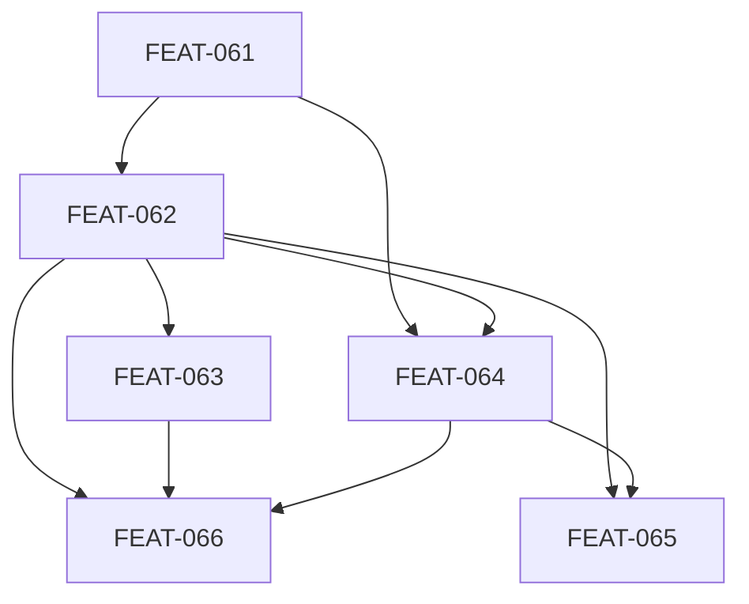

# Initialize Ritual Restoration

## Goal

Restore the power and depth of the original /wizard first-session experience while keeping /library as the sole user entry point. Three structural moves: (1) split /library into a router + dedicated first-session job + returning-session job, (2) orchestrate first-session Initialize via Claude Code Task primitives with prose fallback, (3) restore solicitation prompt depth that was thinned during FEAT-045.

## Scope

**In scope:**
- Split `job-initialize.md` into `job-first-session.md` and `job-returning-session.md`
- Router lives in `agents/raven.md` Job Dispatch table (existing pattern)
- Task orchestration for first-session Initialize with graceful prose fallback
- Restore solicitation prompt depth to pre-FEAT-045 baseline
- Build `alxndr scoreboard derive` CLI and wire into both jobs
- Kill `assessment.md` as persisted artifact; prune `assessment-generation.md` and assessment template
- Strike `session_notes` entirely
- Fix noun-proposal-dialogue orphan (wire explicitly into first-session)
- Restore gap-analysis as procedural beat (not reference material only)
- Replace directory-heuristic greenfield-to-brownfield detection with `git log` drift detection
- ADR documenting host-specific primitives as execution aid with fallback contract
- Eval harness updates (Task lifecycle assertions, depth parity criteria, new first-session and returning-session cases)

**Out of scope:**
- Task orchestration in Product Conversation, Conan, Sam, Bridget — deferred
- Non-Claude-Code harness Task primitives support beyond the declared fallback — deferred
- Data-layer work (event log, persisted grades, incremental assessment) — deferred to forthcoming data architecture conversation
- Three-tier interaction model card — deferred (not required for concierge greeting in FEAT-064)
- Scoreboard rendering changes — renderer is fine, only derivation is changing
- PR #393 / FEAT-056 (Raven writes config directly) — landing separately, this plan assumes it's merged

## Success Outcomes

| ID | Outcome | Tier | Tickets |
|----|---------|------|---------|
| O-1 | First-session ritual restored end-to-end on fresh /library | Must | FEAT-062 |
| O-2 | /library is a pure router; first-session and returning-session are separate jobs | Must | FEAT-061, FEAT-062, FEAT-064 |
| O-3 | First-session Initialize orchestrated via Claude Code Task primitives with prose fallback | Must | FEAT-062, FEAT-066 |
| O-4 | First-session solicitation prompt depth matches pre-FEAT-045 wizard | Must | FEAT-063, FEAT-066 |
| O-5 | alxndr scoreboard derive CLI wired into both init jobs (CLI already ships in-repo) | Should | FEAT-062, FEAT-064 |
| O-6 | Cleanup — kill assessment.md, strike session_notes, fix noun-dialogue orphan | Could | FEAT-065 |

## Context Summary

See [CONTEXT_BRIEFING.md](CONTEXT_BRIEFING.md) for the full briefing from Bridget.

Key findings: The FEAT-045 wizard→library collapse demoted a linear ritual to a branch inside a decision-tree procedure, which licensed skipping under LLM load. Specific losses (per Raven's git-diff analysis): noun-proposal-dialogue orphaned, gap-analysis demoted from step to reference, engine-run gate missing, configuration confirmation became soft rule not structural gate, sequenced state transitions collapsed to alternatives, session-start ballooned to 19 sub-steps, initialize-output.md floor weakened from gate to closing check. Bridget flagged two sequencing constraints: PR #393 (FEAT-056) must land first, and scoreboard-derive CLI unblocks session-start reconstruction in all three new jobs.

## Decisions Made During Planning

| Decision | Options Considered | Chosen | Rationale |
|----------|-------------------|--------|-----------|
| Router location | New `job-router.md` file / Job Dispatch table in raven.md | Job Dispatch table | Existing pattern, cheaper, no new abstraction |
| Task primitives scope | All agents / Initialize only / None | Initialize only (first-session) | Product Conversation is dialogic; Conan/Sam already rubric-driven; Initialize is where prose-adherence failed |
| Task fallback contract | Inline per-skill / ADR | ADR | Portability requires writing it down; first of its kind needs a governing record |
| Depth restoration | Inline in procedure / Explicit refs to calibration files / Both | Both | Explicit refs alone were what FEAT-045 shipped — didn't work. Inline is needed too |
| assessment.md | Kill / Keep / Defer | Kill | Scratchpad evidence: stale the moment written, nobody reads it |
| Drift detection | Directory heuristics / git log | git log | Generalizes to any drift, not just greenfield-to-brownfield |
| O-4 tier | Should / Must | Must | Depth is the user-felt regression; shipping without it fixes geometry but not experience |
| PR #393 handling | Merge first / Roll into plan / Close | Merge first (separately) | Already MERGEABLE and rebased onto main; only pending eval baselines. Plan assumes it's landed |

## Risks and Assumptions

| Type | Description | Mitigation | Tickets Affected |
|------|-------------|-----------|-----------------|
| Assumption | PR #393 (FEAT-056) will merge before this plan's execution begins | Check PR state before starting FEAT-062; if unmerged, rebase FEAT-062 to include its changes | FEAT-062 |
| Risk | Task primitives may not cover the granularity we need (e.g., no nested tasks for Sam sub-writes) | Keep task list flat, one-level dependencies only. If we hit a limitation, narrow scope to the beats that map cleanly | FEAT-062 |
| Risk | Pre-FEAT-045 wizard transcripts may not be cleanly reproducible for the depth baseline | Generate approximate baseline from git-restored wizard files + new runs; note approximation in baseline metadata | FEAT-066 |
| Assumption | `alxndr scan` CLI exists and works per scratchpad line 104 | Verify at FEAT-062 start; if it doesn't exist, add a stub scan ticket as a precursor | FEAT-062 |
| Risk | Killing assessment.md may break unknown consumers (evals, other plans, docs) | `grep` for `assessment.md` before deletion; update any consumer references | FEAT-065 |
| Assumption | Task primitives are stable across Claude Code versions | Accept coupling to Claude Code; document in FEAT-066 ADR | FEAT-062, FEAT-066 |

## Execution Phases

**Phase 1 — Stub split:** FEAT-061 (job dispatch split + stubs). The one hard prerequisite for the Must work.

**Phase 2 — First demoable slice:** FEAT-062 (first-session job with Task orchestration + ritual beats). **This is the first demoable milestone** — after FEAT-061 + FEAT-062 land, a fresh `/library` run on an empty project demonstrates the restored ritual end-to-end with Task-tracked progress. Beat 8 wires the existing derivation CLI into the ritual and renders a real scoreboard.

**Phase 3 — Depth and returning-session (parallelizable):** FEAT-063 (depth restoration, depends on FEAT-062) and FEAT-064 (returning-session, depends on FEAT-062 for shared scoreboard wiring). These can land in either order once FEAT-062 has shipped.

**Phase 4 — ADR + eval gate:** FEAT-066 (ADR for Task primitives fallback contract + eval harness updates for Task lifecycle and depth parity). Depends on FEAT-062, FEAT-063, FEAT-064 so it can exercise the full new surface.

**Post-ritual cleanup (blocked by Phase 2/3):** FEAT-065 — prunes from the new job files created by FEAT-062 and FEAT-064, so it cannot land until they do.

## Re-planning Triggers

- If PR #393 / FEAT-056 doesn't merge before FEAT-062 starts, re-plan FEAT-062 to absorb its scope
- If Task primitives prove insufficient (e.g., harness doesn't expose them reliably, or evals can't assert lifecycle), re-plan FEAT-062 and FEAT-066 — possibly demote O-3 back to Should and rely on prose discipline + eval coverage alone
- If old-wizard depth baseline can't be reproduced cleanly, re-scope FEAT-066 depth criteria to be forward-looking (assert depth against hand-crafted reference transcripts) rather than comparative
- If Raven eval runs fail during FEAT-062 or FEAT-064, pause and diagnose before building further — first-session is the core deliverable and regressions here are blocking

## Ticket Index

| ID | Title | Enabler | Tier | Outcome | Blocked By | Blocks |
|----|-------|---------|------|---------|------------|--------|
| FEAT-061 | Split raven.md Job Dispatch into first-session and returning-session jobs | false | must | O-2 | — | FEAT-062, FEAT-064 |
| FEAT-062 | Build first-session Initialize job with Task orchestration and restored ritual beats | false | must | O-1 | FEAT-061 | FEAT-063, FEAT-064, FEAT-065, FEAT-066 |
| FEAT-063 | Restore first-session solicitation prompt depth to pre-FEAT-045 wizard baseline | false | must | O-4 | FEAT-062 | FEAT-066 |
| FEAT-064 | Build returning-session job with git-log drift detection | false | must | O-2 | FEAT-061, FEAT-062 | FEAT-065, FEAT-066 |
| FEAT-065 | Cleanup: kill assessment.md, strike session_notes, remove dead refs | false | could | O-6 | FEAT-062, FEAT-064 | — |
| FEAT-066 | ADR for Task primitives + eval harness updates for Task lifecycle and depth parity | false | must | O-3 | FEAT-062, FEAT-063, FEAT-064 | — |

## Library Updates

See [library-updates.md](library-updates.md).

## Deferred

None at planning time. Items explicitly scoped out (Task orchestration beyond Initialize, non-CC harness Task support, data-layer work, three-tier interaction model card) are deferred to later plans per the Scope section.

## Completion Status

All six tickets shipped; all six outcomes met. Closing as **complete**.

| ID | Outcome | Tier | Result |
|----|---------|------|--------|
| O-1 | First-session ritual restored end-to-end on fresh /library | Must | Shipped — `job-first-session.md` lands the nine-beat ritual; eval case `first-session-empty-project` exercises it |
| O-2 | /library is a pure router; first-session and returning-session are separate jobs | Must | Shipped — `raven.md` Job Dispatch table splits the two jobs; `job-initialize.md` deleted, no live references remain |
| O-3 | First-session orchestrated via Task primitives with prose fallback | Must | Shipped — ADR 004 checked in and linked from `job-first-session.md` + CLAUDE.md; Task usage is lighter than planned (see execution decisions) |
| O-4 | First-session solicitation depth matches pre-FEAT-045 wizard | Must | Shipped — `job-first-session.md` explicitly invokes `expert-calibration.md`, mismatch detection, and inference-hedge phrasings at the configuration beats |
| O-5 | Scoreboard CLI wired into both init jobs | Should | Shipped via `ax scoreboard render` (the CLI was renamed from `alxndr` → `ax` during execution) |
| O-6 | Cleanup — kill assessment.md, strike session_notes, fix noun-dialogue orphan | Could | Shipped — `assessment-generation.md` deleted, assessment template pruned, `session_notes` removed from live skills/agents/docs, `noun-dialogue.md` wired into first-session |

Ticket-level evidence:

| Ticket | State | Evidence |
|--------|-------|----------|
| FEAT-061 | Shipped | Job Dispatch table in `packages/alexandria-plugin/agents/raven.md` lists both jobs; `job-initialize.md` absent; grep for `job-initialize` in bundled surface is clean |
| FEAT-062 | Shipped | `packages/alexandria-plugin/skills/raven/job-first-session.md` ships the nine-beat ritual, wires scoreboard and noun-dialogue, carries ADR 004 header link |
| FEAT-063 | Shipped | Calibration/mismatch/inference-hedge guidance inlined at the configuration beats of `job-first-session.md` |
| FEAT-064 | Shipped | `job-returning-session.md` runs git-log drift detection, completed-plan nudges, and the concierge opener — exercised live by this very close-out session |
| FEAT-065 | Shipped | `assessment-generation.md` deleted; assessment template removed from `output-formats.md`; `session_notes` has zero references under `packages/alexandria-plugin/` |
| FEAT-066 | Shipped | `docs/adrs/004-host-specific-primitives-as-execution-aid.md` checked in; eval cases `initialize/first-session-empty-project` and `initialize/returning-session-with-drift` present under `packages/ax/tests/eval-cases/initialize/` |

## Decisions Made During Execution

| Decision | What happened | Why |
|----------|---------------|-----|
| CLI naming | Plan assumed `alxndr scoreboard derive` + `alxndr scan`. Both shipped under the final `ax` CLI (`ax scoreboard render`, `ax scan`). | The broader `alxndr`→`ax` CLI rename landed in parallel with this plan. Wiring the current CLI name was the only correct move; no behavior change. |
| Task primitive usage | FEAT-062 AC called for a Task per ritual beat with explicit `blocks`/`blockedBy`. The shipped `job-first-session.md` references Task primitives lightly, leaning on ADR 004's "prose procedure is canonical, primitives are execution aid" contract. | Heavy per-beat TaskCreate scaffolding in a skill file risked coupling the prose to host specifics in a way ADR 004 was written to avoid. The structural check remains in the eval harness; fallback behavior is what the contract actually guarantees. |
| Plan artifact boundary | Initialize engine logic moved from prose into TypeScript (`packages/ax/src/engine/initialize/`) during PR #32 while this plan was mid-flight. | Reduced the surface `job-first-session.md` has to describe in prose — the job now invokes the engine module rather than re-specifying its behavior. Net simplification. |
| `session_notes` residue in plan archive | `session_notes` still appears in this plan's own CONTEXT_BRIEFING.md and feedback-queue.md. Left in place. | Those are frozen planning artifacts, not live schema docs. Sweeping them would edit a historical record for cosmetic reasons. |

## Retrospective

**Planned vs actual.** Execution order broadly tracked the planned phases. The largest deviation was the in-flight CLI rename (`alxndr` → `ax`) which forced a mechanical sweep through the new job files but did not change the shape of the work. The TS port of the initialize engine (#32) was *not* in this plan's scope but landed in a compatible direction and reduced the prose surface `job-first-session.md` had to carry.

**Things that held up.** The router + split was the right primitive: separating first-session from returning-session gave each job a clean scope, and the returning-session git-log drift path is noticeably tighter than the old 19-step session-start it replaced. ADR 004 proved its worth immediately — it gave FEAT-062 room to use Task primitives lightly without feeling under-engineered, and it's the framework future "host-specific aid + fallback" skills will reuse.

**Things to carry forward.**

- Writing an ADR when a skill reaches for a host-specific primitive is a pattern worth making routine. The ADR-first path kept this plan's contract honest where it could easily have become an informal convention.
- Concurrent refactors (the `ax` CLI rename, the TS engine port) can land mid-plan without derailing it *if* the plan's scope is expressed in terms of user-visible behavior rather than current file paths. The parts of this plan written that way absorbed the churn; the parts written against specific CLI names needed mechanical fixups.
- The returning-session "concierge greeting" pattern (state read + top-1 nudge + open invitation) generalizes beyond this job. Worth capturing as a reusable interaction pattern in a later library pass.
- Depth restoration (FEAT-063 / O-4) was the highest-risk ticket because "prompt richness" is hard to gate on. Explicit in-procedure invocation of `expert-calibration.md` (rather than "available reference material") is the pattern that actually moved the needle, and it's the pattern to reuse next time a skill's prose thins under load.
- **Load-bearing vs reference knowledge is a live distinction.** Reference material that isn't invoked at a specific beat effectively doesn't exist under load. Procedures should carry the *invocation prompt* for load-bearing knowledge at the moment of the decision; the substance lives in one canonical file. This is the opposite failure mode from Sam-style duplication across files, and both need separate management.
