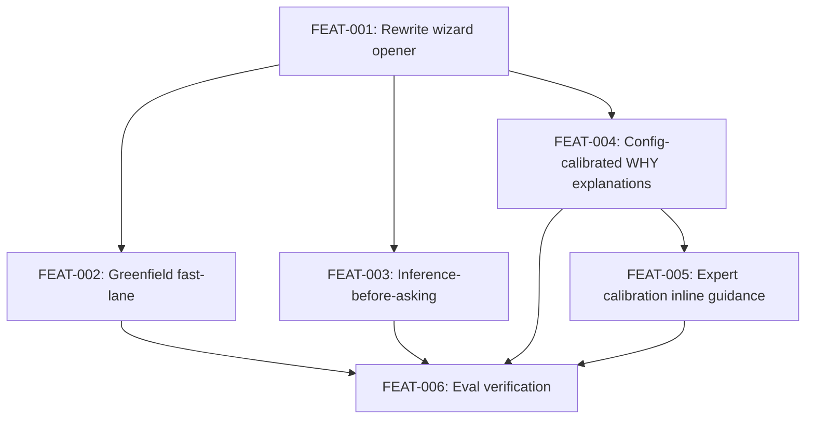

# Phase 1: Raven-Voiced Wizard

## Goal

Rework `skills/initialize/SKILL.md` so the wizard feels like meeting a colleague, not
filling out a form. Raven opens with a first-five-minutes sequence that establishes
the working relationship before configuration begins. Greenfield users get
elicitation-as-generation rather than gap analysis. Configuration questions arrive
with calibrated WHY explanations. Expert calibration from practitioner knowledge is
encoded inline. The wizard engine, output schemas, and downstream agents are untouched.

This is Phase 1 of the /library redesign. Phase 2 gives Raven agent-level orchestration
of the wizard (subagent calls, scoreboard, session continuity). Phase 1 changes only
the skill file.

## Scope

**In scope:**
- `skills/initialize/SKILL.md` — the only file modified
- Wizard opener rewrite (first-five-minutes sequence)
- Greenfield detection and fast-lane branch
- Inference-before-asking on configuration questions
- Config-calibrated WHY explanations for each configuration question
- Expert calibration inline guidance (Frankenstein diagnostic, mismatch detection,
  guidance gap pattern, collaboration model, stopping-point language)
- Existing eval case verification

**Out of scope:**
- `docs/initialize/initialize-engine.yaml` — untouched
- `docs/initialize/phase-6-intake-engine.md` — untouched
- Output artifact schemas (`initialize-output.md`, `alexandria-config.json`, `assessment.md`) — untouched
- Raven's agent definition (`agents/raven.md`) — Phase 2
- Scoreboard design and session continuity — Phase 2
- Subagent orchestration and Sam handoff protocol — Phase 2
- New eval cases (greenfield, brownfield, reconfiguration) — Phase 2

## Success Outcomes

| ID | Outcome | Tier | Tickets |
|----|---------|------|---------|
| O-1 | Wizard opens with Raven's colleague-meeting sequence, not a form | Must | FEAT-001 |
| O-2 | Greenfield users get elicitation-as-generation, not gap analysis | Must | FEAT-002 |
| O-3 | Configuration questions are presented conversationally with config-calibrated WHY explanations | Should | FEAT-003, FEAT-004, FEAT-005 |
| O-4 | Existing wizard eval cases hold at baseline scores | Should | FEAT-006 |

## Decisions

| # | Decision | Options Considered | Chosen | Rationale |
|---|----------|--------------------|--------|-----------|
| 1 | Scope boundary | Rewrite full skill, rewrite opener only, full Phase 2 now | SKILL.md only | No infrastructure changes available. Engine YAML untouched. Phase 2 for orchestration. |
| 2 | Raven agent def | Modify now, defer | Defer to Phase 2 | Raven's agent def changes require subagent tooling design. Phase 1 is skill-only. |
| 3 | Eval strategy | New cases now, existing cases only, defer all | Existing cases must hold; new cases deferred | "Build it, play with it, then harden." Phase 2 adds greenfield, brownfield, reconfigure cases. |
| 4 | Greenfield threshold | Strictly zero docs/code, any thin material, user-declared | Thin material (not enough for gap analysis to be meaningful) | Zero-only is too narrow. User-declared is unreliable. Raven reads the state. |
| 5 | Configuration question order | Keep current, reorder, collapse | Keep current (AI mode → novelty → complexity) | Order is engine-driven and downstream artifacts depend on it. Presentation changes; order does not. |
| 6 | Expert calibration encoding | Separate doc, inline SKILL.md, agent prompt | Inline SKILL.md | Phase 1 is skill-only. Inline guidance is the available mechanism. Phase 2 moves it to Raven's agent def. |

## Risks

| Type | Description | Mitigation |
|------|-------------|------------|
| Risk | Opener length may affect eval timing or turn-count dimensions | Run evals (FEAT-006) and diagnose. Accept trade-off with written rationale if needed. |
| Risk | Greenfield detection threshold is ambiguous at runtime | Acceptance criteria require explicit specification. If ambiguous after implementation, add examples. |
| Risk | Inference-before-asking scoped to current scanner output may feel incomplete | Implementation notes scope it explicitly. Shipping directional improvement is acceptable; note what scanner changes would unlock more. |
| Risk | Expert calibration inline guidance becomes too long | Voice guidance ("Be concise ~300-500 words per response") applies. Inline guidance should be concise operating principles, not transcribed source docs. |
| Assumption | SKILL.md changes are sufficient to change the user experience without agent definition changes | Validated by Phase 1 scope: the wizard is invoked via the skill file, not the agent definition. |

## Execution Phases

**Stage 1: Foundation**

FEAT-001 — Rewrite opener. This is the foundation. All other tickets build on the
voice and relationship established here. No other tickets start until FEAT-001 is
integrated.

**Stage 2: Architecture (parallel)**

FEAT-002 — Greenfield fast-lane (blocks on FEAT-001 for voice consistency)
FEAT-003 — Inference-before-asking (blocks on FEAT-001)
FEAT-004 — Config-calibrated WHY explanations (blocks on FEAT-001)

FEAT-002 and FEAT-003 can run in parallel. FEAT-004 is a prerequisite for FEAT-005
(expert calibration guidance is layered on top of question presentation).

**Stage 3: Calibration**

FEAT-005 — Expert calibration inline guidance (blocks on FEAT-004 for posture guidance
to exist before calibration is layered on)

**Stage 4: Gate**

FEAT-006 — Eval verification. Final gate before PR. Runs after all other tickets are
integrated.

## Ticket Index

| ID | Title | Enabler | Tier | Outcome | Blocked By | Blocks |
|----|-------|---------|------|---------|------------|--------|
| FEAT-001 | Rewrite wizard opener with Raven's first-five-minutes sequence | false | must | O-1 | — | FEAT-002, FEAT-003, FEAT-004, FEAT-005 |
| FEAT-002 | Add greenfield detection and fast-lane branch | false | must | O-2 | FEAT-001 | FEAT-006 |
| FEAT-003 | Add inference-before-asking to complexity and novelty questions | false | should | O-3 | FEAT-001 | FEAT-006 |
| FEAT-004 | Rewrite configuration question presentation with config-calibrated WHY explanations | false | should | O-3 | FEAT-001 | FEAT-005, FEAT-006 |
| FEAT-005 | Add expert calibration inline guidance | false | should | O-3 | FEAT-001, FEAT-004 | FEAT-006 |
| FEAT-006 | Run and verify all existing wizard eval cases hold at baseline | false | should | O-4 | FEAT-002, FEAT-003, FEAT-004, FEAT-005 | — |

## Library Updates

See [library-updates.md](library-updates.md).

## Completion Status

**All 6 tickets shipped. All 4 outcomes met.** Merged in PR #221 on 2026-04-03.

| ID | Title | Status |
|----|-------|--------|
| FEAT-001 | Rewrite wizard opener with Raven's first-five-minutes sequence | Shipped |
| FEAT-002 | Add greenfield detection and fast-lane branch | Shipped |
| FEAT-003 | Add inference-before-asking to complexity and novelty questions | Shipped |
| FEAT-004 | Rewrite configuration question presentation with config-calibrated WHY explanations | Shipped |
| FEAT-005 | Add expert calibration inline guidance | Shipped |
| FEAT-006 | Run and verify all existing wizard eval cases hold at baseline | Shipped |

| ID | Outcome | Tier | Status |
|----|---------|------|--------|
| O-1 | Wizard opens with Raven's colleague-meeting sequence, not a form | Must | Met |
| O-2 | Greenfield users get elicitation-as-generation, not gap analysis | Must | Met |
| O-3 | Configuration questions presented conversationally with config-calibrated WHY | Should | Met |
| O-4 | Existing wizard eval cases hold at baseline scores | Should | Met |

Eval results at merge (no regressions):

| Case | Structural | Judge |
|------|-----------|-------|
| factory-high-high | 13/13 | 58/60 |
| pair-programmer-high-mod | 13/13 | 56/60 |
| no-low-ai-low-low | 11/13 | 59/60 |

## Decisions Made During Execution

| # | Decision | What Happened | Rationale |
|---|----------|---------------|-----------|
| 1 | Greenfield as soft threshold, not hard branch | FEAT-002 implemented greenfield detection as a "thin material" assessment rather than a strict binary branch. Step 0g uses judgment-based triggers ("is there enough material to meaningfully identify gaps?") with a fallback question when ambiguous. | More practical than a rigid zero-docs check. Matches the plan's stated threshold ("not enough for gap analysis to be meaningful") but implemented as graduated assessment rather than hard cutoff. |
| 2 | All 6 tickets shipped in a single PR | All tickets landed in one commit/PR (#221) rather than staged merges per the execution phases. | The changes are all in a single file (SKILL.md) with tight interdependencies. Staging separate PRs for markdown edits to the same file would have created unnecessary merge friction. |
| 3 | Eval max_turns bumped 15→18 | The conversational opener adds turns. Eval harness needed headroom. | Mechanical accommodation, not a design decision. The opener is longer by nature; the harness config followed. |

## Retrospective

**Planned vs actual:**

- The plan called for four execution stages (Foundation → Architecture → Calibration → Gate) with parallelism in Stage 2. In practice, all tickets shipped as a single integrated change. This was the right call — SKILL.md is one file, and the tickets describe conceptual units of change, not independently mergeable artifacts. The plan's staging was useful for thinking about dependencies but didn't map to separate PRs.
- Scope held cleanly. No Must outcomes missed. No tickets cut. No scope creep into Phase 2 territory (agent definition, scoreboard, session continuity all stayed out).
- The greenfield implementation was lighter than the ticket's full specification (e.g., no explicit "source material concepts" output section) but met the outcome: greenfield users get conversational elicitation, not gap analysis framing.

**What was learned:**

- For plans where all changes land in a single file, the ticket decomposition is valuable for design clarity but the execution phases should acknowledge that staging isn't meaningful. Future single-file plans should note "likely ships as one PR" upfront.
- The eval gate (FEAT-006) worked as intended — it validated the changes without blocking them. Three eval cases provided good coverage signal. The plan's decision to defer new eval cases to Phase 2 ("build it, play with it, then harden") was validated: Phase 1 shipped clean against existing baselines.

## Deferred

Nothing was deferred from Phase 1 scope. All planned tickets shipped.

**To Phase 2 (Raven Orchestrates the Wizard):**

- Raven's agent definition — wizard-mode job, `/library` entry point
- Session-start procedure — read alexandria-config.json, read library state, render
  scoreboard, orient
- Scoreboard derivation spec — how fill level is computed from current library state
- Sam handoff protocol — how Raven directs Sam to produce artifacts mid-conversation
- Exemplar calibration reference material — encoded as Raven agent material, not
  skill inline guidance
- New eval cases — greenfield onboarding, brownfield with existing docs,
  reconfiguration after AI mode change

**To Phase 3 (Parallel Assembly and Persistent Room):**

- Background agents running while Raven converses
- Scoreboard updating in real time through any channel
- Synopsis paragraphs on shared documents
- Full iterative room experience with async execution
