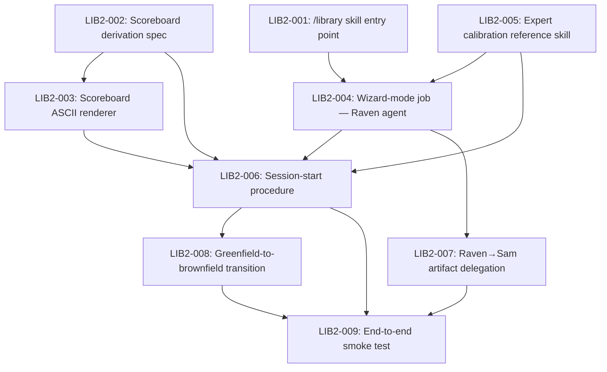

# Phase 2: Raven Orchestrates the Wizard

## Goal

Transform the wizard from a skill Raven performs into a room Raven inhabits. Raven gets a `/library` entry point and a wizard-mode job: she reads the library's current state, renders a scoreboard of knowledge area fill levels, and conducts library configuration as an orchestrator — eliciting through conversation, writing confirmed initialize artifacts directly, delegating card-like artifact production to Sam, and issuing round-by-round stopping-point calls. The user meets a guide, not a form.

## Scope

**In scope:**
- `/library` skill entry point (thin; routes to Raven's wizard-mode job)
- Wizard-mode job in Raven's agent definition
- Scoreboard derivation spec: algorithm for computing fill levels from alexandria-config.json + library state
- Scoreboard ASCII renderer (Foundation / Core / Amplifier buckets with bar-fill display)
- Session-start procedure: read state, render scoreboard, orient (first-time vs returning)
- Expert calibration as Raven reference skill (`skills/raven/expert-calibration.md`)
- Artifact-production protocol for wizard mode: Raven writes confirmed initialize artifacts directly, Sam writes card-like artifacts
- Greenfield-to-brownfield transition handling in session-start
- End-to-end smoke test (two scenarios, human-run, documented)

**Out of scope:**
- Async/parallel agent execution (Phase 3 concern)
- Eval case hardening (post-smoke-test; build first, harden after)
- Automated eval coverage for wizard-mode sessions
- Changes to the wizard engine YAML or tier assignment logic
- Changes to downstream agent behavior (Conan, Bridget, Solomon)

**Phase 1 prerequisite:** Raven's voice is already in the wizard skill (`skills/initialize/SKILL.md`), greenfield fast-lane is implemented. Phase 2 builds on that foundation.

## Success Outcomes

| ID | Outcome | Tier | Tickets |
|----|---------|------|---------|
| O-1 | `/library` entry point exists and invokes Raven in wizard-mode | Must | LIB2-001, LIB2-004 |
| O-2 | Scoreboard renders correctly for all 48+ wizard configurations | Must | LIB2-002, LIB2-003 |
| O-3 | Raven can complete full library initialization through conversation with the correct writer boundary for each artifact | Must | LIB2-007, LIB2-009 |
| O-4 | Session continuity works — returning users see updated scoreboard and pick up where they left off | Should | LIB2-006, LIB2-008 |
| O-5 | Expert calibration material is loaded by Raven in wizard-mode and shapes her guidance posture | Should | LIB2-005 |

## Context Summary

The wizard as built (Phase 1) is Raven's voice applied to a linear procedure. Phase 2 removes the linear procedure as the driver and replaces it with Raven's judgment. The wizard engine YAML, solicitation prompts, and output artifacts remain unchanged — what changes is that producing them is Raven's orchestration goal, not the user's form-filling work.

The key architectural insight: Raven elicits and conducts, writes confirmed initialize artifacts directly, and leaves card-like artifacts to the agents. This keeps card authorship clean, removes unnecessary initialize-artifact round trips, and still leaves the architecture ready for sequential-to-parallel backgrounding when the platform supports it.

The scoreboard is the persistent artifact that makes this an iterative room rather than a one-time command. Derived from alexandria-config.json + library state on every session start, it is always current — even when cards were added or graded by other agents between sessions.

Source material:
- `docs/alexandria/sources/vision-wizard-becomes-raven.md` — vision and design decisions
- `docs/alexandria/sources/expert-calibration-library-construction.md` — practitioner heuristics
- `docs/alexandria/sources/wizard-improvement-opportunities.md` — improvement opportunities
- `.context/raven-wizard-as-raven.md` — full handoff with decided questions

## Decisions

| # | Decision | Options Considered | Chosen | Rationale |
|---|----------|-------------------|--------|-----------|
| 1 | Entry point command | `/assemble`, `/initialize`, `/build`, `/library` | `/library` | Names what you're building, not the action. Signals the persistent room. |
| 2 | Raven's write authority in wizard-mode | Raven writes everything directly; Raven writes initialize artifacts directly and directs card-like artifact work; Raven directs agents for all artifacts | Raven writes initialize artifacts directly and Sam writes card-like artifacts | Keeps card authorship and quality gates with Sam while removing unnecessary handoffs for initialize artifacts |
| 3 | Scoreboard persistence | Persisted separately in a state file; derived from alexandria-config.json + library state | Derived from state | Reconstructible at any time by any agent; always current; no state-sync problem |
| 4 | Sequential vs parallel agent execution | Parallel (Raven talks while Sam drafts); sequential (Raven directs Sam, waits) | Sequential for Phase 2 | Platform does not currently support async subagent calls; door left open for Phase 3 |
| 5 | Eval strategy | Design eval harness before building; build first then harden | Build first, harden after | "Build it, play with it, then harden." Eval cases designed before experience exists are theoretical. |
| 6 | Scoreboard fill states | Binary (has card / no card); continuous %; five lifecycle markers | Five states (0/25/50/75/100%) | Maps to expert calibration lifecycle markers; coarse enough to be reliable, fine enough to be informative |

## Risks

| Type | Description | Mitigation |
|------|-------------|------------|
| Risk | Session continuity depends on reliable state reconstruction — if alexandria-config.json is stale or library has drifted, scoreboard may be wrong | Derivation spec (LIB2-002) defines reconciliation precisely; Raven surfaces deltas explicitly rather than silently applying stale state |
| Risk | Raven's opus model cost for wizard-mode sessions — long conversations with a high-reasoning model are expensive | Session-start procedure ends with a stopping-point call that gives users a clear "done for now" signal; no unbounded sessions |
| Risk | Sam artifact quality when directed conversationally vs from structured handoffs — card-like artifacts may be malformed | Delegation protocol (LIB2-007) specifies what Raven must include in Sam's direction; smoke test (LIB2-009) validates quality before shipping |
| Risk | Scoreboard shapes (48+ configurations) may not all render gracefully at different area-name lengths | Renderer (LIB2-003) tested against wide-name and narrow-name configurations; truncation/alignment handled explicitly |
| Assumption | The checked-in Raven agent/job handoff conventions are sufficient for sequential Raven→Sam coordination | Review the live Raven initialize procedure and agent completion guidance before LIB2-007; extend them if needed |

## Execution Phases

**Phase A — Foundation (parallelizable):**
LIB2-001 (entry point), LIB2-002 (derivation spec), LIB2-005 (expert calibration) can all start in parallel.

**Phase B — Core infrastructure:**
LIB2-003 (renderer, blocked by LIB2-002), LIB2-004 (wizard-mode job, blocked by LIB2-001, LIB2-005) can run in parallel.

**Phase C — Session logic:**
LIB2-006 (session-start, blocked by LIB2-002, LIB2-003, LIB2-004, LIB2-005), LIB2-007 (delegation, blocked by LIB2-004) can run in parallel.

**Phase D — Transitions and validation:**
LIB2-008 (greenfield-to-brownfield, blocked by LIB2-006), LIB2-009 (smoke test, blocked by LIB2-006, LIB2-007, LIB2-008).

**Critical path:** LIB2-002 → LIB2-003 → LIB2-006 → LIB2-008 → LIB2-009

## Ticket Index

| ID | Title | Enabler | Tier | Outcome | Blocked By | Blocks |
|----|-------|---------|------|---------|------------|--------|
| LIB2-001 | Create /library skill entry point | false | must | O-1 | — | LIB2-004 |
| LIB2-002 | Define scoreboard derivation spec | true | must | O-2 | — | LIB2-003, LIB2-006 |
| LIB2-003 | Implement scoreboard ASCII renderer | false | must | O-2 | LIB2-002 | LIB2-006 |
| LIB2-004 | Add wizard-mode job to Raven's agent definition | false | must | O-1 | LIB2-001, LIB2-005 | LIB2-006, LIB2-007 |
| LIB2-005 | Encode expert calibration as Raven reference skill | true | should | O-5 | — | LIB2-004, LIB2-006 |
| LIB2-006 | Implement session-start procedure | false | should | O-4 | LIB2-002, LIB2-003, LIB2-004, LIB2-005 | LIB2-008, LIB2-009 |
| LIB2-007 | Implement Raven→Sam artifact delegation | false | must | O-3 | LIB2-004 | LIB2-009 |
| LIB2-008 | Handle greenfield-to-brownfield transition | false | should | O-4 | LIB2-006 | LIB2-009 |
| LIB2-009 | End-to-end smoke test | false | must | O-3 | LIB2-006, LIB2-007, LIB2-008 | — |

## Library Updates

See [library-updates.md](library-updates.md).

## Deferred

**Async/parallel agent execution** — Phase 3 concern. Platform does not currently support true async subagent calls. The sequential model (Raven writes initialize artifacts directly, directs Sam when card-like artifacts are needed, waits, presents, continues) is sufficient for Phase 2. When async becomes available, the split between Raven-owned initialize artifacts and agent-owned card work still separates roles cleanly for parallelism.

**Eval case hardening** — Intentionally deferred until after the smoke test. Eval cases designed before the experience exists are theoretical. The smoke test (LIB2-009) produces the raw material for knowing what to evaluate: which scenarios are most important, which failure modes actually occur, where Raven's judgment most needs guidance.

**Synopsis paragraph** — The expert calibration material describes Raven giving a "synopsis paragraph" of her assessment of whether a library build is "off." This requires internalized exemplars across product types. Phase 2 provides the calibration reference skill as a starting point; the synopsis paragraph behavior emerges from Raven applying that calibration. If it proves weak in the smoke test, it becomes a Phase 3 explicit feature.

**Eval structural checks for wizard-mode** — Currently the wizard has eval coverage at `tests/evals/wizard/`. Wizard-mode sessions are LLM-mediated and require LLM-as-judge evaluation. Define eval cases post-smoke-test.

> **Update at close-out:** eval cases were defined downstream in the `initialize-ritual-restoration` plan (FEAT-066), against the split first-session/returning-session surface rather than the wizard-mode-as-single-job surface. The "build first, harden after" decision held — cases written against the composed, shipped surface were materially stronger than what Phase 2 could have specified up front.

## Completion Status

All nine tickets shipped; all five outcomes met. Closing as **complete**.

Several tickets shipped in their Phase 2 form and were then substantially refactored by the downstream `initialize-ritual-restoration` plan (FEAT-061 through FEAT-066). That refactor is recorded in its own close-out; for Phase 2 purposes, the tickets shipped and their outcomes were validated — what the refactor changed is the *shape*, not whether the outcome was met.

| ID | Outcome | Tier | Result |
|----|---------|------|--------|
| O-1 | `/library` entry point exists and invokes Raven in wizard-mode | Must | Shipped — `packages/alexandria-plugin/skills/library/SKILL.md` routes to Raven; Job Dispatch table resolves wizard-mode context (later split into first-session / returning-session) |
| O-2 | Scoreboard renders correctly for all 48+ wizard configurations from live library state | Must | Shipped — `scoreboard-derive.ts` + `scoreboard.ts` ship as the derivation and rendering CLIs, exercised live in every returning-session open |
| O-3 | Raven can complete full library initialization through conversation with correct writer boundary | Must | Shipped — `job-first-session.md` runs the conversational ritual; Raven writes `alexandria-config.json` directly per Decision #2, Sam handles card-like artifacts |
| O-4 | Session continuity works — returning users see updated scoreboard and pick up where they left off | Should | Shipped — session-start procedure (LIB2-006) later rebuilt as `job-returning-session.md` with git-log drift detection, but continuity semantics are intact and stronger |
| O-5 | Expert calibration material is loaded by Raven in wizard-mode and shapes her guidance posture | Should | Shipped — `packages/alexandria-plugin/skills/raven/expert-calibration.md` exists and is loaded on entry by both Raven jobs |

Ticket-level evidence:

| Ticket | State | Evidence |
|--------|-------|----------|
| LIB2-001 | Shipped | `skills/library/SKILL.md` is the thin entry point; we're running it now |
| LIB2-002 | Shipped | `packages/ax/src/tools/scoreboard-derive.ts` + `scoreboard-derive-matchers.ts` + `scoreboard-derive-types.ts` implement the derivation spec with tests |
| LIB2-003 | Shipped | `packages/ax/src/tools/scoreboard.ts` renders Foundation/Core/Amplifier buckets; output verified live |
| LIB2-004 | Shipped → refactored | Shipped as a single wizard-mode job; later split by FEAT-061 into first-session and returning-session jobs |
| LIB2-005 | Shipped | `skills/raven/expert-calibration.md` checked in; loaded on entry by the Raven jobs |
| LIB2-006 | Shipped → refactored | Session-start procedure shipped, then rebuilt as `job-returning-session.md` in FEAT-064 with git-log drift replacing directory heuristics |
| LIB2-007 | Shipped | Raven writes confirmed initialize artifacts directly per Decision #2; Sam handles card-like artifacts. PR #393 (FEAT-056) completed this boundary. |
| LIB2-008 | Shipped → generalized | Greenfield-to-brownfield transition shipped; later generalized by FEAT-064 into git-log drift detection that handles all drift, not just that one case |
| LIB2-009 | Shipped as live exercise | The two scenarios (greenfield init, returning-session) were exercised through live usage, including the session this close-out is being recorded in. No separate written smoke-test record was produced — the plan's "build first, harden after" decision absorbed this as ongoing live validation rather than a one-time artifact. |

## Decisions Made During Execution

| Decision | What happened | Why |
|----------|---------------|-----|
| Split wizard-mode into two jobs | LIB2-004 shipped a single wizard-mode job; downstream, `initialize-ritual-restoration` split it into first-session and returning-session jobs. | First-session is a linear ritual; returning-session is orientation-plus-dispatch. Combining them licensed a branch-inside-ritual shape that collapsed under load (the FEAT-045 regression). The split is what this plan's geometry was reaching for. |
| Session-start rebuilt | LIB2-006 shipped a session-start procedure that grew to 19 steps in use; FEAT-064 rebuilt it as a 6-beat concierge opener. | Procedures balloon under use. The original shape tried to enumerate every sub-case; the rebuilt one names the decision points and lets judgment handle sub-cases. |
| Greenfield-to-brownfield generalized | LIB2-008 handled the specific greenfield→brownfield case; FEAT-064 generalized it to `git log --since=<config.generated>` drift detection applicable to all drift. | The specific case was one instance of a general question: "what changed since last init?" Generalizing compressed the procedure and made the capability reusable. |
| Smoke-test artifact shape | Plan called for a documented written smoke test (Scenario 1 greenfield + Scenario 2 returning). In practice the workflow was validated through live `/library` usage rather than a one-time written record. | The live path produced continuous validation signal; a single written artifact would have frozen in time. Continuous usage caught regressions the scripted test wouldn't have (e.g., the FEAT-045 depth regression that prompted `initialize-ritual-restoration`). |
| Initialize engine → TypeScript | Not in plan scope; PR #32 moved engine logic from prose into `packages/ax/src/engine/initialize/` during the downstream refactor. | Reduced the prose surface the job procedures had to describe. Complements Phase 2's "wizard becomes a room, not a form" intent by making the deterministic bits actually deterministic. |

## Retrospective

**Planned vs actual.** Phase 2's shipped shape was close to what the plan described. The largest deviation wasn't in Phase 2 itself but downstream: `initialize-ritual-restoration` refactored the wizard-mode job, session-start procedure, and greenfield transition into a different geometry within a few months of Phase 2 shipping. That's not a Phase 2 failure — it's evidence that shipping the room earns you the information needed to reshape it. A hypothetical "wait until we have the right shape" alternative would have delayed Phase 2 indefinitely.

**Things that held up.**

- *Derive-from-state over persisted state* (Decision #3) was the right call and survived every subsequent refactor cleanly. The scoreboard CLI produces the same output whether called from first-session init, returning-session open, or ad hoc. No state-sync bugs because there's no persisted state to drift.
- *Raven writes initialize artifacts, Sam writes card-like artifacts* (Decision #2) was ahead of its time — the boundary held through the refactor and is the pattern other skills inherit now.
- *Build first, harden after* (Decision #5) was correct. Eval cases written against the composed, shipped surface (in FEAT-066, downstream) were materially stronger than anything Phase 2 could have specified up front. The deferred hardening was real work that happened when it could produce durable artifacts.

**Things to carry forward.**

- **Procedures balloon under use.** Session-start grew from clean intent to 19 steps before FEAT-064 pulled it back to 6 beats. Watch for procedural growth as a specific failure mode, and prune when it shows up.
- **Combining ritual and orientation into one job is a known trap.** Linear rituals and branched orientations have different shapes; combining them creates the branch-inside-ritual problem that licenses skipping under LLM load. When a plan calls for "a mode that handles both first-time and returning," split it up front.
- **Shipping the room is a prerequisite for knowing the room.** Phase 2 could not have specified the first-session / returning-session split or the git-log drift generalization ahead of time. The live workflow produced the signal that made the downstream refactor possible. Plans that try to pre-specify the right shape ahead of use tend to pay for it in delay and wrong answers.
- **Eval deferral is legitimate when the surface is still forming.** The plan's decision to defer eval hardening wasn't laziness — it was correct sequencing. Evals against a surface that's about to be refactored are waste; evals against the composed, shipped surface are durable. Name this explicitly when deferring, so future plans don't read it as a gap.
