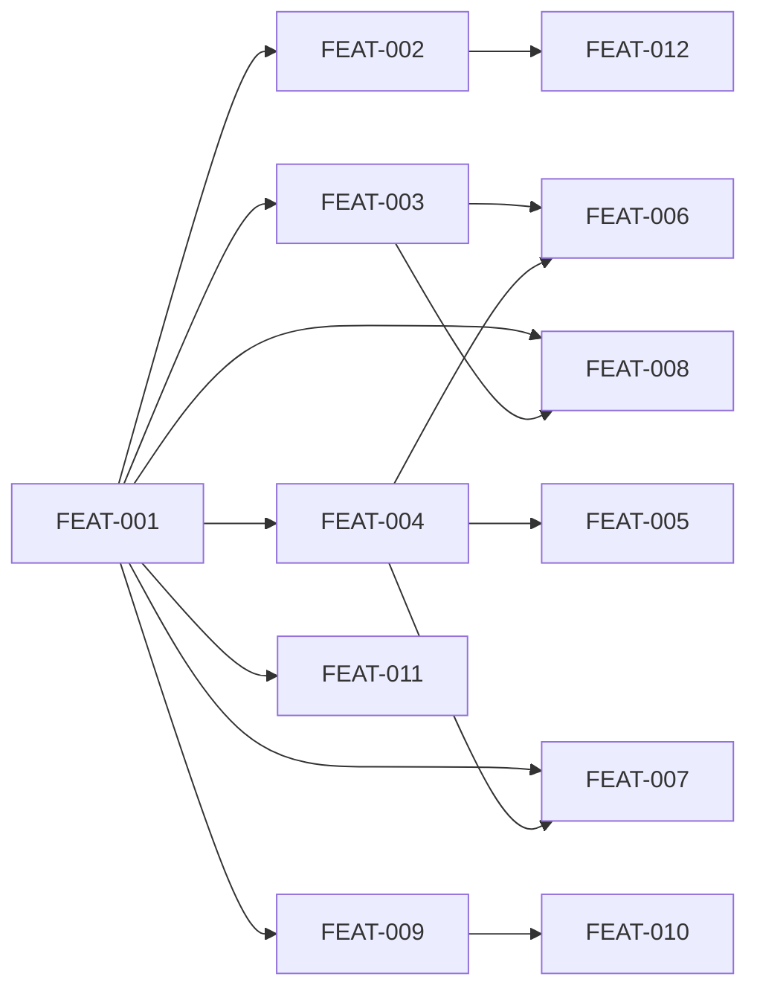

# Alexandria Library Viewer

## Goal

Build a local web interface for browsing the Alexandria product knowledge library.
The viewer renders the markdown wiki from `docs/alexandria/` as navigable HTML with
clickable wikilinks, a dashboard overview, sidebar navigation, and a plans section.
It runs as a CLI tool (`bin/alexandria-viewer`) with file watching for live development
and static export for sharing.

## Scope

**In scope:**
- Astro + React static site generated from library markdown
- CLI entry point following existing Alexandria wrapper pattern
- Card rendering with five-dimension layout and wikilink navigation
- Sidebar directory tree mirroring folder structure
- Dashboard with library health metrics from graph parser
- Plans section rendering releases, outcomes, and tickets
- File watching and hot reload during development
- Static build mode for offline/CI use
- Alexandrian visual theme (Tailwind CSS)

**Out of scope:**
- Editing library content from the browser (read-only viewer)
- Authentication or multi-user access (single-user local tool)
- Search functionality (deferred to future iteration)
- Graph visualization / node-link diagram (deferred)
- Agent integration / wizard prompting to start viewer (noted for future)
- Deployment to hosted infrastructure

## Success Outcomes

| ID | Outcome | Tier | Tickets |
|----|---------|------|---------|
| O-1 | Library cards render as navigable HTML with clickable wikilinks | must | FEAT-003, FEAT-004, FEAT-005, FEAT-006, FEAT-011 |
| O-2 | CLI command starts a local dev server with file watching | must | FEAT-001, FEAT-002, FEAT-012 |
| O-3 | Sidebar tree mirrors the library folder structure | must | FEAT-007 |
| O-4 | Dashboard overview shows library health and breadth | should | FEAT-008 |
| O-5 | Plans section renders releases, outcomes, and tickets | should | FEAT-009, FEAT-010 |

## Context Summary

See [CONTEXT_BRIEFING.md](CONTEXT_BRIEFING.md) for the full briefing from Bridget.

**Key findings:**
- The graph parser (`src/lib/graph.ts`) already implements card parsing, wikilink
  resolution, and all metrics the dashboard needs. The viewer imports it directly.
- Library cards follow a five-dimension pattern (WHAT/WHERE/WHY/WHEN/HOW) with
  wikilinks as `[[Type - Name]] -- context phrase`. ~190 cards across 18 types.
- The folder structure (`library/{layer}/{type-plural}/`) encodes the type taxonomy
  and should be mirrored in sidebar navigation.
- Implementation plans have a distinct structure (release.md + outcomes/ + tickets/)
  and must remain separate from the library card browser.
- The aesthetic north star is "a well-run franchise" — clean, quiet, purposeful.
- This is the first human-browsing surface; the library was designed AI-native.
  The viewer makes AI-native structure legible to humans without changing the format.

## Decisions Made During Planning

| Decision | Options Considered | Chosen | Rationale |
|----------|-------------------|--------|-----------|
| D1: Code location | repo root, src/viewer/, packages/viewer/ | `packages/viewer/` workspace | Clean separation, own deps, monorepo-friendly |
| D2: Graph consumption | Direct import, JSON data layer, Both | Direct TypeScript import | Avoids duplication, Astro supports TS natively |
| D3: Output modes | Dev only, Static only, Both | Dev server + static build | Dev for authoring, static for sharing/CI |
| D4: Styling approach | Tailwind, Pico/classless, Hand-crafted CSS | Tailwind + custom Alexandrian theme | Fast iteration, full visual control |
| D5: Wikilink context display | Inline, Tooltip, Both | Inline styled text | Matches Legible Graph experience goal |

## Risks and Assumptions

| Type | Description | Mitigation | Tickets Affected |
|------|-------------|-----------|-----------------|
| Risk | Cross-workspace TypeScript imports may need Vite/Astro alias config | FEAT-003 validates the import path early | FEAT-003, FEAT-006, FEAT-008 |
| Risk | Astro content collection custom loaders for external dirs may have limitations | Test early; fall back to symlinks if needed | FEAT-004, FEAT-009 |
| Risk | File watching for external dirs may not trigger content collection invalidation | Configure Vite watcher explicitly; may need custom plugin | FEAT-012 |
| Assumption | Bun workspace linking works cleanly with Astro | Validated by Astro's official Bun support | FEAT-001 |
| Assumption | Graph parser performance is sufficient for build-time use (~190 cards) | Parser is already fast for CLI tools; same data volume | FEAT-008 |

## Execution Phases

### Phase 1: Scaffolding (FEAT-001, FEAT-003, FEAT-011)
Set up the Astro workspace, wire the graph parser import, and establish the visual
theme. This is the foundation everything else builds on.

### Phase 2: Core Card Rendering (FEAT-004, FEAT-005, FEAT-006)
Content collection for library cards, card page layout with five dimensions, and
wikilink plugin. After this phase, cards are browsable with working navigation.

### Phase 3: Navigation & CLI (FEAT-002, FEAT-007, FEAT-012)
Sidebar tree, CLI entry point, and file watching. After this phase, the viewer is
a usable tool with proper entry point and navigation.

### Phase 4: Dashboard & Plans (FEAT-008, FEAT-009, FEAT-010)
Dashboard overview page and plans section. These are Should-tier outcomes that
complete the feature set.

## Re-planning Triggers

- **Astro content collection limitations:** If custom loaders can't handle external
  directories, re-evaluate the content strategy (symlinks, copy-on-build, etc.)
- **Cross-workspace import failure:** If TypeScript imports from `src/lib/` don't
  work cleanly in Astro, consider a JSON data layer approach (option from D2)
- **Scope expansion:** If the user wants search, graph visualization, or agent
  integration, create a follow-up plan rather than expanding this one

## Ticket Index

| ID | Title | Enabler | Tier | Outcome | Blocked By | Blocks |
|----|-------|---------|------|---------|------------|--------|
| FEAT-001 | Initialize Astro workspace package | false | must | O-2 | — | FEAT-002, FEAT-003, FEAT-004, FEAT-007, FEAT-008, FEAT-009, FEAT-011 |
| FEAT-002 | Create CLI entry point | false | must | O-2 | FEAT-001 | FEAT-012 |
| FEAT-003 | Wire graph parser import | false | must | O-1 | FEAT-001 | FEAT-006, FEAT-008 |
| FEAT-004 | Astro content collection for cards | false | must | O-1 | FEAT-001 | FEAT-005, FEAT-006, FEAT-007 |
| FEAT-005 | Card page layout with five dimensions | false | must | O-1 | FEAT-004 | — |
| FEAT-006 | Wikilink remark plugin | false | must | O-1 | FEAT-003, FEAT-004 | — |
| FEAT-007 | Sidebar directory tree | false | must | O-3 | FEAT-001, FEAT-004 | — |
| FEAT-008 | Dashboard overview page | false | should | O-4 | FEAT-001, FEAT-003 | — |
| FEAT-009 | Plans content collection | false | should | O-5 | FEAT-001 | FEAT-010 |
| FEAT-010 | Plan detail view | false | should | O-5 | FEAT-009 | — |
| FEAT-011 | Alexandrian Tailwind theme | false | must | O-1 | FEAT-001 | — |
| FEAT-012 | File watching and static build | false | must | O-2 | FEAT-002 | — |

## Library Updates

See [library-updates.md](library-updates.md).

## Completion Status

Closing as **partial** — all 12 tickets have shipped code in `packages/viewer/`, but the Must outcomes are functionally compromised: the design is useless, the CLI surface has drifted underneath the viewer, and the artifact was never dogfooded to validate that it actually works end-to-end. The plan is being closed not because the work is done well, but because leaving it as `pending` misrepresents the state. A full rebuild is expected in a future release.

| ID | Outcome | Tier | Result |
|----|---------|------|--------|
| O-1 | Library cards render as navigable HTML with clickable wikilinks | Must | Code shipped (FEAT-003 through FEAT-006, FEAT-011) — untested under real use; design is unusable |
| O-2 | CLI command starts a local dev server with file watching | Must | Code shipped (FEAT-001, FEAT-002, FEAT-012) — CLI surface has since drifted (alxndr→ax rename, monorepo rehome); integration likely broken, unvalidated |
| O-3 | Sidebar tree mirrors the library folder structure | Must | Code shipped (FEAT-007) — present but unusable in the larger context |
| O-4 | Dashboard overview shows library health and breadth | Should | Code shipped (FEAT-008) — same caveats |
| O-5 | Plans section renders releases, outcomes, and tickets | Should | Code shipped (FEAT-009, FEAT-010) — same caveats |

Ticket-level evidence:

| Tickets | State |
|---------|-------|
| FEAT-001 through FEAT-012 | All have commits in `packages/viewer/`; structure present (components, pages, plugins, content.config.ts, lib, styles) — but the artifact was never validated under sustained real use |

## Decisions Made During Execution

| Decision | What happened | Why |
|----------|---------------|-----|
| Skipped prototype / design pass | The plan did not include a prototype step. Execution went straight to implementation and shipped a first-pass design that turned out to be useless. | The plan treated "get to something" as the goal. No intermediate design check (mockup, customer session, paper prototype) was built into the sequence. |
| Skipped end-of-plan dogfooding | After the code shipped, there was no "human uses this for a week and feeds back" phase. | Same "ship it" pressure. No explicit dogfooding ticket was created, and without one nobody returned to exercise the viewer in anger. |
| Accepted CLI drift without re-validation | Between ship and close-out, the broader CLI underwent an `alxndr`→`ax` rename and the plugin was rehomed into `packages/alexandria-plugin/`. Viewer integration was not re-verified against those changes. | Drift was only noticed because the viewer wasn't being used. If it had been under daily use, the breakage would have surfaced immediately. |

## Retrospective

**Planned vs actual.** The plan's 12-ticket scope executed on paper — every FEAT has commits and the expected file layout exists. But the plan under-specified the two phases that would have caught the problem: a prototyping beat before implementation, and a dogfooding beat after it. With both absent, "shipped" and "useful" diverged — the code shipped, the viewer is not useful, and the CLI surface moved underneath it while nobody was using the artifact.

**Things to carry forward.**

- **Skipping the prototype is a design tax, not a time savings.** "Getting to SOMETHING" is not the same as getting to something useful. When the prototype step is cut, the plan needs an explicit substitute — paper mockup, customer session, design review, *anything* — before committing to implementation. Otherwise the plan is shipping blind. For surfaces with no prior design reference (the viewer was Alexandria's first human-browsing surface), the prototype is not optional.
- **End-of-plan dogfooding is where real feedback emerges — and its absence is the canary for rot.** Writing the code doesn't validate it; using it does. A plan that ships code but skips the "human uses this for a week" phase leaves the feedback loop open, and the open loop is *also* what lets adjacent surfaces (CLI rename, rehome) drift underneath the artifact unnoticed. Dogfooding catches drift as a byproduct of catching design problems. Bake it in as a ticket, not an afterthought.
- **"Something is better than nothing" is a false trade when the something is useless.** Zero-UI is an honest signal ("we haven't built this yet") that preserves the design space. Bad-UI is a *misleading* signal ("we have this, just not well") that blocks the real design, because now there's something to "fix" rather than something to design from scratch. The next viewer attempt should consider whether the current artifact is a useful starting point or a liability to throw away — and be willing to choose the latter.

## Deferred

- **Full rebuild of the viewer as a separate future plan.** The shipped artifact is not a useful starting point for the real product. A future plan should begin with a prototype/design phase, explicitly include dogfooding as a closing ticket, and decide up front whether to build on or discard the current `packages/viewer/` code. The current artifact can remain in the repo as reference but should not be treated as partial progress toward the real viewer.
- **CLI surface re-wiring if the current code is kept.** If any of the current viewer is preserved, it needs explicit revalidation against the `ax` CLI and the `packages/alexandria-plugin/` layout.
