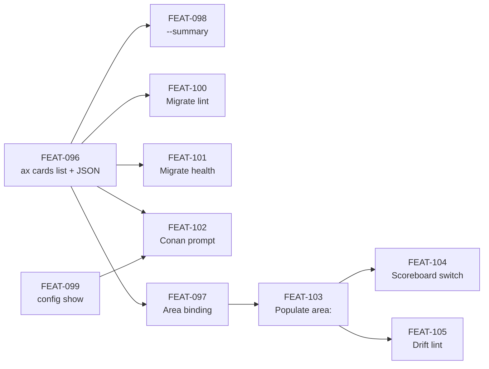

# Manifest Dissolution — Phase 1

## Goal

Extract inventory queries from `manifest.md` into composable CLI tools,
migrate every code and agent reader off manifest inventory tables, and
fix the scoreboard so cards are consistently categorized and scored.

This phase closes the arc that PR #87 (matcher orphan cleanup) and the
type-claim taxonomy reification (PR #88, this branch) opened. The
original observation — that cards should self-declare their knowledge
area in YAML frontmatter rather than be matched by filename heuristics —
is finally paid off here.

## Scope

In scope:

- New `ax cards list` command surface with type/layer filters, JSON output, and summary mode
- New `ax config show` command
- `parseCardFrontmatter` stays lenient while supporting fields used by shipped readers
- New `Standard - Card Frontmatter Schema` library card documenting the schema
- Migration of `lint-manifest.ts` Sweep 4 inventory reads to CLI
- Migration of `health-check.ts` inventory reads to CLI
- Update of `Agent - Conan` prompt to use CLI for inventory queries
- Population of `area:` field on all 141 library cards
- Switch of `scoreboard-derive.ts` from path-based matchers to frontmatter `area:`
- Drift-lint check enforcing area/folder consistency

Out of scope (deferred — see Deferred section):

- `expected_cards` mechanism (blocked on beads + ledger data layer)
- Anti-pattern rehoming of 6 existing `Artifact - Anti-Pattern` cards (separate plan)
- `ax conformance show` command (blocked on graph-edge schema design)
- `ax dag` extensions for cards (blocked on graph-edge schema design)
- Deletion of `manifest.md` itself (blocked on data layer)
- Promotion of Enumeration Decisions and HUMAN JUDGMENT NEEDED items to Decision cards
- Conan grades in card frontmatter (future architectural shift)
- Plugin templates folder rename (deferred until natural breaking change)
- Full `WHERE` graph-edge schema (separate library card and implementation plan)
- Provenance/classification frontmatter (`source`, `classification_rationale`) until Conan writes it, Sam stores it, and readers consume it in one horizontal slice

## Success Outcomes

| ID | Outcome | Tier |
|----|---------|------|
| O-1 | Inventory CLI is composable: `ax cards list` with type/layer filters, `--json`, `--summary`, plus `ax config show` work end-to-end | Must |
| O-2 | `Standard - Card Frontmatter Schema` documents the active stored schema and defers unshipped fields until writer + reader behavior exists | Must |
| O-3 | Inventory readers route through CLI — `lint-manifest` Sweep 4, `health-check`, and `Agent - Conan` no longer parse manifest.md inventory tables | Must |
| O-4 | `ax cards --help` self-documents the surface | Could |
| O-5 | Cards bind to areas via frontmatter; scoreboard renders accurate area-attributed presence | Must |

## Context Summary

See `CONTEXT_BRIEFING.md` for the full Bridget-assembled context.
Highlights:

- **Primary cards**: `Primitive - Card`, `Standard - Type Claim Test`, `Principle - Each Card Type Makes One Kind of Claim`, `System - Knowledge Graph`, `Capability - Inventory`
- **Supporting cards**: `Standard - Five-Dimension Card Requirements`, `Capability - Linting`, `Capability - Health Check`, `Section - Card Repository`, `System - Gap Analysis Engine`, `Artifact - Type Taxonomy`
- **Surfaced gaps that this plan closes**: no CLI contract for inventory queries; no canonical frontmatter schema card; no decision card recording the dissolution direction; no area-binding via frontmatter (matcher table misfile rate ~20%)

## Decisions

| ID | Decision | Rationale |
|----|----------|-----------|
| D-1 | Phase 1 scope is "extract inventory queries"; full dissolution waits for Phase 2 | Manifest.md serves multiple roles (inventory, expected-cards, judgment notes); only inventory has a clean CLI replacement today |
| D-2 | `expected_cards` config field is NOT introduced in Phase 1 | No clean writer (init does not produce one; manifest.md was the only writer); right shape is a query over a future data layer, not a static config field |
| D-3 | `--area` filter ships as a reader contract before live population | Avoids a parser-only field while respecting the library-write boundary: FEAT-097 proves parser/filter behavior against fixtures, and FEAT-103 completes live area binding through the Conan/Sam population loop |
| D-4 | `status:` and `--status` are removed from Phase 1 | Active cards are derived from files present under the library; missing cards require expected_cards/data layer; retired cards need an archive or ledger mechanism rather than a card-local flag |
| D-5 | Manifest.md keeps expected-cards and judgment-notes tables through Phase 1 | No replacement exists yet; narrows manifest's role from "everything" to "expected cards plus judgment notes" |
| D-6 | Scoreboard already independent of manifest.md (uses `parseCardFrontmatter` + matchers); no migration ticket needed for scoreboard inventory reads | `scoreboard-derive.ts` walks filesystem directly; spec doc `scoreboard-derivation.md` lines 181-182 are stale and updated by FEAT-102 |
| D-7 | `getAreaMatchers` matcher table demoted to fallback (Option B), not deleted (Option A) | Fallback emits warnings if any card lacks `area:`; preserves graceful degradation during Phase 2 work |
| D-8 | Anti-pattern rehoming is a separate Slice 5 plan, not part of Phase 1 | Library content concern (Sam), not code; independent of CLI infrastructure |
| D-9 | FEAT-103 area-population ships in 4 commits, one per layer | Review tractability — 141 cards in one diff is unreviewable; ~28-75 per layer is digestible |
| D-10 | Relationship fields are removed from FEAT-096 | Existing `WHERE` sections use a richer verb set than `depends_on`/`constrains`/`parent`; graph-edge schema needs its own design instead of partial frontmatter fields |
| D-11 | Fields ship only in horizontal slices | `source`, `classification_rationale`, and `area` are not added as disconnected parser fields; each needs writer behavior and reader behavior in the same slice |

## Risks and Assumptions

| Risk / Assumption | Mitigation |
|-------------------|------------|
| Parser extension (FEAT-096) reveals undocumented frontmatter conventions across the live library | Lenient parsing — unknown fields remain accessible and do not error; run test suite against live library after parser change |
| Conan prompt edit (FEAT-102) subtly regresses Conan eval scores | Run eval before and after; keep manifest.md fallback in prompt during transition; revert if scores drop |
| `lint-manifest` migration (FEAT-100) changes Sweep 4 outputs subtly | Compare Sweep 4 output before-and-after on the live library; black-box integration tests |
| `health-check` migration (FEAT-101) changes report shape | Refactor only the inventory data path; do not change report structure in Phase 1 |
| Multiple "wired but no-op" filters confuse early users | Document explicitly in `--help` text; flag in Decision card |
| Area-population (FEAT-103) requires human judgment on ~40 cards | Sam writes, human reviews per layer; do not rush; budget 1-2 days for the sweep |
| Switching scoreboard to frontmatter (FEAT-104) changes scoreboard rendering visibly | Capture before/after in PR description; document the visual shift as the proof point |
| Drift-lint check (FEAT-105) produces false positives on edge cases | Calibrate strictness against live library during implementation; tune heuristic before merging |

## Execution Phases

**Phase 1A — Foundation (parser + CLI surface)**

1. FEAT-096 (`ax cards list` with type/layer filters and JSON) — first demoable slice
2. FEAT-098 (`--summary`) — generated replacement for manifest summary
3. FEAT-097 (`area` field + area filter) — reader/filter contract for area binding
4. FEAT-099 (`ax config show`) — parallel to 097/098

**Phase 1B — Reader migrations**

5. FEAT-100 (lint-manifest migration)
6. FEAT-101 (health-check migration)
7. FEAT-102 (Conan prompt + scoreboard doc fix)

**Phase 1C — Area binding (the user-visible value)**

8. FEAT-103 (populate `area:` on all 141 cards through Conan/Sam layer batches)
9. FEAT-104 (switch scoreboard from matchers to frontmatter)
10. FEAT-105 (drift-lint check)

**First demoable milestone**: After FEAT-096 lands, `ax cards list` walks
the library and emits inventory. That is the proof point that Phase 1 is
real.

**Critical path for primary Must outcomes**:

- O-1: FEAT-096 → FEAT-098 → FEAT-099
- O-2: Sam's library card plus FEAT-096's no-unused-fields parser stance
- O-3: FEAT-096 → (FEAT-100, FEAT-101, FEAT-102)
- O-5: FEAT-097 → FEAT-103 → FEAT-104 (reader contract, library population, scoreboard switch)

## Dependency Graph

## Re-planning Triggers

- If FEAT-096 reveals widespread frontmatter inconsistency across the live library, pause Phase 1B and 1C; surface a remediation plan before continuing
- If FEAT-102 Conan eval scores regress >10%, halt and diagnose before continuing reader migrations
- If FEAT-103 area-population reveals more than ~50 ambiguous cards (vs the projected ~40), revisit the area schema; consider promoting `informs:` to a canonical multi-area edge
- If beads + ledger work begins before Phase 1 completes, re-evaluate which deferred items can be promoted into Phase 1

## Ticket Index

| ID | Title | Tier | Layer |
|----|-------|------|-------|
| FEAT-096 | Implement first usable ax cards list inventory slice | must | 1A |
| FEAT-097 | Add area binding to ax cards list as a horizontal slice | must | 1A/1C |
| FEAT-098 | Add --summary mode to ax cards list | must | 1A |
| FEAT-099 | Implement ax config show | should | 1A |
| FEAT-100 | Migrate lint-manifest.ts Sweep 4 inventory reads to CLI | must | 1B |
| FEAT-101 | Migrate health-check.ts inventory reads to CLI | must | 1B |
| FEAT-102 | Update Agent - Conan prompt + fix stale scoreboard-derivation.md reference | should | 1B |
| FEAT-103 | Populate area: on all 141 library cards (per-layer commit batches) | must | 1C |
| FEAT-104 | Switch scoreboard-derive.ts from getAreaMatchers to frontmatter area: | must | 1C |
| FEAT-105 | Add drift-lint check: frontmatter area: vs folder consistency | should | 1C |
| FEAT-106 | Defer card status and retirement rendering to ledger/archive design | could | deferred |
| FEAT-107 | Add card provenance and classification fields end-to-end | should | deferred |

## Library Updates

See `library-updates.md` for the full list of cards Sam will create or
update as part of this plan. Highlights:

- **Create** `Standard - Card Frontmatter Schema`
- **Create** `Artifact - Decision: Dissolve Manifest Into CLI Tools (Phase 1)`
- **Update** WHEN sections on `Capability - Inventory`, `Capability - Linting`, `Capability - Health Check`, `Agent - Conan`, `Section - Card Repository`

## Deferred to Phase 2+

This plan defers a substantial amount of work. Each deferred item is
recorded here with what blocks it, so future planning sessions can pick
up the thread without re-deriving the constraints.

| Deferred Item | Blocked By | Notes |
|---------------|-----------|-------|
| `expected_cards` mechanism | Beads + ledger data layer | No clean writer in any current artifact; right shape is a query over structured data, not a static config field |
| Card status / retirement rendering | Archive or ledger design | Built is derived from active files on disk; missing is future expected-card data; retired cards need a real archive/ledger state before rendering |
| `--area` filter populated end-to-end | FEAT-097 + FEAT-103 | FEAT-097 adds the reader/filter contract; FEAT-103 makes it live and non-empty by populating library cards through the Conan/Sam loop |
| Full `WHERE` graph-edge schema | Dedicated graph-edge schema card and implementation plan | Must capture relationship verbs such as Implements, Conforming, Governs, Affects, Contained by, Parent, Depends on, References, and Related without flattening them into under-specified fields |
| Provenance/classification fields | FEAT-107 horizontal writer + reader slice | `source` and `classification_rationale` need Conan inventory output, Sam frontmatter writing, parser typing, and JSON/lint consumption together |
| `ax conformance show` | Graph-edge schema populated for conformance relationships | Standards and governed cards need a precise edge direction/source of truth before this command exists |
| `ax dag build-order` over cards | Graph-edge schema populated for build-order relationships | Existing `ax dag build-order` works on plan dirs only; card-level build order needs a real edge model |
| `ax dag dependents <Card>` | Same | Requires card dependency edge data |
| Deletion of `parseInventoryManifests()` | `expected_cards` mechanism | Function still parses manifest.md for the expected-cards half through Phase 1 |
| Deletion of `manifest.md` itself | All of the above | Manifest.md narrows in Phase 1 to expected-cards + judgment notes; full deletion waits for data layer |
| `Artifact - Anti-Pattern` rehoming (6 cards) | None — independent | Library content sweep; separate plan. Targets: convert each to Principle, Decision, or Standard per plan.md guidance |
| Promotion of Enumeration Decisions to Decision cards | None — independent | Library content sweep; per plan.md, each manifest "Enumeration Decisions" row becomes a first-class Decision card |
| Promotion of HUMAN JUDGMENT NEEDED items to Decision cards | None — independent | Same pattern as above |
| Drop BUILD_TO_LEARN section from manifest.md | None — independent | Plan.md flags this for cut; could ride along with any manifest cleanup |
| Drop Completion Status from manifest.md | None — independent | Eventual home is the Ledger (future shared data layer) |
| Conan grades stored in card frontmatter | Architectural decision | Plan.md flags this as the future shape; currently grades live in Conan transcripts |
| Plugin templates folder rename (`templates/` → `scaffolds/`) | None — minor | Deferred until a natural breaking change |
| Card-creation lifecycle documentation | None — gap | No card describes how cards come into being (signal triage, plan-driven, taxonomy-mandated). Surfaces during Solomon work but no formal home yet |

## Library Updates Reference

See `library-updates.md`.
