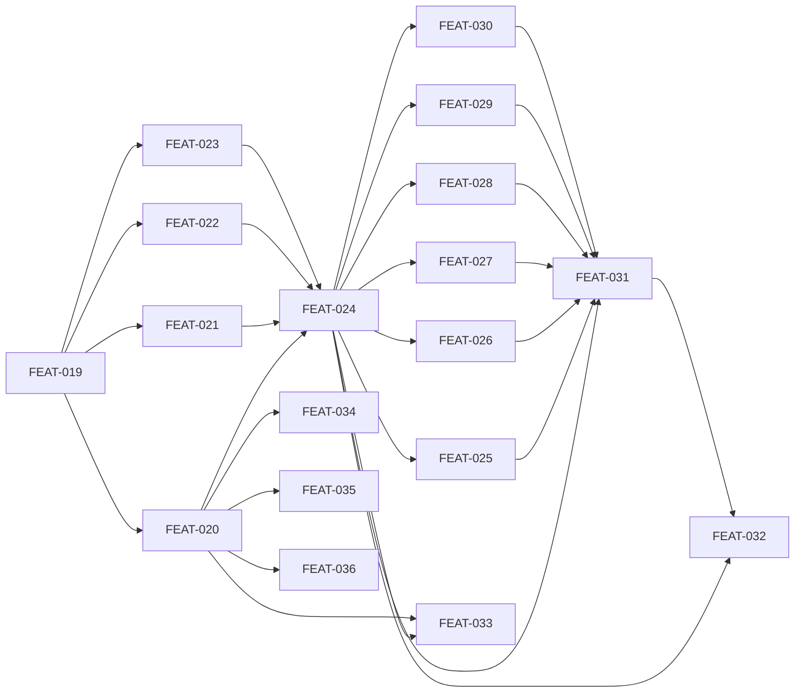

## Completion Status

All 18 planned tickets (FEAT-019 through FEAT-036) shipped. All 5 outcomes met:

- **O-1 (must) — met.** `alxndr lint` covers all 11 named targets plus the six Sweep 6 families (paths, plans, wizard, counts, grades, briefings) — FEAT-020, FEAT-025 through FEAT-030.
- **O-2 (must) — met.** `alxndr health-check` emits structured JSON and Conan's health-check skill consumes it via CLI pre-flight — FEAT-031, FEAT-032.
- **O-3 (should) — met.** Sweep names propagated across skills, agents, and cards — FEAT-020, FEAT-033.
- **O-4 (must) — met.** `alxndr` is the unified CLI surface; grade, dag, version, and update-check migrated; `bin/alexandria-*` wrappers deleted with no shims — FEAT-019 through FEAT-024.
- **O-5 (could) — met.** Gap-fill lint targets (lines, layers, library terminology) shipped — FEAT-034 through FEAT-036.

Additional follow-on work that emerged during execution and also shipped: FEAT-037 through FEAT-046 and FEAT-048 (see Retrospective).

## Decisions Made During Execution

| Decision | What Changed | Why |
|----------|--------------|-----|
| Extend Sweep 6 beyond the six planned families | Added FEAT-037 through FEAT-042 (L6 reconciliation, briefing compliance, count verification, conformance, internal consistency, downstream sync deviation) as follow-ons | Building the first six targets revealed the same mechanical pattern across more rule families than planned; easier to keep the momentum than defer |
| Retire Nit as an agent surface, not just software-ify it | FEAT-046 deletes the Nit agent file and skill directory; all dispatch references rewritten to `alxndr lint` calls (FEAT-043) | Once the CLI reached parity on mechanical checks, keeping a dispatch-only agent was dead surface area. Clean retirement was cheaper than maintaining a thin wrapper |
| Collapse `/wizard` into `/library` during this plan's tail | FEAT-045 + the `/wizard → initialize` rename shipped under this effort | The health-check and lint rework touched the same skill/agent surface; deferring the `/wizard` collapse would have forced a second doc-update pass |
| Unify Health Check and Quality Cycle in the playbook | FEAT-048 merged two previously-separate plays into one | The CLI pre-flight made the distinction between them obsolete — both are now one deterministic-then-judgment loop |
| Absorb terminology drift fix inline | FEAT-044 fixed `docs/design/alexandria.md` terminology drift discovered by the new `alxndr lint library` target | Found by the very tool this plan built — cheaper to close out with the doc corrected than to leave a known lint failure |

## Retrospective

**Planned vs actual.** Scope grew: the plan shipped all 18 planned tickets and another 11 follow-on tickets (FEAT-037 through FEAT-046, FEAT-048). The plan's core spine — CLI scaffold → migration → Sweep 6 → health-check refactor → naming — executed in the intended order. The surprise was downstream: once `alxndr lint` was real, it kept surfacing adjacent mechanical checks that were cheaper to add immediately than to carry as deferred work.

**What we learned:**
- **CLI-first consolidation pays compound interest.** Each new lint target after Phase 2 cost less than the one before it because the scaffolding, test harness, and result format were settled. Plans in this shape should expect scope to expand productively during Phase 2+, not stay fixed.
- **Agent retirement is a valid outcome of software-ification.** The plan framed Nit as "first target for software-ification," leaving agent retirement unstated. Execution showed that once a dispatch-only agent has a deterministic replacement, keeping the agent is net-negative. Future software-ification plans should make "retire the agent surface" an explicit option from day one.
- **Lint on the docs you just wrote.** Running the new `alxndr lint library` target against in-repo docs immediately found drift (FEAT-044). Building a linter is a great excuse to close out pre-existing documentation debt in the same slice — cheap and it proves the tool works.
- **The clean-break migration (FEAT-024) held up.** No backwards-compat shims, forced migration. No regressions reported post-landing. For tooling migrations where the user surface is small (this repo + dev scripts), "delete the wrappers" is the right default.

**What future plans should absorb:**
- Budget explicitly for follow-on tickets when building a tool that replaces human judgment with deterministic checks — the tool reveals the next layer of work as it lands.
- When a plan retires a role, retire the artifacts too (agent files, skill dirs, dispatch references). Do not leave vestigial surface area.

# Nit CLI Hardening

## Goal

Harden Alexandria's lint CLI into a complete, standalone `alxndr` tool that covers all mechanical checks from Nit's six sweep levels, consolidate all existing CLI tools under a unified `alxndr` command, and refactor Conan's health-check assessment to consume structured CLI output instead of relying on LLM for mechanical work. This is the first step in progressively hardening core skills — Library Health Check assessment first, then Solomon/Ingestion next.

## Scope

**In scope:**
- `alxndr` unified CLI entry point with subcommand router
- All 11 named lint targets (lines, cards, graph, layers, library, paths, plans, wizard, counts, grades, briefings)
- Sweep 6 deterministic checks (6 rule families: path resolution, plan status, wizard arithmetic, design doc counts, grade-evidence reconciliation, briefing compliance)
- `alxndr health-check` top-level subcommand with structured JSON output
- Migration of grade, dag, version, update-check under `alxndr`
- Deletion of migrated `bin/alexandria-*` wrappers (lint, grade, dag, version, update-check — no backwards compatibility)
- Conan health-check skill refactor to consume CLI output
- Sweep renaming from numbers to names across all skills and docs
- Removal of eval cases replaced by deterministic tests

**Out of scope:**
- Sweep 6 regression detection (requires two-snapshot architecture — deferred)
- Sweep 6 internal consistency (prose-vs-YAML semantics — requires judgment, stays with Nit agent) _(note: execution retired the Nit agent entirely via FEAT-046; this check is now unowned and should be picked up by a future plan)_
- npm/binary distribution packaging (deferred until tool is stable)
- Solomon/Ingestion hardening (next phase)
- New eval cases for lint or health-check

## Success Outcomes

| ID | Outcome | Tier | Tickets |
|----|---------|------|---------|
| O-1 | alxndr lint covers all mechanical checks across 11 named targets | must | FEAT-020, FEAT-025 through FEAT-030 |
| O-2 | Conan's health-check assessment consumes CLI output for mechanical steps | must | FEAT-031, FEAT-032 |
| O-3 | Lint targets have human-readable names used consistently across skills and docs | should | FEAT-020, FEAT-033 |
| O-4 | alxndr is the unified CLI with lint, health-check, grade, dag, version, update-check | must | FEAT-019 through FEAT-024 |
| O-5 | Sweep 1-5 gap fill for tab indentation, code block tags, terminology, manifest reconciliation | could | FEAT-034 through FEAT-036 |

## Context Summary

See [CONTEXT_BRIEFING.md](CONTEXT_BRIEFING.md) for the full briefing from Bridget.

Key findings:
- `src/tools/lint.ts` already implements sweeps 1-5 with solid deterministic test coverage
- `Library` class in `src/lib/graph.ts` provides all graph traversal primitives needed
- Sweep 6 is entirely absent from CLI — 6 of 8 rule families are deterministic
- Decision 7 (Nit as Independent Linter) explicitly calls for "software-ification" of mechanical checks
- Decision 31 (Sampling for Judgment, Exhaustive for Mechanics) mandates 100% coverage for mechanical checks
- No eval coverage exists for lint or health-check — deterministic tests are the primary gate

## Decisions Made During Planning

| Decision | Options Considered | Chosen | Rationale |
|----------|-------------------|--------|-----------|
| CLI structure | Flag-based (`--sweep`), subcommand-based, defer to spike | Subcommand-based under `alxndr` umbrella | Self-documenting, extensible, aligns with distribution goal |
| Sweep names | Various naming schemes | lines, cards, graph, layers, library, paths, plans, wizard, counts, grades, briefings | Plural where many items, singular where one thing (graph, library, wizard) |
| Health-check placement | Lint output format (`--format health-check`), top-level subcommand | Top-level subcommand (`alxndr health-check`) | Health-check is conceptually different from linting — status report vs problem finding |
| CLI consolidation scope | Lint+health-check only, full consolidation, scaffold only | Full consolidation — all tools under `alxndr` | One migration, clean break, no shims |
| Backwards compatibility | Shims, aliases, clean break | Clean break — delete all `bin/alexandria-*` | No maintenance burden, forced migration |
| Regression detection | Include in plan, scope out | Scoped out — deferred to future | Requires two-snapshot architecture that doesn't exist |
| Sweep 6 individual commands | Each rule family individually addressable, grouped under `system` | Individually addressable as lint targets | More granular control, self-documenting CLI surface |

## Risks and Assumptions

| Type | Description | Mitigation | Tickets Affected |
|------|-------------|-----------|-----------------|
| Risk | FEAT-024 has wide blast radius — every reference to `bin/alexandria-*` must be found and updated | Comprehensive grep before and after; CI as safety net | FEAT-024 |
| Risk | Sweep 6 path resolution needs to handle diverse path formats in skill/agent files | Start with common patterns, expand iteratively | FEAT-025 |
| Risk | `alxndr` binary name may conflict on PATH or npm | Check npm registry; use `@alexandria/cli` package name if needed | FEAT-019 |
| Assumption | Bun remains the runtime — `alxndr` is Bun-run TypeScript | If Bun changes, CLI entry point needs adaptation | All |
| Assumption | Grade data format is accessible for grade-evidence reconciliation | Check `src/tools/grade.ts` output format during implementation | FEAT-029 |
| Assumption | Existing test infrastructure adapts to new CLI entry points without major rework | Tests call tools as executables; changing the executable path is straightforward | FEAT-020 through FEAT-023 |

## Execution Phases

### Phase 1: CLI Scaffold + Migration (FEAT-019 through FEAT-024)
Build the `alxndr` entry point, migrate all existing tools under it, delete old wrappers. This is foundational — everything else depends on it.

### Phase 2: Sweep 6 Implementation (FEAT-025 through FEAT-030)
Add the six new lint targets for cross-system checks. Each is independent of the others but all depend on the migration being complete.

### Phase 3: Health-Check + Conan Refactor (FEAT-031, FEAT-032)
Build the health-check subcommand that aggregates lint output, then refactor Conan's skill to consume it.

### Phase 4: Naming + Documentation (FEAT-033)
Update sweep names across all skills and docs. Can happen in parallel with Phase 3.

### Phase 5: Gap Fill (FEAT-034 through FEAT-036) — Could
Fill remaining sweep 1-5 gaps. Independent of other phases, lowest priority.

## Re-planning Triggers

- If sweep 6 path resolution proves too noisy (too many false positives from diverse path formats), re-scope FEAT-025 to cover only explicit file path patterns
- If the health-check JSON schema proves insufficient for Conan's needs during FEAT-032, revise FEAT-031 schema before finalizing the Conan refactor
- If npm distribution is needed before this plan completes, add a distribution ticket

## Ticket Index

| ID | Title | Enabler | Tier | Outcome | Blocked By | Blocks |
|----|-------|---------|------|---------|------------|--------|
| FEAT-019 | alxndr CLI entry point and subcommand router | false | must | O-4 | — | FEAT-020, FEAT-021, FEAT-022, FEAT-023 |
| FEAT-020 | Migrate lint under alxndr lint with named targets | false | must | O-3 | FEAT-019 | FEAT-024, FEAT-033, FEAT-034, FEAT-035, FEAT-036 |
| FEAT-021 | Migrate grade under alxndr grade | false | must | O-4 | FEAT-019 | FEAT-024 |
| FEAT-022 | Migrate dag under alxndr dag | false | must | O-4 | FEAT-019 | FEAT-024 |
| FEAT-023 | Migrate version + update-check under alxndr | false | must | O-4 | FEAT-019 | FEAT-024 |
| FEAT-024 | Delete bin/alexandria-* wrappers and update all refs | false | must | O-4 | FEAT-020, FEAT-021, FEAT-022, FEAT-023 | FEAT-025, FEAT-026, FEAT-027, FEAT-028, FEAT-029, FEAT-030, FEAT-031, FEAT-032, FEAT-033 |
| FEAT-025 | alxndr lint paths — file path resolution | false | must | O-1 | FEAT-024 | FEAT-031 |
| FEAT-026 | alxndr lint plans — plan status verification | false | must | O-1 | FEAT-024 | FEAT-031 |
| FEAT-027 | alxndr lint wizard — wizard arithmetic | false | must | O-1 | FEAT-024 | FEAT-031 |
| FEAT-028 | alxndr lint counts — design doc counts | false | must | O-1 | FEAT-024 | FEAT-031 |
| FEAT-029 | alxndr lint grades — grade-evidence reconciliation | false | must | O-1 | FEAT-024 | FEAT-031 |
| FEAT-030 | alxndr lint briefings — briefing compliance | false | must | O-1 | FEAT-024 | FEAT-031 |
| FEAT-031 | alxndr health-check — structured JSON for Conan | false | must | O-2 | FEAT-024, FEAT-025, FEAT-026, FEAT-027, FEAT-028, FEAT-029, FEAT-030 | FEAT-032 |
| FEAT-032 | Refactor job-health-check.md for CLI pre-flight | false | must | O-2 | FEAT-024, FEAT-031 | — |
| FEAT-033 | Update sweep names across skills, agents, cards | false | should | O-3 | FEAT-020, FEAT-024 | — |
| FEAT-034 | alxndr lint lines — tab, code block, terminology | false | could | O-5 | FEAT-020 | — |
| FEAT-035 | alxndr lint layers — manifest reconciliation | false | could | O-5 | FEAT-020 | — |
| FEAT-036 | alxndr lint library — terminology sweep | false | could | O-5 | FEAT-020 | — |

## Library Updates

Applied. The Nit-retirement side (delete `Agent - Nit the Picker`, update `Agent - Conan`, `Capability - Linting`, `Capability - Health Check`) shipped via PR #398. One new Decision card, `Artifact - Decision: alxndr Unified CLI`, was added during close-out with reciprocal backlinks to `Bun as Tooling Runtime`, `Three-Tier Bin Wrapper`, `Decision 31`, `Decision 34`, `Capability - Linting`, `Capability - Health Check`, `System - DAG Engine`, and `System - Quality Grading Engine`. The three other Decision cards originally proposed (Named Lint Targets, No Backwards Compatibility for CLI Migration, Health-Check as Top-Level Subcommand) were dropped as not worth tracking.

## Deferred

- Sweep 6 regression detection (two-snapshot diffing) — requires architectural work
- Sweep 6 internal consistency (prose-vs-YAML semantics) — requires judgment, stays with Nit agent
- npm/binary distribution packaging
- Solomon/Ingestion hardening
