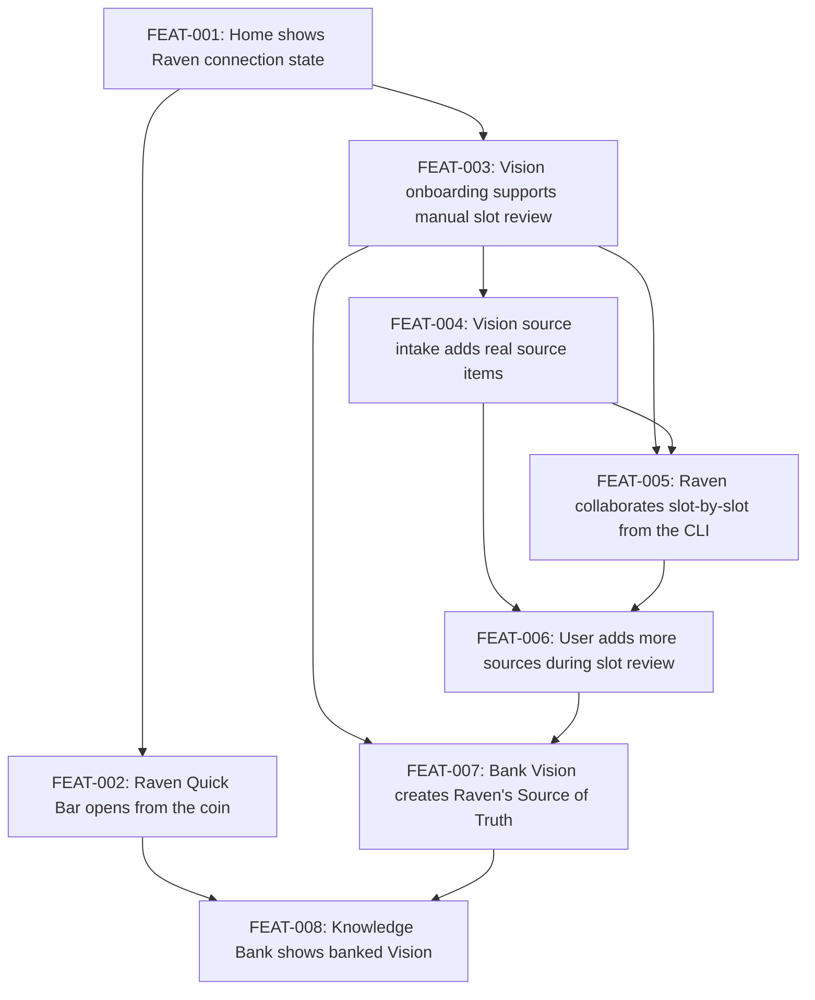

# Raven Onboarding Experience

## Goal

Build the first real Raven power-up flow in Alexandria Next. A first-time user connects Raven, opens Vision onboarding, works slot-by-slot with manual edits and Raven CLI participation, adds shared sources when needed, banks Vision into Raven's Source of Truth, and sees Vision banked in Raven's Knowledge Bank.

## Scope

**In scope:**

- Home state for Raven connection and `Power up Raven: Vision`
- Raven bottom-shelf coin and Quick Bar
- Vision onboarding with nine slots
- Manual slot editing, approval, skipping, and reducer-computed `ready_to_bank`
- Shared source intake from Vision
- File, URL-to-file, and typed-note-to-file intake
- CLI/runtime path for Raven to update Vision slots
- Additional source intake during slot review
- Raven Source of Truth Markdown generation
- Knowledge Bank status screen showing Vision banked
- Web UI and CLI verification in every ticket

**Out of scope:**

- Source-code processing
- Source deletion/removal behavior
- Multi-agent connection modeling
- Library card atomization
- Full Playbook UI
- Logo upload
- Dynamic slot-to-source attribution
- Knowledge Bank subjects beyond Vision
- Sophisticated Source of Truth authoring

## Success Outcomes

| ID | Outcome | Tier | Tickets |
|----|---------|------|---------|
| O-1 | Home makes Raven connection and agent actions legible | Must | FEAT-001, FEAT-002 |
| O-2 | Vision onboarding is a durable review workflow | Must | FEAT-003, FEAT-004 |
| O-3 | Raven can collaborate slot-by-slot from the CLI | Must | FEAT-005, FEAT-006 |
| O-4 | Banking Vision updates Raven's Knowledge Bank | Must | FEAT-007, FEAT-008 |

## Context Summary

See [CONTEXT_BRIEFING.md](CONTEXT_BRIEFING.md) for the full briefing.

The prototype established useful visual and interaction ideas: Raven's coin, a bottom agent shelf, Knowledge Bank progression, and a slot-based Vision builder. The production slice keeps those ideas but removes the confusing phase rail, overlay-as-home navigation, source sliders, logo upload dependency, and parallel-library implication.

The core architecture decision is reducer-driven state. The ledger remains the source of truth. `alexandria-config.json` stores compact pointers and Raven state. The shared source inventory is a materialized JSONL projection at `sourcesPath`.

## Decisions Made During Planning

| Decision | Options Considered | Chosen | Rationale |
|----------|--------------------|--------|-----------|
| Navigation surface | Top-level Raven nav, modal overlays, bottom agent shelf | Bottom agent shelf and Raven Quick Bar | Agent-specific actions should live with the agent; Raven should not become app-level navigation. |
| Source ownership | Raven-specific sources, Library-only sources, shared source intake | Shared source intake | Sources feed many future agents and plays, not only Raven. |
| Source storage | Inline config, event log only, JSONL projection | `sourcesPath` JSONL projection produced by reducer | Keeps config small and makes database migration straightforward. |
| URL/note intake | Durable URL/note source kinds, file-backed intake | Capture to files first | Downstream processors can read files uniformly. |
| Vision slot model | Prototype build/tune/approved states, simple review states | `empty`, `needs_review`, `approved`, `skipped` | Easier to understand and aligns with user review. |
| Source of Truth structure | Section map by subject, user-facing doc, Raven internal doc | Raven-owned whole Markdown document | Raven can structure the doc however she needs; user does not navigate SOT sections. |
| Ticket slicing | State-first foundation, screen-by-screen stories | Screen/workflow-centered stories | Each ticket remains independently demoable and verifiable. |

## Risks and Assumptions

| Type | Description | Mitigation | Tickets Affected |
|------|-------------|------------|------------------|
| Risk | Existing connection projection may not expose exactly what the Viewer needs | Keep connection runtime-derived; add only the narrow projection needed for Home | FEAT-001 |
| Risk | CLI/Web collaboration can drift if Raven writes through a different path than the UI | Use the same runtime events/reducer for CLI and Web updates | FEAT-005 |
| Risk | Source intake can become a generic ingestion project | Limit first slice to file, URL-to-file, and typed-note-to-file | FEAT-004, FEAT-006 |
| Risk | Knowledge Bank may still look like a parallel Library | Keep it a status/checklist screen and explicitly avoid card generation | FEAT-008 |
| Assumption | Manual slot editing is always valid and should remain supported | Treat manual editing as first-class in tests and UI | FEAT-003, FEAT-005 |

## Execution Phases

**Earliest demoable milestone: Home and Vision manual review**

FEAT-001 through FEAT-003 produce the first meaningful demo: the user can see Raven connected, open Vision onboarding, manually fill/review slots, and reach `ready_to_bank`.

**Source-backed Vision workflow**

FEAT-004 proves source intake is real and shared. FEAT-005 adds Raven's CLI participation. FEAT-006 proves sources can be added later during review without resetting work.

**Banking and status**

FEAT-007 banks Vision into Raven's Source of Truth. FEAT-008 shows the durable Knowledge Bank state.

## Re-planning Triggers

- The existing plugin connection projection cannot reliably drive Raven's inert/glowing state.
- URL-to-file capture requires authenticated browsing or external fetch semantics beyond local runtime scope.
- Raven cannot observe Web UI approval/skip feedback through existing CLI/runtime channels.
- Vision banking needs Library card generation earlier than planned.
- The Knowledge Bank screen needs more than Vision to be understandable.

## Ticket Index

| ID | Title | Enabler | Tier | Outcome | Blocked By | Blocks |
|----|-------|---------|------|---------|------------|--------|
| FEAT-001 | Home shows Raven connection state | false | must | O-1 | — | FEAT-002, FEAT-003 |
| FEAT-002 | Raven Quick Bar opens from the coin | false | must | O-1 | FEAT-001 | FEAT-008 |
| FEAT-003 | Vision onboarding supports manual slot review | false | must | O-2 | FEAT-001 | FEAT-004, FEAT-005, FEAT-007 |
| FEAT-004 | Vision source intake adds real source items | false | must | O-2 | FEAT-003 | FEAT-005, FEAT-006 |
| FEAT-005 | Raven collaborates slot-by-slot from the CLI | false | must | O-3 | FEAT-003, FEAT-004 | FEAT-006 |
| FEAT-006 | User adds more sources during slot review | false | must | O-3 | FEAT-004, FEAT-005 | FEAT-007 |
| FEAT-007 | Bank Vision creates Raven's Source of Truth | false | must | O-4 | FEAT-003, FEAT-006 | FEAT-008 |
| FEAT-008 | Knowledge Bank shows banked Vision | false | must | O-4 | FEAT-002, FEAT-007 | — |

## Library Updates

See [library-updates.md](library-updates.md).

## Deferred

- Source-code processing
- Source deletion/removal behavior
- Multi-agent connection modeling
- Library card atomization
- Full Playbook UI
- Logo upload
- Dynamic slot-to-source attribution
- Knowledge Bank subjects beyond Vision
- Sophisticated Source of Truth authoring
