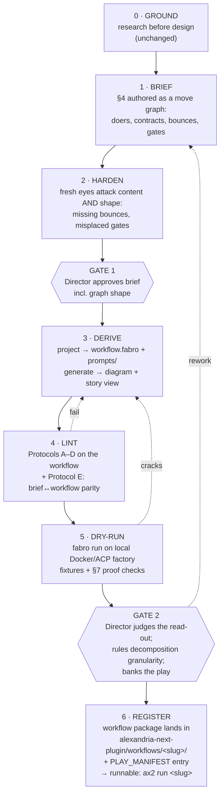

# Play Maker's Studio → Fabro: the Unified Line

Status: DRAFT — awaiting Director review
Date: 2026-06-12
Owner: Director (Danvers), drafted by orchestrator

---

## §1 Goal

**Spoken:** The studio exists to produce real Alexandrian plays — plays
that go live and ship inside Alexandria. That is why it was moved into
this repo, and it is why we are converting to Fabro workflows: a Fabro
workflow registered in the Alexandria Next playbook is what makes a play
*operational* — runnable by users, not just proven on paper. Today the
studio takes a play from raw research to a proven monolithic prompt, and
everything after that — becoming a Fabro workflow — is a black box we
promised to open later. This plan opens the box and then removes it: the
play production line is reshaped so that a play's logic is authored
once, as a graph, and everything downstream (the diagram the
Director reviews, the Fabro workflow Alexandria runs, the full-chain
"story" a human reads for QA) is derived from that one source. A banked
play is no longer a prompt file; it is a runnable workflow package
registered in Alexandria Next, proven on the local factory. The
monolithic prompt retires as a pipeline step — it was the control for a
black-box handoff that no longer exists — and the job it still serves
(seeing everything working together in one story) moves to a generated
view. The studio's live surfaces move into
`packages/viewer-next` as real product UI; the play records stay as files.

**Anti-drift rule:** this plan changes *how plays are made and what
"banked" means*. It does not change what any individual play does, does
not touch the Alexandria 1 line, and does not use the remote Railway
factory (that factory builds Alexandria; it is not a factory inside
Alexandria).

## §2 Where we start

- **Studio** (`studio/`): 17 plays; 1 proven (Frame the Problem), 14
  drafted, 2 grounding-only. Ladder: Ground → Brief → Harden → Gate 1 →
  Author → Lint → Dry-run → Gate 2 → banked `prompt.md`. Static HTML
  Board/Registry served by `site-server.py`; state in `plays/registry.js`
  + `plays/board-state.json`.
- **Fabro** (`repos/fabro`, vendored): workflows are Graphviz DOT
  (`.fabro`) graphs — agent / prompt / command / human-gate / conditional
  nodes, condition-labeled edges, retry policies, goal gates, run TOML.
  Local Docker/ACP factory runbook at `.fabro/README.md`.
- **The wire-up that already exists:**
  `packages/alexandria-next-plugin/workflows/source-assessment/workflow.fabro`
  is a working smoke play — registered in `PLAY_MANIFEST`
  (`packages/ax-next/src/domain/plays.ts`), run via
  `ax2 run source-assessment`, executing through the ACP backend.
- **Known debt:** the graph-era conventions in
  `studio/inheritance/quarantine/conventions/` are quarantined — written
  without Fabro sources, autopsied for rationale leaks. Nothing there is
  load-bearing until re-grounded.
- **Viewer** (`packages/viewer-next`): Astro + React on the AX2 runtime
  (SSE + `/api/*`), single `/` route today, Effect confined to
  `src/app/runtime/*`.

## §3 The core move: one source, derived renderings

This is the reshaping that makes the rest possible.

**Source of truth — the play graph.** Brief §4 (golden path) is no longer
prose-numbered moves with bounces described in the margins. It is authored
as a *move graph*: each move declares its doer type (judgment /
mechanical / human), what it consumes and emits, its bounce edges, and
where Director checkpoints sit. Same plain English as today — but the
structure (nodes, edges, gates) is explicit and machine-readable.

**Two derived renderings, never edited directly:**

1. **The diagram** — the workshop page's logic drawing is generated from
   the graph, not hand-drawn alongside it.
2. **The workflow package** (`workflow.fabro` + `prompts/<move>.md` +
   run config) — the graph *projected*: judgment moves → agent nodes,
   mechanical moves → command/prompt nodes, Director checkpoints →
   human-gate hexagons, bounces → condition-labeled edges, three-strikes
   → `max_visits`/`retry_target`, enforceable §7 checks → `goal_gate`
   nodes. Node prompts are authored from the brief's §6 draft language,
   one per move. This is the deployable, testable, banked artifact.

**The monolithic prompt is retired as a step — its surviving job moves
to a view.** The monolith existed to give the black-box Fabro handoff a
working control, and complex plays will eventually be too big for a
single prompt to even run as a control. That job retires with the black
box. The job that survives is human: seeing the whole play work together
as one story — reading the golden path end-to-end, diving in and out of
each move's full prompt where it falls in the chain, for QA and for the
future role whose job is to look at a play and ask "how could we make it
better." That job is serviced by **the story view**: a generated reading
surface that walks the brief's golden path in order with each node's
complete prompt inlined in place. It is rendered (workshop page now,
viewer-next in Slice 4), never run, never edited — and it cannot drift,
because it is assembled from the same source as the workflow itself.

**The sync mechanism:** edits land in the brief and re-derive. Lint gains
**Protocol E (parity)**: every move in the brief graph appears in the
workflow with the same consumes/emits contract and no language drift
against §6. Dry-runs grade the workflow against the §7 proof spec on the
local factory; divergence from the brief's intent is crack analysis, not
a shrug.

**Honest escape hatch:** some plays may grade better with less
decomposition (context fragmentation across nodes is a real risk). A
coarse graph — down to a single agent node carrying the whole golden
path — is a legitimate projection; the Director rules per play at
Gate 2, with the read-out in hand.

## §4 The reshaped ladder

**What changed vs today:** Ground, Harden, and the two Gates survive
intact. Brief §4 gains structure (the graph). "Author" becomes "Derive"
(the workflow package projected from the brief, with diagram and story
view generated alongside). Lint gains Protocol E. Dry-run becomes a real
fabro run on the local factory. "Register" is new — the end of the line
is a play Alexandria can actually run.

**What is subtracted:** the hand-drawn workshop diagram (generated now);
the convert-to-fabro-later black box (gone — conversion is the line);
the monolithic prompt as a step (retired — its control job dies with the
black box; its read-the-whole-story job is serviced by the generated
story view).

**Ladder statuses** (`registry.js`) extend to:
`slot → designed → hardened → derived → proven → registered`.
Board columns follow: Source Material → Play Logic → Renderings →
Hardening → Proven → Registered. Cards still move right only on Director
confirm.

## §5 What could go wrong

| Hypothesis | Severity | Response |
| --- | --- | --- |
| Workflow drifts from the brief despite Protocol E (someone hot-fixes a node prompt) | High | Lint blocks banking on parity failure; standing rule: edits land in the brief, the workflow re-derives. Hot-fix found in a rendering → kicked back as a brief amendment. |
| Decomposed play underperforms — context fragmentation across nodes | High | Expected, not fatal. Tune `fidelity`/`thread_id` first; if still poor, Director rules a coarser decomposition (down to a single agent node carrying the whole golden path). Recorded as crack analysis either way. |
| Quarantined conventions leak in unverified | Medium | Slice 1 re-grounds them against `repos/fabro` docs, quote-or-demote; only Director-ruled conventions become load-bearing. |
| Local factory version skew / instability mid-dry-run | Medium | `alexandria-dev-upgrade-fabro-factory-local` skill before each dry-run campaign; vendored source refreshed via `pnpm run subtrees:update` before grounding work. |
| Viewer rebuild starts before the process is proven and bakes in the wrong pipeline | Medium | ~~Sequencing rule: Slice 4 (viewer) starts only after Slice 3's Gate 2. Static studio carries review duty until then.~~ **OVERRIDDEN — Director ruling, 2026-06-12, mid-Slice-3:** "as a human who is working on these plays WITH you, I need the full debug surfaces from the beginning... they are out of order... let's just build Slice 4 right now." Earned empirically: the first factory run looped and the Director caught it only via the Fabro UI, then couldn't review the preserved run records in the studio at all. Slice 4 runs concurrently with Slice 3, debug/review surfaces first (runs → workshop → registry/board). The original mitigation inverts: surfaces built mid-proving get shaped by real debugging needs instead of guesses. |
| Director gate load multiplies (gates now also exist *inside* runs as fabro human-gate nodes) | Medium | In-run gates are play behavior (the play's own checkpoints); ladder gates remain exactly two (Gate 1, Gate 2). No new ladder gates. |
| Guinea-pig surgery damages the proven exemplar | Low | Frame the Problem is frozen read-only; all Slice 3 work happens in a carved copy. |

## §6 The slices

### Slice 1 — Conventions, grounded (the step-0 of this whole plan)

Re-ground the conversion conventions against the vendored Fabro source
and docs (refresh subtrees first). Produces one Director-reviewable
artifact: **the projection conventions** — the move-graph → fabro mapping
table (doer types → node types, bounces → edges, gates → hexagons,
three-strikes → retry policy, §7 checks → goal gates), every claim cited
to `repos/fabro/docs/public/` or demoted `[unverified]`. Anything from
quarantine that survives is promoted with provenance; the rest stays
quarantined.

**Done when:** Director has ruled on the projection conventions doc.

### Slice 2 — The reshaped ladder, on paper

Rewrite the studio process docs to the §4 ladder: `TEMPLATE-BRIEF.md`
(§4 becomes the move-graph format), `AUTHORING.md` (Derive step: node
prompts authored from §6 draft language; monolith retired, story view
generated), `TESTING.md` (fabro dry-run on the local factory, runbook
pointer), lint spec (Protocol E), `registry.js` status vocabulary and
Board columns. All changes carry dated provenance per studio rules.

**Done when:** Director has ruled on the process docs; a cold agent
reading HANDOFF.md can state the new ladder correctly.

### Slice 3 — Frame the Problem, the guinea pig

Freeze `plays/frame-the-problem/` (read-only, stays banked and safe).
Carve `plays/frame-the-problem-next/` and run the entire new ladder on
it:

1. Re-express brief §4 as a move graph (content unchanged — this is a
   re-rendering of proven logic, not a redesign).
2. Harden the graph shape.
3. Gate 1.
4. Derive: project → `workflow.fabro` + `prompts/`; generate the diagram
   and the story view.
5. Lint A–E.
6. Dry-run the workflow on the local Docker/ACP factory against the
   existing fixtures (`fixtures/` is reused wholesale). The frozen play's
   banked monolith dry-runs and graded `read-out.md` serve as the
   comparison baseline — a control we get for free because it already
   exists. (This is the control job's last performance: it retires going
   forward, not retroactively.) One new `read-out.md` compares the
   workflow's results against §7 and against the frozen baseline.
7. Gate 2: Director judges the read-out, rules decomposition granularity,
   banks.
8. Register: package lands in
   `packages/alexandria-next-plugin/workflows/frame-the-problem/`,
   `PLAY_MANIFEST` entry added, `ax2 run frame-the-problem` smoke-proven
   the way source-assessment is today.

This closes the gap HANDOFF.md names: *the missing exemplar* — an
approved play successfully converted, linkable as THE canonical pair.

**Done when:** registered and smoke-run; HANDOFF.md links the exemplar.

### Slice 4 — Studio upfit into viewer-next

Rebuild the live surfaces as viewer-next routes backed by the AX2
runtime: the Board (kanban, Director-confirm-only advancement), the
Registry (ladder chain with live statuses), and workshop pages
(generated diagram + story view + rendered record files + decision
queue). The story view is a first-class surface here: walk the golden
path, expand any move to its full node prompt in place. The dated
records — briefs, hardening transcripts, research, dry-runs, read-outs —
**stay as files**; the viewer renders them, it does not own them.
`site-server.py` and the static HTML retire; board state persistence
moves behind an AX2 endpoint (same one-fact-one-place contract:
`registry.js`-equivalent for identity/ladder, board state for columns).

★ One open Director decision inside this slice: where the record files
live — stay at `studio/plays/` with the viewer reading across, or move
to a content directory the viewer serves. Lean: stay at `studio/plays/`
for Slice 4; relocation is a later mechanical move once the viewer is
the only consumer.

**Done when:** Director runs a full review session (board moves, gate
rulings, read-out review) entirely in viewer-next; static site retired.

### Slice 5 — The fleet

The 14 drafted + 2 grounded plays re-enter the line as the new system's
test material. None are far along; each re-enters at its honest rung
(most at Brief, with §4 re-authored as a graph). They proceed in Board
priority order, Director-gated as ever. Each registration adds a
`PLAY_MANIFEST` entry — this is the point of the whole line: every play
that reaches *registered* is live in Alexandria, runnable by users
through the Alexandria Next playbook, not a studio artifact awaiting a
handoff. The shipped playbook grows play by play.

**Done when:** open-ended by design — measured per play, on the Board.

## §7 Proof spec for this plan

- **Slice 1:** projection conventions doc exists, every mapping cited or
  demoted, Director ruling recorded.
- **Slice 2:** cold-launch test passes — fresh agent reads HANDOFF.md +
  process docs and correctly states ladder, statuses, and parity rule.
- **Slice 3:** `ax2 run frame-the-problem` executes on the local factory;
  read-out compares workflow results against §7 and the frozen baseline;
  Gate 2 ruling recorded; frozen original untouched (`git diff` clean
  under `plays/frame-the-problem/`).
- **Slice 4:** the Director session test — one real review session
  conducted wholly in viewer-next, no fallback to static pages; board
  state survives server restart.
- **Slice 5:** first non-guinea-pig play reaches *registered* with no
  process-doc amendments required (the process held without patching).

## §8 Deferred / out of scope

- Remote Railway factory: builds Alexandria, never runs inside it. Out.
- Alexandria 1 plugin line: untouched.
- Play *content* redesigns: re-rendering only; logic changes are normal
  play amendments, not this plan.
- Multi-model stylesheets, parallel fan-out, and run-config sophistication
  per play: available in Fabro, adopted per play at Derive when a play's
  logic calls for it — not mandated by the line.
- Library writes: any proposed `docs/alexandria/library/` updates are
  recorded here, not written directly (per repo rule). None yet.
