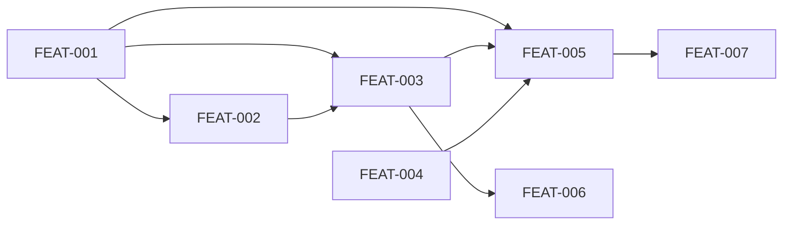

# Plugin Distribution

## Goal

Package and distribute Alexandria plugin as a lightweight tarball hosted
at `sociotechnica.org/alexandria/`, installable via a curl one-liner. The private
repo ships only runtime files to users. Compiled binaries persist across updates
via `${CLAUDE_PLUGIN_DATA}`.

## Scope

**In scope:**
- Tarball build script that strips dev-only files (~7.3 MB → ~1.2 MB)
- Bash install script with context-aware path detection (project-local vs global)
- Static file hosting on sociotechnica.org/alexandria/ (Astro site, Netlify)
- CI release workflow (tag → build → deploy)
- Migration to `${CLAUDE_PLUGIN_DATA}` for compiled binaries and state
- README and release process documentation

**Out of scope:**
- Plugin marketplace distribution (deferred — desired for auto-updates)
- Codex plugin compatibility (deferred — TOML agents, `.codex-plugin/` manifest)
- npm publishing (poor fit for plugin directory layout)
- Pre-compiled binaries in releases (~500 MB+ per platform, impractical)

## Success Outcomes

| ID | Outcome | Tier | Tickets |
|----|---------|------|---------|
| O-1 | Stripped tarball contains only runtime files and installs a working plugin | Must | FEAT-001 |
| O-2 | curl one-liner installs a working plugin with context-aware path detection | Must | FEAT-003, FEAT-006 |
| O-3 | Compiled binaries persist in CLAUDE_PLUGIN_DATA and survive plugin updates | Must | FEAT-002 |
| O-4 | CI builds tarball and deploys install artifacts to sociotechnica.org/alexandria/ | Should | FEAT-004, FEAT-005 |
| O-5 | Update-check reports download URL from sociotechnica.org | Could | FEAT-007 |

## Context Summary

See [CONTEXT_BRIEFING.md](CONTEXT_BRIEFING.md) for the full briefing.

The context library has minimal card coverage on distribution/installation. The
knowledge lives in code (`setup` script, bin wrappers, `update-check.ts`) and
ADR 001 (dual-mode distribution). Key findings:

- **Runtime payload is ~1.2 MB** — agents (68 KB), skills (492 KB), src (452 KB),
  bin wrappers (44 KB), templates (20 KB), wizard-engine.yaml (25 KB), config (4 KB)
- **Dev overhead is ~6.1 MB** — tests (3.5 MB), docs/alexandria (1.8 MB),
  docs/design (228 KB), docs/plans (728 KB), docs/adrs (12 KB)
- **Only one docs/ file is runtime-critical** — `docs/wizard/wizard-engine.yaml`
- **11 compiled binaries** produced by `bun build --compile`, currently stored at
  `bin/.compiled/` inside the plugin root
- **Existing env vars** (`CONTEXT_LIBRARY_COMPILED_DIR`, `CONTEXT_LIBRARY_STATE_DIR`,
  `CONTEXT_LIBRARY_PLUGIN_ROOT`) provide backward-compatible override points

## Decisions Made During Planning

| Decision | Options Considered | Chosen | Rationale |
|----------|-------------------|--------|-----------|
| D-1: Hosting | GitHub Releases, npm, CDN, sociotechnica.org | sociotechnica.org/alexandria/ via Netlify | Existing Astro site with auto-deploy; no new infrastructure needed |
| D-2: PLUGIN_DATA adoption | Keep bin/.compiled/, move to PLUGIN_DATA, hybrid | Hybrid with PLUGIN_DATA preferred | Survives updates; backward compatible when unset |
| D-3: Install confirmation | Auto-install, prompt, fail with instructions | Prompt for path confirmation | Users should see where files will land before committing |
| D-4: Version discovery | Hardcoded in script, latest-version.txt, GitHub API | latest-version.txt at sociotechnica.org | Stable install script; works with private repo; also used by update-check |
| D-5: Pre-compiled binaries | Ship binaries, compile on install | Compile on install | Each binary embeds Bun runtime (~50-90 MB × 11 = 500 MB+); source tarball is ~1.2 MB |
| D-6: Marketplace | Build now, defer | Defer | Official Claude Code mechanism for install/update; requires more research on private repo support |
| D-7: Codex compatibility | Build now, defer | Defer | ~80% format overlap but agents need TOML translation; not blocking |

## Risks and Assumptions

| Type | Description | Mitigation | Tickets Affected |
|------|-------------|-----------|-----------------|
| Risk | Bun auto-install may fail on some systems | Install script provides clear error with manual instructions | FEAT-003 |
| Risk | Netlify deploy from private repo CI needs secrets | Configure NETLIFY_AUTH_TOKEN or use deploy key | FEAT-005 |
| Risk | `rsync --files-from` may behave differently across macOS/Linux | Test tarball build on both platforms in CI | FEAT-001 |
| Assumption | `${CLAUDE_PLUGIN_DATA}` is set by Claude Code for installed plugins | Fallback paths ensure it works without | FEAT-002 |
| Assumption | `setup` script works without `.git` directory (tarball installs) | The `command -v git` check validates the tool, not the repo | FEAT-001, FEAT-003 |
| Assumption | sociotechnica.org Netlify site stays on current infrastructure | Low risk; team controls the site | FEAT-004, FEAT-005 |

## Execution Phases

**Phase 1: Packaging foundation (Must)**
- FEAT-001: Build script and dist manifest
- FEAT-002: Migrate to `${CLAUDE_PLUGIN_DATA}`

**Phase 2: Install experience (Must)**
- FEAT-003: curl install script (blocked by FEAT-001, FEAT-002)
- FEAT-006: README and docs update (blocked by FEAT-003)

**Phase 3: Automated releases (Should)**
- FEAT-004: Alexandria hosting setup (independent)
- FEAT-005: CI release workflow (blocked by FEAT-001, FEAT-003, FEAT-004)

**Phase 4: Polish (Could)**
- FEAT-007: Update-check integration (blocked by FEAT-005)

## Re-planning Triggers

- If Claude Code adds official support for tarball/URL-based plugin sources in
  marketplaces, revisit the marketplace deferral (D-6)
- If `${CLAUDE_PLUGIN_DATA}` behavior changes or is deprecated, revisit FEAT-002
- If the repo goes public, simplify the install to point at GitHub directly

## Ticket Index

| ID | Title | Enabler | Tier | Outcome | Blocked By | Blocks |
|----|-------|---------|------|---------|------------|--------|
| FEAT-001 | Create dist-include manifest and build-tarball script | false | must | O-1 | — | FEAT-002, FEAT-003, FEAT-005 |
| FEAT-002 | Migrate compiled binaries and state to ${CLAUDE_PLUGIN_DATA} | false | must | O-3 | FEAT-001 | FEAT-003 |
| FEAT-003 | Create install.sh curl installer with context-aware path detection | false | must | O-2 | FEAT-001, FEAT-002 | FEAT-005, FEAT-006 |
| FEAT-004 | Add alexandria download page and static hosting to sociotechnica-site | false | should | O-4 | — | FEAT-005 |
| FEAT-005 | CI workflow to build tarball and deploy to sociotechnica.org/alexandria/ | false | should | O-4 | FEAT-001, FEAT-003, FEAT-004 | FEAT-007 |
| FEAT-006 | Update README with curl install instructions and release docs | false | must | O-2 | FEAT-003 | — |
| FEAT-007 | Update-check fetches version from sociotechnica.org and reports download URL | false | could | O-5 | FEAT-005 | — |

## Library Updates

See [library-updates.md](library-updates.md).

## Deferred

- **Plugin marketplace distribution:** Claude Code supports official marketplace
  install (`claude plugin install`) with auto-updates. Requires plugin source to
  be a git repo or npm package — no tarball/URL support yet. When marketplace
  supports URL-based sources or the repo goes public, this becomes the preferred
  distribution path. See research notes in planning conversation.

- **Codex plugin compatibility:** Codex uses a nearly identical plugin format
  (`.codex-plugin/plugin.json`, `skills/`, `mcpServers`). ~80% compatible with
  Claude Code plugins. Key gap: Codex agents use TOML files in `.codex/agents/`
  instead of markdown in `agents/`. Skills are portable as-is. Supporting both
  would require shipping dual manifests and a TOML translation of the 6 agent
  definitions. See https://developers.openai.com/codex/plugins/build and
  https://developers.openai.com/codex/subagents.
