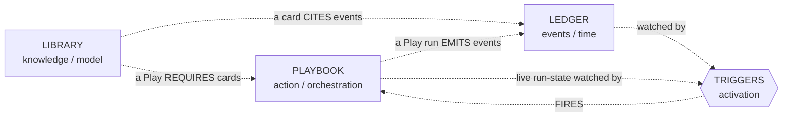
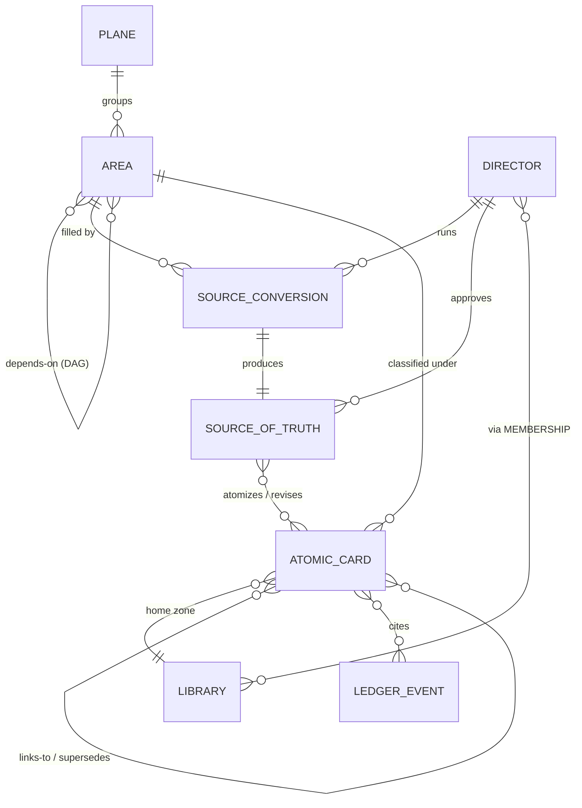
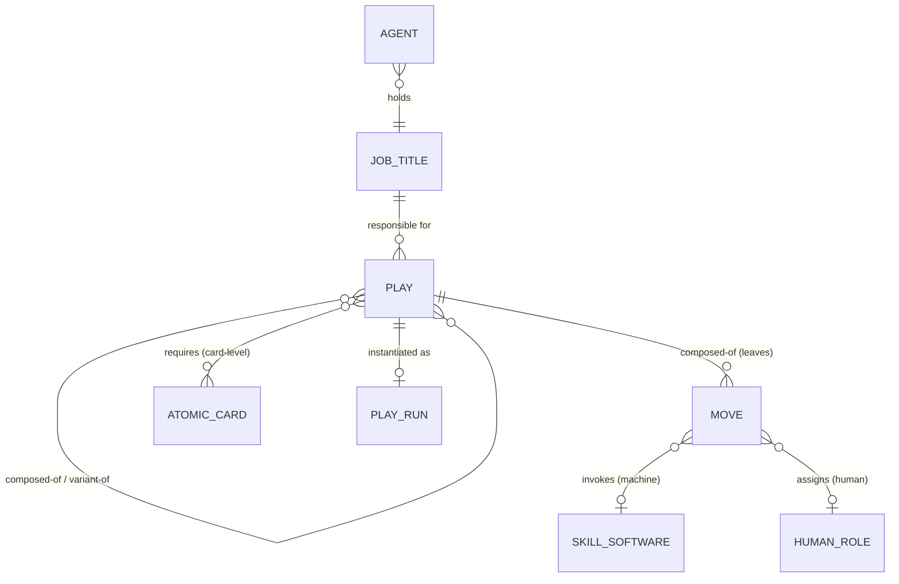
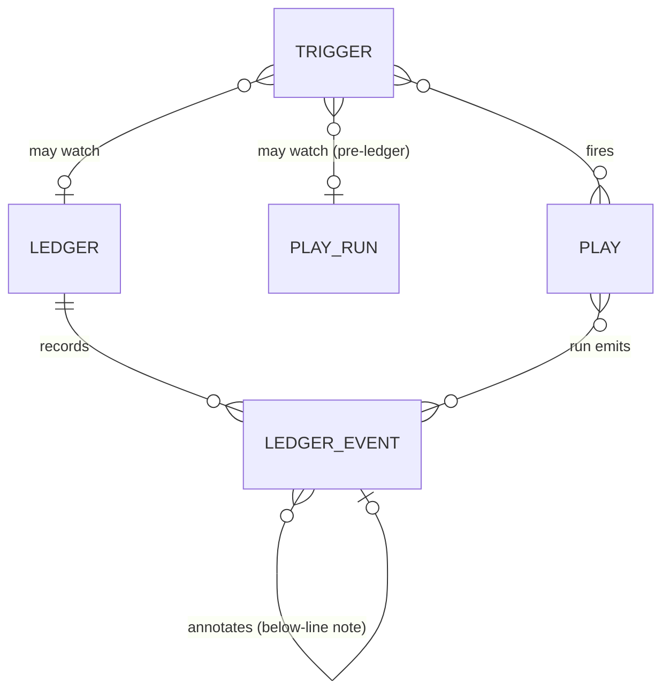

# Data Model — Alexandria: Library, Playbook, Ledger

*A conceptual data model for Alexandria. The product rests on **three pillars —
Library, Playbook, Ledger** — plus **Triggers** as the activation layer. A
director's scattered **source material** is converted into reusable library cards;
that product knowledge **unlocks plays** an agent can run; events land on the
ledger and **trigger** further plays. The player-facing game is **build-an-employee**:
the director delegates *authority to act* and *responsibility for company duties*
to a non-human.*

> **Status:** draft for review. *Conceptual* model (business-readable nouns +
> relationships), drifting into *logical* where status/cardinality appear. **Not**
> physical (no tables, types, storage, distribution). Where a capability depends on
> a physical choice, it's flagged (e.g. pre-ledger triggering). Renames & resolved
> questions are in the [Appendix](#appendix--provenance-renames--resolved-questions).

> **Depth note:** the **Library**, **Playbook**, and **Ledger** pillars — and the
> relationships within and among them — are substantially modeled. **Triggers** are
> deliberately scoped to **governance only** (registry, authority-gating, loop-safety
> invariants); their **mechanics** (semantics, debounce, conflict) are intentionally
> **deferred** to a later session. Treat the thin Trigger mechanics sections as
> intentional placeholders, not gaps.

---

## Contents

- [How to read this document](#how-to-read-this-document)
- [Core structure: three pillars, triggers, and three temporal surfaces](#core-structure-three-pillars-triggers-and-three-temporal-surfaces)
- [Model vs. machine (governs what is and isn't a card)](#model-vs-machine-governs-what-is-and-isnt-a-card)
- [Layer 1 — Nouns (what exists)](#layer-1--nouns-what-exists)
- [Layer 2 — Relationships (how they connect)](#layer-2--relationships-how-they-connect)
- [Layer 3 — State (stored vs. derived, operations, lifetimes)](#layer-3--state-stored-vs-derived-operations-lifetimes)
- [Authority, governance & gates](#authority-governance--gates)
- [Failure, surgery & live status](#failure-surgery--live-status)
- [Ownership, confidence & future seats](#ownership-confidence--future-seats)
- [Open questions (for review)](#open-questions-for-review)
- [The modeling toolkit (method)](#the-modeling-toolkit-method)
- [Worked example: the population play](#worked-example-the-population-play-prior-art-running-today)
- [Appendix — provenance: renames & resolved questions](#appendix--provenance-renames--resolved-questions)

---

## How to read this document

Three layers, in order: **nouns → relationships → state**. Each constrains the
next; disagreements get more expensive as you descend, so resolve naming before
connection before ownership. The **core structure** and **model-vs-machine** frame
the layers; cross-cutting concerns (authority/governance, failure/surgery,
ownership) follow.

**The practical test:** for any prototype screen, name which **noun** each element
renders, which **relationship** it traverses, and which **state** it reads/writes.
Where that's unclear, a competing data model is hiding.

---

## Core structure: three pillars, triggers, and three temporal surfaces

**Three pillars**, each a company-wide source of truth:
- **Library** — the **mental model / documentation** (intent cards).
- **Playbook** — the **orchestration**: named **Plays**, composed of **Moves**.
- **Ledger** — the **event log**: what happened/was decided, with when & why.

**Triggers** are the **activation layer** (their own mechanism, not part of the
Ledger): they fire Plays. They watch the **Ledger**, the **live run-state**, a
**schedule**, or **manual/external** sources.

**Three temporal surfaces** (NASA's separation): **definition** (Playbook/Library —
what *should* happen), **live-status** (telemetry — what's happening *now*), and
**history** (Ledger — what *happened*). Triggers can watch the latter two.

**The four principles:**
- **P1 — Three pillars.** Library / Playbook / Ledger; distinct sources of truth.
- **P2 — Company-wide pillar + agent-scoped view.** **Knowledge Bank** = an
  agent's view of the Library; **Playbook page** = its view of the Playbook;
  **Briefing** = an agent-/situation-scoped view of the Ledger. One graph per pillar,
  many derived projections.
- **P3 — Map vs. territory.** The Library *documents* the company (including the
  Playbook and the software) but is none of them; representations point at the
  territory.
- **P4 — The activation loop.** Library **gates** action (a Play requires cards);
  the Ledger **records** it (runs emit events) and **grounds** knowledge (cards cite
  events); **Triggers fire** it. Knowledge ↔ Action ↔ Time.

---

## Model vs. machine (governs what is and isn't a card)

- **The Library is the *model*** — intent/architecture. Every card is a **writeup
  of intent**, five-dimension form.
- **The running skills, software, humans, kits, and live plays are the *machine*** —
  they *do the work; they are not the record.*
- **The library *represents and references* the machine — it is not the machine.** A
  skill card is a writeup + a link + version history. Never the executable.

So: **every card is intent; nothing executable is ever a card.**

---

## Layer 1 — Nouns (what exists)

### Library pillar (the model / record)

| Noun | Definition |
|------|------------|
| **Director** | A user whose product knowledge we're capturing. |
| **Library** | The **whole** card graph — all cards across all zones; the federated view of everything; the ground truth all views project from. **Two faces of the same thing:** to an **agent** it's a *context library* that powers its work; to **humans** it's the *living documentation* of a rationally-run company. |
| **Library (zone)** | A federated partition for control. `origin`: `company` or `alexandria-core`. A card has one home zone. |
| **Area** | A topical region (Vocabulary, Roadmap…), grouped by **Plane**. The thing a bar visualizes. **Hard-locked** until prerequisite areas are filled. Out-of-box areas ship with the agents; **new areas can be added**, **new Planes cannot.** |
| **Plane** | The **closed** grouping: **Strategy / Product / Learning** *(3rd name open: Learning/Evidence/Rationale)*. *Lab logic (why these three): Strategy = craft the hypothesis · Product = run the experiment · Learning = capture results + external research that feed the hypothesis back.* |
| **Source Conversion** | Converting source material → approved atomic cards (stages: source intake → drafted → approved → banked). `mode`: **scaffolded** (one defined Area, vetted Draft Kit) or **freestyle** (arbitrary input, general reconciliation, fans across many cards/areas). |
| **Source material** | The shared input (docs, GitHub, the director's head). Referenced upstream; conversion tracks whether it's *shared*. |
| **Artifact** | A captured, *human-friendly* supporting material — a research report, a quarterly review, "Bob's notes," a rendered **diagram**. **Referenced/cited by cards; never a card and never *replacing* one.** (To an agent, a connected card-graph *is* the diagram; the Artifact is the human's companion view.) Same category as referenced source material. |
| **Source of Truth (SOT)** | The **approved output of a Source Conversion** (its 3rd / *approved* stage) — a *distilled, reconciled, director-approved* refinement of the incoming **source material**, **required before anything becomes a card**: the director confirms **what's true**, resolves **contradictions**, and flags **what's missing**, so only vetted information enters the library. A **frozen** snapshot; one per conversion (never mutated — see Layer 3 *One update path*). |
| **Atomic Card** | A unit of **intent** (WHAT/WHERE/WHY/WHEN/HOW) + tracked `confidence`. Classified under one **Area**, homed in one **zone**. **The pivot.** |
| **Knowledge Bank** | An **agent-scoped *view*** of the Library — the cards an agent's plays call, by Area, with coverage bars. **Derived.** |
| **Membership** | A director's role-bearing relationship to a *library zone* (Director↔**zone** access/role). **Future seat** (structural-only). *Contrast the live Director↔(agent, play) [Grant](#authority-governance--gates), detailed under Authority.* |

> **The Atomic Card's four jobs:** holds current intent · cites Ledger Events (see
> *Ledger pillar*) · links to other cards (the graph) · satisfies Play
> requirements (the super-seam).

**In action — filling the Product Roadmap.** The **Director** decides the company's
roadmap should be written down, so she opens the **Product Roadmap Area** — it lives in
the **Product Plane**, and it's available because its prerequisite areas are already
filled. She starts a **Source Conversion** in *scaffolded* mode. The first stage, **source
intake**, is just gathering: she drops in her **source material** — the pitch deck, the
GitHub repo, last quarter's board review — and that board review, being a polished human
document, is kept to the side as a referenced **Artifact** rather than torn apart. Because
she thinks by sketching, Raven offers a **Draft Kit** built on the "draw-and-discuss"
**Interaction Pattern**; she draws the roadmap and they talk it through (she could just as
easily have chatted). Out of that back-and-forth comes a **draft**, which sharpens into a
**Source of Truth**. Here she hits **Gate 1**: she **approves** it — meaning she's confirmed
what's *true*, reconciled where the deck and the repo *contradicted* each other, and flagged
what's still *missing*. Now the machine takes over: **atomize** breaks the approved SOT into a
handful of **Atomic Cards**, each a single claim carrying a tracked **confidence** (most
high; one she marks as a hypothesis). She reviews them at **Gate 2** and **banks** them. The
cards settle into the **Roadmap Area**, homed in the company **Library (zone)**, **linked** to
related vision and bets cards, each one **citing** the **Ledger Events** that justify it.
The Roadmap **bar** ticks up — nobody sets it; it's *derived* from coverage — and any agent
whose plays draw on the roadmap now sees it appear in its **Knowledge Bank**.

### Playbook pillar (action / orchestration)

| Noun | Definition |
|------|------------|
| **Play** | A unit of work that aligns software, agents, and humans. A **Composite**: a combination of **Moves** and/or other **Plays** (recursive — "a play can be a chain of plays"; often a *variant* of a base play + a tweak). User-facing; the hero noun of the playbook. Canonical, **global identity** — duplicates (a renamed copy) are detected and rejected; **no per-director skins.** Carries `owner`, a required **authority level**, **abort conditions + safe state**, and **contingency routing**. |
| **Move** | The **leaf**: one doer's atomic action. Either **directly invokes a Skill/Software** (machine) or is **assigned to a Human-Role** (human). *References* a reusable Skill/action and *binds* it to a doer within the play. Reusable across plays. Carries a required authority level and a required capability. |
| **Job Title** | A **role** = the bundle of **{responsibilities (the plays it owns) + authority (a level — what it may do)}**. The org-chart/NASA-console position. |
| **Agent (front-of-house)** | The **delegation surface** — a named non-human identity to which a human delegates **authority to act** and **responsibility for duties.** Holds a Job Title; carries persona/**Package**; projects a **Knowledge Bank**, **Playbook page** & **Briefing**; receives **ledger attribution** ("their name lands"). The *context a play runs in* — **never an executor.** *(Raven is the running example of a front-of-house Agent.)* |
| **Playbook page** | An **agent-scoped *view*** of the Playbook — the plays an agent is in / can access; where you configure, inspect, and flag plays for upgrade. **Derived.** |
| **Play Run (live status)** | The **durable, inspectable state** of an executing play — progress, per-branch status, freeze points. Supports **freeze/resume** (preserving completed work). The "now" surface, watched by triggers. *(Preferred as a durable store; may degrade to a Ledger projection — see Layer 3 state.)* |

> **Back-of-house "agents" (Sam, Conan) are NOT nouns.** They were cognitive
> crutches; in the model they dissolve into the **Skills/Plays** they wrapped, which
> are invoked directly. The discriminator: *does anyone build, relate to, or get
> work attributed to this as an employee?* Yes → a real front-of-house **Agent**.
> Just an internal mechanic with a cute name → dissolve to skills.

**In action — giving Raven the daily report.** Raven is being built toward the **Job Title**
*Product Analyst*. One responsibility of that role is the **Play** *Daily Product Performance
Report*. Right now the play is **locked**, because it **requires** cards from three areas —
**Roadmap**, **Product Evidence**, and **User Research** — and only one is filled. The Director
runs two more **Source Conversions** to fill the other two **bars**. The moment the last
required **Atomic Card** is banked, the play's **`unlocked`** flag flips on its own (it's
*derived* — "are the required cards here?"). But unlocked only means the play *can* run; the
Director still has to **grant** Raven the authority to actually run it — Raven's role clears
the play's **authority level** (the ceiling), and the Director issues a discretionary **Grant**
(Director → this agent → this play) because she trusts Raven with it. To make it a standing
weekday duty, she arms a **Trigger** in the trigger registry, scheduled for weekday mornings,
riding on that standing Grant. Each weekday the Trigger **fires** the play. A **Play Run** spins
up and walks the play's **Moves**: a **Software** **Participant** pulls the metrics, an
**Agent+Skill** Move analyzes them, and a last Move assembles the **Briefing** that Raven hands
to her Director. The run **emits Ledger Events** as it goes, and the play sits green on Raven's
**Playbook page**.

**In action — when it breaks.** Raven's report isn't standalone; it's one branch of a bigger
composite play, *Automated Product Improvement*. One Tuesday the metrics **Move**'s
**Software** can't reach the data source and **fails**, emitting a **failure event** with
severity *no-response*. The play doesn't collapse: by the default **propagation** rule, only the
**broken branch freezes** — everything already done, including a **Human-Role** Move a teammate
had signed off earlier, is preserved — and the play settles into its declared **safe state**
instead of stopping mid-write. The failure event trips a **Trigger** that **fires** a
**contingency play** to retry the feed; when that can't fix it, the system **escalates** (an
**Andon** pull). Escalation routes by **governance lane**: a broken *mechanism* goes to the
technical *trigger-machine owner* — not to the Director, whose lane is for "did we grant too
much authority" judgment calls. The **Play Run** sits **frozen** at the broken branch, fully
inspectable, and **resumes** the instant the feed is fixed — no completed work redone.

### Execution layer (the machine — *referenced*, in no pillar)

| Noun | Definition |
|------|------------|
| **Skill / Software** | The reusable executable capability a Move invokes directly (`analyze_email`, the intro skill). Lives in repo/playground; the Library *represents* it via a card, never contains it. |
| **Human-Role** | A role (e.g. *Director*) a Move assigns work to — bound to the role, not the person; a person staffs the role. |
| **Participant** | Umbrella for a Move's doer — `kind {Skill/Software, Human-Role}`. *(The Agent is not a participant kind — it's context, not an executor.)* |

### Draft tooling (optional machinery)

| Noun | Definition |
|------|------------|
| **Interaction Pattern** | A base, reusable, **core-owned** interactive mode ("draw-and-discuss," "read-and-slider"). Finite curated catalog; not auto-grown from directors. Also a builder constraint. |
| **Draft Kit** | A pattern enriched with prompts/skills for a use. Optional; an agent offers a **menu**, with **chat as fallback**. Machinery, not a card. Wild one-offs aren't captured. |
| **Lesson Plan / Rubric / Interactive Rendering** | A kit's parts. |

### Ledger pillar

> **The Ledger is the immutable record of events — built for continuity and handoff.** A
> watch change-over hands over the **ledger**, not a 50-minute briefing; it's also the
> primary thing that **triggers** action. Beyond the bare facts, capture the
> **interpretation around an event** — an observation, an assessment, a concern — as
> further events that *annotate* the original, so interpretation rides *alongside* the
> facts and the record stays flat and append-only.

> **Library vs. Ledger — what goes in each, and how they tag each other.**
> Put **durable, curated understanding** in the **Library** — intent + reconciled
> knowledge, revisable, held at varying confidence. Put the **record of events** in the
> **Ledger** — what happened / was observed / assessed / instructed (by whom, when),
> fixed and append-only. *(Both are true; if anything the Ledger's events are the surer
> facts, while the Library can hold a hypothesis that's later corrected.)* **Neither
> stores the other — they *tag* each other:** a **card cites a Ledger Event** ("this rests
> on what happened here"), and a **Ledger Event references a card** ("this moment used /
> produced / found-wrong this truth"). A pattern in the Ledger becomes Library truth
> **only** by being fed back through a gated **Source Conversion** — never automatically.

| Noun | Definition |
|------|------------|
| **Ledger** | The append-only **event log** — the operational record + the source of truth for time/provenance + the primary trigger source. Company-wide and shared (P2). |
| **Ledger Event** | **One immutable, append-only, attributed record** (when, who, why) — Jess's "here's the event," kept flat. *One typed noun*; `type` widens beyond system-actions to: `run / revision / failure / **observation** / **assessment** / **note** / **instruction** / **decision** / **finding**`. **An assessment is itself an event** ("officer recorded: likely sabotage") that **`annotates`** the fact-event — so interpretation rides *alongside* the facts as more events (no separate "levels"). Cards cite events; runs/revisions/failures emit them. |
| **Briefing** | An **agent- and situation-scoped *view*** of the Ledger (and Library) — a **compacted relevant slice** handed to an agent to bring it up to speed cold ("download the admiral's memory in 10 seconds"). **Derived, not stored** (the Bridget pattern). The context-handoff superpower; relevance/compaction quality is physical. |

**In action — the hand-off and the autopsy.** Everything in the two stories above has been
landing on the shared **Ledger** as immutable **Ledger Events**: the daily runs, Tuesday's
**failure**, and the on-call engineer's **assessment** ("looks like the metrics vendor changed
their API"), which is recorded as its own event that **`annotates`** the failure. When a second
agent picks the thread up the next morning, it doesn't re-read everything — it pulls a
**Briefing**, a compacted slice of the Ledger scoped to this situation, and is current in
seconds (the watch hand-off). Weeks later, a roadmap **card** turns out to be wrong. The
**autopsy** is a **traversal**, not a hunt: from the bad card, follow its **revision events**
back to the **SOT** it came from, then to the **source material** that fed it — and the
**finding** ("the deck was stale") is itself written to the Ledger as an event, so the next
investigator inherits it. Throughout, the **Library** holds the *understanding* and the
**Ledger** holds the *record*; they tag each other, and a recurring pattern in the Ledger only
becomes new Library truth by being fed back through a fresh **Source Conversion**.

### Triggers (the activation layer — governance defined, mechanics deferred)

> **Governance is modeled; mechanics are intentionally deferred.** What is settled:
> Triggers live in their **own registry** (a Trigger is a persistent, armed/disarmed
> noun separate from the Ledger), firing is **authority-gated** (a fired Play still passes
> the full unlock + authority gates — see [Authority](#authority-governance--gates)),
> and the **loop-safety invariants** hold (events are append-only and citations
> read-only; the only loop risk is a self-re-triggering play). **Firing runs under a
> standing grant:** a trigger fires with no human in the moment, so a trigger-fired play
> runs on a *pre-issued* Director grant — arming a trigger to auto-fire play Y for agent
> X presupposes that grant; the run gate is checked at fire time against the standing
> grant + ceiling, and a missing grant means it can't fire (it escalates). What is deferred to a
> later session: the firing **mechanics** — debounce, one-shot vs. recurring,
> priority/conflict resolution (Open Question 4).

| Noun | Definition |
|------|------------|
| **Trigger** *(mechanics deferred)* | The **activation mechanism** (separate from the Ledger). Fires a Play. Watches **Ledger events**, **live run-state** (catching in-flight conditions *before* they hit the ledger), **schedule**, or **manual/external**. Authority-gated; lives in a registry. |

### Not nouns (and why)

- **Source material artifacts**, **ambient conversation** — upstream / out of scope.
- **Craft Knowledge** — phantom; cards in the core zone.
- **Back-of-house agents**, **a Skill/Software/person/Draft Kit** — machine, referenced.
- **Knowledge Bank, Playbook page, Briefing, bars, locks** — derived views/state.
- **The live-routing logic of a play** — execution-layer (its *state*, the Play Run,
  is durable; its moment-to-moment control flow is machine).
- **Raven-as-executor** — Raven is context/identity, not a doer.

---

## Layer 2 — Relationships (how they connect)

### Library pillar

(Areas hard-lock on unfilled prereqs; scaffolded conversion → one area, freestyle →
many; SOT `1→1` conversion; card `*→1` area and `*→1` zone; cards link/supersede;
cards cite events. Area↔conversion and SOT-revision lineage are orthogonal.)

### Playbook pillar

- **Play `* — *` Atomic Card (requires)** — the **super-seam**; card-level; company-
  and/or core-zone cards. A Play may require **zero** cards (an ungated, always-
  available play — e.g. a pure-craft "introduce yourself"); zero-or-more is intended.
- **Play composed-of Plays/Moves** — Composite recursion; `variant-of` for "base
  play + a tweak."
- **Move invokes a Skill/Software directly**, or **assigns to a Human-Role** (bound
  to the role, not the person). The Move *references a reusable capability* and binds
  it to a doer.
- **Agent holds a Job Title**; the Job Title is *responsible for* a set of plays. A
  play runs **in an Agent's context** (whose Package + attribution) — and that
  context can differ per Move, which is how one play spans multiple agents/humans.
- **Play instantiated as a Play Run** (its live state).

**Level assignment:** gating (`requires` cards, authority level) + `owner` on the
**Play**; doer-binding + capability on the **Move**; control flow on the
**composite**; context (Package, attribution) supplied by the **Agent** the run is in.

### Ledger & Triggers

- **Trigger fires Play**; watches **Ledger events** and/or **live run-state**
  (the pre-ledger emergency case) and/or schedule/manual/external. Firing is
  authority-gated (Triggers governance, above); mechanics deferred.
- **Play run emits events** — closing the loop (an emitted event can trip a trigger).

---

## Layer 3 — State (stored vs. derived, operations, lifetimes)

**Immutable spine:** atomized SOTs (frozen), Ledger Events. **Mutable surface:**
Atomic Cards, in-progress Source Conversions, Play Runs.

| Noun | Stored | Derived | Operations | Lifetime |
|------|--------|---------|------------|----------|
| **Area** | plane; `requirement`; depends-on edges | **`locked`** (hard); **bar** | define | persistent |
| **Source Conversion** | `mode`; stage; area(s); director | progress | start, draft, **approve**(g1), atomize, **bank**(g2) | resumable |
| **Source of Truth** | `{draft, approved, atomized}`; approver | — | submit, approve, atomize | frozen at atomize |
| **Atomic Card** | dimensions; **`confidence`**; `{proposed, built, retired}`; area; zone; edges | which plays it unlocks | create→proposed, **bank**→built, **revise**(+event), retire, **split/merge** via surgery | current value; history in Ledger |
| **Play** | `owner`; required **authority level**; `requires` edges; composition; **abort conditions + safe state**; contingency routing | **`unlocked`** = required cards exist; **for a composite, all child plays also unlocked (roll-up)** *(+future: usage/eval thresholds)* | run, configure, flag-for-upgrade | persistent; core versioned |
| **Move** | doer (Skill/Software or Human-Role); referenced capability; required authority level; required **capability** | — | invoke / assign | persistent |
| **Play Run** | **durable, inspectable**: progress, per-branch status `{running, succeeded, failed…}`, freeze points | (or, in the fallback, *reconstructed by replaying the Ledger*) | start, **freeze**, **resume**, abort-to-safe-state | per run; watched by triggers |
| **Ledger Event** | what/when/why; `type`; `annotates` edge | — | append | immutable |
| **Trigger** *(mechanics deferred)* | condition (ledger pattern / run-state / schedule / external); target play | armed? | arm, disarm, fire | persistent |
| **Job Title** | authority **level**; responsibilities (its play set) | — | define, set-authority | persistent |
| **Grant/Authorization** | director; (agent, play) scope; granted/revoked | — | grant, revoke | persistent; revocable |
| **Agent** | identity; persona/Package; held Job Title | **Knowledge Bank**, **Playbook page**, **Briefing** (views) | build, configure | persistent |
| **Knowledge Bank / Playbook page / Briefing / Library zone / Plane / Director / Draft Kit / Membership / Skill / Human-Role** | *(see Layer 1)* | KB, Playbook-page & Briefing **derived** | — | persistent |

---

## Authority, governance & gates

### Authority is two layers: systemic ceiling + discretionary grant

Authority isn't one number — it's **two layers**, like a real org (the *role* defines
what a title is *allowed* to do; your *manager* decides what *you specifically* are
*trusted* to do, and adjusts as they watch you work):

1. **Systemic ceiling** — the role's authority **level**, a "pay grade" carried by a
   **Job Title**; an agent holding the title inherits it. What an agent *can* do; set
   by the system / library owner. The structural floor-and-ceiling.
2. **Discretionary grant** — a **Director's per-(agent, play) authorization**, *within*
   the ceiling. Revocable; **preference-driven today**, **telemetry-informed later**
   (observed performance read off the Ledger / play telemetry — itself parked, variable-live).
   This is why Director A may allow Agent X on a play while
   Director B withholds Agent Y on the *same* play — same ceiling, different grant. The
   grant is a relationship-carrying-data → the **Grant/Authorization** join noun — a
   *distinct, live* edge (Director↔(agent, play)), **not** the future Director↔zone
   [Membership](#library-pillar-the-model--record) seat (same shape, different edge).

**The run gate.** A play runs for an agent only if **unlocked (cards exist) + level ≥
required (ceiling) + Director has granted it (trust)**.

### Escalation (Andon Pull)

- **Plays and Moves declare a required authority level.** Acting role's level ≥
  required → proceed. Below → **escalate (Andon Pull)**: route *up* to a higher-
  level role/agent, or to the human owner.
- **Escalation ≠ soft lock.** You don't lower the bar to let an under-authorized
  agent "vibe it" — you route the work to someone who clears it. Hard gate preserved.

### Permission vs. capability

- **Permission vs. capability are two requirements under one "senior" badge.**
  *"Senior-manager-only"* = permission (allowed to). *"Use Opus for this move"* =
  capability (good enough). Model them separately; show one "seniority" in the story.

### Two governance lanes — problems route by *kind*

The "flag for upgrade" loop classifies the issue and routes it to a different decider:
- **Mechanical fault** (the trigger/prompt/skill is broken) → the **technical
  "trigger-machine" owner** (Jess-type). *"The machine misfired."*
- **Policy misjudgment** (we granted too much / too little autonomy) → the
  **library / business owner** (the Director). *"Our delegation call was wrong."*

This cleanly splits machine-health (technical) from delegation-policy (business).

### The two director gates (approval is two judgments)

1. **Gate 1 — approve the SOT** (draft→approved): **true** (Raven only recommends,
   flagging inconsistencies) + **complete** (Raven advises; director can override).
2. **Gate 2 — bank the atomized cards** (proposed→built): atomization can surface
   issues; QC shifts *left*; banking makes cards live — **bars fill, plays unlock.**

### Derived-state rules

`locked`, `unlocked`, bars, **Knowledge Bank**, **Playbook page**, **Briefing** — all
**derived, never stored**. Card history lives in the Ledger. Freeze at atomization, not
approval.

**One update path.** Only **cards** are updated. The **SOT is a frozen, per-
conversation forensic snapshot** — never mutated; each director conversation produces
a *new* SOT that drives card revisions. A card's current value + its **structured
change-log** (ledger events carrying *what changed, from→to, and which SOT drove it*)
**is the living truth.** So "update the SOT vs. update cards" is a single path: cards.
*(Atomicity is back-of-house, for agents; the director only ever has conversations —
the SOT is the frozen hinge where director-language becomes agent-structure.)*

---

## Failure, surgery & live status

### Unlock ↔ card-lifecycle, and card surgery

Killed card → play **re-locks**; superseded (1:1) and merged (many:1) **auto-follow**;
**split (1:many) uses a pre-approved per-play routing map** (auto-follow can't guess).
Restructuring is a **surgery**: *plan + pre-approve the routing → execute
transactionally* (plays lock only for the brief cutover). Atomization is a
transaction; dependent plays lock/pause. *(This is Conan's existing Surgery job.)*

### Failure handling (NASA off-nominal) — almost no new nouns

A **failure is just an event** (emitted to the Ledger or caught live), and a
**contingency response is just a Play** (fired by a Trigger). So failure handling
reuses the three pillars + triggers + authority. What's new is *attributes on the
play*, not nouns:

- **Severity vocabulary** (NASA Caution & Warning): not binary — *errored /
  low-confidence / timed-out / no-response / needs-input*, so the response can differ.
- **Abort conditions + a defined safe state** per play: never abort into the unknown.
- **Propagation: default branch-level freeze + repair, per-play override to whole-
  play freeze.** Principle: **preserve completed work — especially human work.** A
  big play 3/4 done shouldn't be nuked because one branch looped; freeze the broken
  branch, run a contingency (known moves/plays) to fix it, resume; the rest persists.
- **Routing:** contingency plays handle what they can; **escalation (Andon) is the
  catch-all** when nothing handles it or authority is insufficient.

### Live status, freeze/resume, and the (b)/(c) tradeoff

A **Play Run** has durable, inspectable state — required for freeze/resume and for
triggers to watch in-flight conditions. Two implementations:
- **(b) durable run-state store** *(preferred)* — enables **pre-ledger triggering**
  (catch a breakage emergency before it's logged).
- **(c) Ledger projection (event-sourcing)** *(graceful fallback)* — current state is
  replayed from the ledger. **Loses only pre-ledger triggering** (in event-sourcing
  nothing exists before the ledger); freeze/resume/inspection still work.

The model marks **pre-ledger triggering as the one (b)-dependent capability** —
everything else survives a downgrade. *(Design the model around the required
behavior, not the implementation, and flag the capabilities that depend on the
physical choice.)*

---

## Ownership, confidence & future seats

**Core vs. company** (`origin`/`owner`, `company | alexandria-core`): company-owned
is director-built & private; **core-owned** is core plays/skills/kits/representations
+ out-of-box Area & Interaction-Pattern catalogs — tuned across ~1,000 deployments,
black-box, versioned. **Distribution is a deferred physical concern.**

**Confidence & play telemetry: behavior parked, variable live** — tracked, queryable
fields captured now (card confidence; play runs/scores), gated on later.

**Two grades of future seat:** structural-only (**Membership**) vs structural + data
(**confidence**, **play telemetry**).

---

## Open questions (for review)

*(Resolved: conversion modes, hard locks, split/merge surgery, areas-open/planes-
closed, interaction patterns, plays-aren't-cards, three-pillar reframe, Move/Play
naming, role-based + direct binding, front/back-of-house agents, authority-as-level +
escalation, two-layer authority (ceiling + grant), NASA failure handling, live-status
(b)/(c), Ledger church/state, assessment-is-an-event, Briefing, two governance lanes — see
Appendix.)*

1. **Third Plane's name** — Learning / Evidence / Rationale.
2. **Card *type* for representations — DEFERRED (next tranche: library schema).** A
   skill/play/agent's representation card gets an appropriate type, settled at schema
   time; revisit only if we want `Play` as a first-class queryable type.
3. **Agent-scoped live view** — a per-agent "control panel" of its running/frozen plays?
4. **Trigger semantics detail** — debounce, one-shot vs recurring, priority/conflict.
5. **Play telemetry & composite unlock** — how runs/scores combine into the unlock predicate.
6. **Authority granularity** — start with one level + escalate; when to add domains/multi-axis?
7. **Ledger views — RESOLVED: the Briefing** — the Ledger's agent-/situation-scoped
   derived projection (see *Ledger pillar*).
8. **Atomization lock granularity (concurrent conversions)** — per-card/play/global?
9. **Custom Areas governance** — who adds a company Area, and how is it vetted?
10. **Raven-identity persistence** — provenance-by-agent for multiple / A-B'd agents.
11. **Composite-Play unlock — RESOLVED: roll-up.** A composite is unlocked only when
    its own required cards exist *and* every child play is unlocked.
12. **Revision mechanism — RESOLVED.** A *new* Source Conversion → a new frozen SOT →
    logged card revisions (see Layer 3 *One update path*).
13. **Naming — RESOLVED.** Renamed "primitive" → **pillars** (the three pillars:
    Library / Playbook / Ledger); "Interaction Primitive" → **Interaction Pattern**.
14. **Card-history ↔ Ledger dependency** — card revision history "lives in the Ledger,"
    so the Library's audit story depends on the (deferred) Ledger Event schema. Fine to
    defer, but resolve when the Ledger is walked.
15. **Living-artifact vs. atomic-card — RESOLVED.** No separate type *replaces* cards.
    Cards stay the truth (a connected card-graph *is* a diagram to an agent); a
    human-friendly **Artifact** (research report, review, notes, diagram) is
    *referenced/cited* by cards — same category as referenced source material. The
    diagram doesn't replace the card.
16. **Autopsy / forensic provenance (Ledger walk)** — make tracing a bad card a
    *traversal* (card → revision event → SOT/finding → source) via structured
    provenance edges + findings-as-events + a non-mutating overlay on the frozen SOT,
    rather than prose notes. The loop-safety guard (events append-only + citations
    read-only; the only loop risk is a self-re-triggering play) lives in **trigger
    semantics** — design in the Ledger session.

### Deferred to-dos, by tranche

- **Next tranche — the Ledger session:** #14 (Ledger-Event schema) + #16 (autopsy / forensic
  provenance). These power the change-log, Briefing, and forensic traversal.
- **Next tranche — library schema:** #2 (representation card types — incl. whether
  `Play` is a first-class queryable type).
- **Jess's domain (the trigger machine):** #4 (trigger mechanics — debounce, one-shot
  vs. recurring, conflict/priority).
- **Open for the director (product/governance calls):** #1 third-Plane name · #3 agent
  live "control panel" view · #5 play-telemetry → unlock formula · #6 authority
  granularity (domains/multi-axis) · #8 atomization lock granularity · #9 custom-Area
  governance · #10 Raven-identity persistence.

---

## The modeling toolkit (method)

*Shared vocabulary for the method used to build this model.*

- **Three pillars + activation** — peer source-of-truth pillars + the mechanism
  that activates them; don't fold one into another.
- **Company-wide pillar + agent view** — one graph, many derived projections.
- **Model vs. machine (map ≠ territory)** — the Library documents the company but is
  none of it.
- **Front-of-house vs. back-of-house** — an "agent" is a real identity only if someone
  *builds, relates to, or attributes work to* it as an employee; else it's a crutch →
  dissolve to skills.
- **Reusable capability vs. in-play binding** — the *route/skill* (reused) vs the
  *assignment* (in this play, this doer) — i.e. **Skill** vs **Move**.
- **Composite pattern** — a noun that is a leaf (**Move**) or a collection of itself
  (**Play** of plays).
- **Nouns → relationships → state**; **stored vs derived**; **a view is not a store**.
- **Containment vs reference**; **a relationship that carries data is a hidden noun**;
  **part vs reference**; **phantom noun**; **same-noun-two-words** (Module Run = Source
  Conversion).
- **Name the invariant, not the optional part** (Source Conversion).
- **Library vs. Ledger — what goes where** — keep the durable, curated
  *understanding* (Library) separate from the immutable *event record* (Ledger); they cite
  each other, never contain each other. Both are true — the split is *kind*, not truth.
  **The durability test:** a durable general claim/intent → Library; a specific event
  ("what happened / was decided") → Ledger.
- **Prefer a distinctive, non-overloaded term for a core noun** when the obvious word
  is loaded in engineering/agent vocab — **"Move," not "Action"/"Assignment"** (both
  collide: Redux actions, `x = 5` assignment). Overloaded words breed the very "which
  meaning?" ambiguity this exercise fights — at the word level.
- **Two-layer authority** — separate the systemic *ceiling* (what a role may do) from
  the discretionary *grant* (what this director trusts this agent to do), so policy and
  observed performance ride a revocable join noun, not the role.
- **Design for graceful physical downgrade** — model the required *behavior*; flag the
  capabilities that depend on a physical choice (e.g. pre-ledger triggering).
- **Unambiguous-in-its-room, not globally unique**; **verb vs noun**; **template vs
  instance**; **same-shape test**; **bounded contexts & seams**; **conceptual vs
  physical altitude**; **two grades of future seat**; **don't add a noun until it pays
  rent**; **authority by level + escalate** (route up, don't lower the bar).

---

## Worked example: the population play (prior art, running today)

The 6-phase library-population play (`docs/alexandria/plans/library-population-playbook/`),
via the skills once personified as Conan/Sam, director as human-in-the-loop:

| Running today | This model |
|---|---|
| 13 areas / 3 planes; foundations gate later areas | **Areas** by **Plane**, depends-on **hard locks** |
| Gather → Draft+Sharpen → **Bank** | source intake → draft → **Gate 1** (true+complete) |
| **Atomize** + grade | atomize → `proposed`; **Gate 2** bank → `built`; `confidence` |
| Live with it / re-bank + **Decision Trail** | `revise` + **Ledger Events** |
| Conan **Surgery** job (plan → approve → execute) | **pre-approved card surgery** |
| Conan→Sam handoffs; `DONE/BLOCKED/NEEDS_CONTEXT` | a **Play** of **Moves** binding doers; statuses = the **Play Run** live-state |
| `agents/*.md` + `skills/*` vs `Agent - … .md` cards | **Model vs. machine** — and the *named back-of-house agents are crutches for the skills* |

What the prior art doesn't yet show — and the model adds: **explicit software Moves**,
**richer Human-Roles**, **authority/escalation**, **failure contingencies**, and
**per-agent views** over shared pillars.

---

## Appendix — provenance: renames & resolved questions

**Renames:** Elicitation → Intake → **Source Conversion** (intake = stage 1); "Module
Run" → retired (= Source Conversion); "Module"/"Elicitation Kit" → **Draft Kit**; Raw
content → **Source material**; **Atomic Library → Library** (the whole graph), with a
**Library (zone)** = a federated partition; **Knowledge Bank**/**Playbook page** = agent
views; Craft Knowledge = phantom; a skill is not a card; **primitive/leaf play → Move**,
composite stays **Play**; "Action"/"Assignment" rejected (collisions) → **Move**;
**build-an-employee** (lower confidence);
**primitive → pillars** (the three pillars Library/Playbook/Ledger); **Interaction Primitive
→ Interaction Pattern**; **Artifact** added (referenced human-friendly material — report,
review, notes, diagram — cited by cards, never a card).

**Resolved questions:** conversion modes (scaffolded/freestyle) · hard locks +
extensible unlock predicate · split/merge via pre-approved surgery · areas open /
planes closed · interaction-pattern catalog (no autogen capture) · plays aren't cards
· **three-pillar + triggers reframe** · Move/Play two-tier · role-based + direct-
skill doer binding · front/back-of-house agent cut · Job Title = duties + authority ·
authority-as-level + Andon escalation · permission-vs-capability split · **two-layer
authority** (systemic ceiling + discretionary Director Grant via the Grant/Authorization
join noun) · **two governance lanes** (mechanical fault → trigger-machine owner; policy
misjudgment → library/business owner) · NASA failure handling (severity, abort/safe-state,
branch-freeze default) · live-status (b)/(c) with pre-ledger triggering as the (b)-dependent
capability · **Library/Ledger split** (Library = curated understanding, Ledger =
event record; both true; cite-not-store; Ledger→Library only via gated conversion) ·
**assessment-is-an-event**
(interpretive notes are `annotate` events; the ledger stays flat & immutable) · **Briefing** =
the Ledger's agent/situation-scoped derived view.
