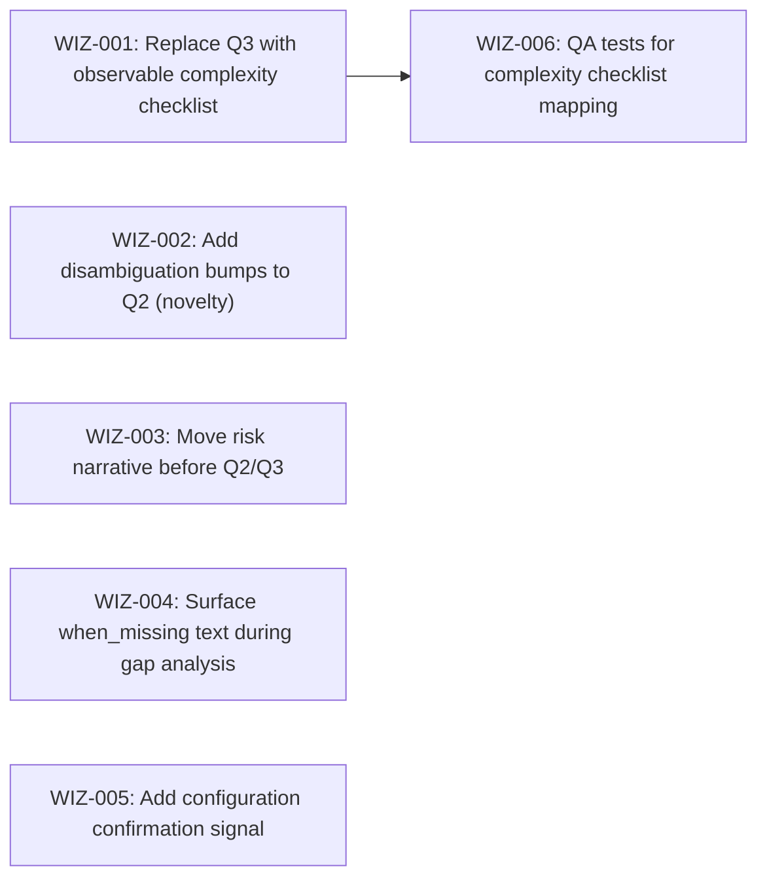

# Wizard 85%: Make the Wizard Accessible to Non-Systems-Thinkers

## Goal

Make the wizard interface work for the ~85% of users who don't naturally think in
systems. The engine is well-calibrated but gets miscalibrated inputs because questions
require systems reasoning (tracing ripple effects, assessing interconnection). Replace
abstract self-assessment with observable signals.

## Scope

**In scope:** Interface-layer changes to the wizard skill and engine YAML. Five changes
to how questions are presented, how answers are validated, and how gap analysis surfaces
information.

**Out of scope:** Engine algorithm, tier assignments, 36 configuration tables, sensitivity
profiles, 22 knowledge areas, pool membership, Foundation assignments, output format
(wizard-output.md, wizard-config.json, assessment.md), solicitation prompts.

## Success Outcomes

| ID | Outcome | Tier | Tickets |
|----|---------|------|---------|
| O-1 | Non-systems-thinkers produce correctly calibrated complexity answers | Must | WIZ-001, WIZ-002, WIZ-006 |
| O-2 | Users reason against concrete failure scenarios before answering calibration questions | Should | WIZ-003, WIZ-004 |
| O-3 | Miscalibrated configurations are caught before gap analysis proceeds | Could | WIZ-005 |

## Design Principles

From Danvers' plan (docs/plans/wizard-85-percent/plan.md):

1. **Observable over abstract.** Replace questions requiring systemic reasoning with
   questions about things people can see and count.
2. **Prime before asking.** Show the risk narrative before collecting inputs, not after.
3. **Infer, don't ask.** Derive systemic properties from concrete proxy signals rather
   than asking users to self-assess.
4. **Show the "why" at decision time.** Surface when_missing impact text during gap
   analysis, not just in the final output.
5. **Don't touch the engine.** All changes are in the interface layer.

## Decisions Made During Planning

| Decision | Options Considered | Chosen | Rationale |
|----------|-------------------|--------|-----------|
| Q3 replacement format | Free-text rewrite, sliding scale, binary checklist | Binary checklist | Each item is observable and binary — no systems reasoning needed. Count maps cleanly to Low/Moderate/High. |
| Checklist thresholds | 0-1/2-3/4+ vs 0-2/3-4/5+ | 0-1/2-3/4+ | Each signal is a known source of cross-feature coupling. 4+ signals = structurally interconnected. |
| Outcome tiering | All Must vs Must/Should/Could | Must/Should/Could | Q3 fix (O-1) is highest impact. Priming (O-2) helps but isn't required. Confirmation (O-3) is a safety net. |

## Risks and Assumptions

| Type | Description | Mitigation | Tickets Affected |
|------|-------------|-----------|-----------------|
| Risk | Checklist items may not cover all complexity dimensions | Calibration check against 3-5 real products | WIZ-001, WIZ-006 |
| Assumption | 6 checklist items are sufficient to discriminate Low/Moderate/High | Test with known products; adjust thresholds if needed | WIZ-001 |
| Assumption | Existing QA tests are sufficient to verify engine is untouched | Run full qa-wizard.sh after each change | All |

## Execution Phases

Phase 1 (can start immediately):
  - WIZ-001: Replace Q3 with observable complexity checklist
  - WIZ-002: Add disambiguation bumps to Q2 (novelty)
  - WIZ-003: Move risk narrative before Q2/Q3
  - WIZ-004: Surface when_missing text during gap analysis self-assessment
  - WIZ-005: Add configuration confirmation signal after Step 4

Phase 2 (after Phase 1):
  - WIZ-006: QA tests for complexity checklist mapping

Critical path: WIZ-001 → WIZ-006 (2 tickets)

## Re-planning Triggers

- After WIZ-001 ships: verify checklist thresholds against real products. If calibration
  is off, adjust thresholds before WIZ-006 tests lock them in.

## Ticket Index

| ID | Title | Enabler | Tier | Outcome | Blocked By | Blocks |
|----|-------|---------|------|---------|------------|--------|
| WIZ-001 | Replace Q3 with observable complexity checklist | — | Must | O-1 | — | WIZ-006 |
| WIZ-002 | Add disambiguation bumps to Q2 (novelty) | — | Must | O-1 | — | — |
| WIZ-003 | Move risk narrative before Q2/Q3 | — | Should | O-2 | — | — |
| WIZ-004 | Surface when_missing text during gap analysis | — | Should | O-2 | — | — |
| WIZ-005 | Add configuration confirmation signal after Step 4 | — | Could | O-3 | — | — |
| WIZ-006 | QA tests for complexity checklist mapping | — | Must | O-1 | WIZ-001 | — |

## Library Updates

Minimal — this is an interface-layer refactor. See library-updates.md.

## Release Completion

**Completed:** 2026-03-26
**Version:** 0.4.1

### What Shipped

| Ticket | PR | Status |
|--------|----|--------|
| WIZ-001 | #61 | Shipped |
| WIZ-002 | #62 | Shipped |
| WIZ-003 | #63 | Shipped |
| WIZ-004 | #64 | Shipped |
| WIZ-005 | #65 | Shipped |
| WIZ-006 | #66 | Shipped |

### Devin Review Notes

- PR #61: Restored product-vs-technical disambiguation (fixed in follow-up commit)
- PR #64: Changed approach to keep "present" internally, "Robust" as user-facing label only (fixed)
- PR #65: Reworded confirmation to not reference column not visible in summary (fixed)
- PR #66: Added checklist_mapping to 'all' test target (fixed)

### Deferred

None — all 6 tickets shipped.
