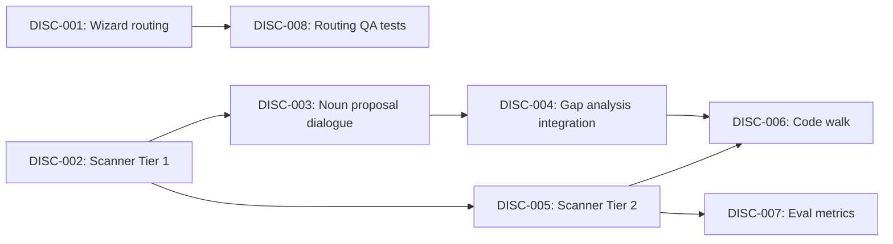

# Progressive Codebase Discovery

## Goal

Extend the wizard to discover what actually exists in a codebase today — product-level
entities, domain structure, and feature boundaries — so the context library reflects
present-tense reality, not just future-tense strategy docs. Closes the gap for code-first
users who have a codebase but no documentation.

## Scope

**In scope:** Routing (input-path determination), tiered codebase scanner (file tree +
schema/routes), interactive noun proposal dialogue, gap analysis integration, doc-vs-code
validation, and mechanical scanner eval.

**Out of scope:**
- M5 Reconciliation — deferred until eval framework exists
- M6 Git Archaeology — descoped (past context is better captured contemporaneously)
- Analytics ingestion (usage patterns, conversion funnels, performance) — separate feature
- Stack-specific parsers — starting with framework-agnostic heuristics, will add if needed

## Success Outcomes

| ID | Outcome | Tier | Tickets |
|----|---------|------|---------|
| O-1 | Code-first users have an entry point into the wizard without needing documentation | Must | DISC-001, DISC-008 |
| O-2 | The scanner extracts product-level nouns from a codebase using progressive investigation | Must | DISC-002, DISC-005 |
| O-3 | A solo builder confirms, shapes, and configures discovered entities interactively in under 10 minutes | Must | DISC-003, DISC-004 |
| O-4 | Existing documentation is validated against code reality, with divergences classified | Should | DISC-006 |
| O-5 | Scanner efficiency is measured: token cost per tier, escalation rate, self-consistency | Could | DISC-007 |

## Context Summary (from Bridget's context briefing)

**Primary cards:** System - Wizard Configuration Engine (the system being extended),
System - Gap Analysis Engine (downstream consumer of discovery output), Decision 32:
Bottom-Up Discovery (the governing design principle), Decision 14: Twenty-Two Knowledge
Areas (areas 2.2 Noun Vocabulary and 2.3 Product Entities are the bridge)

**Key relationships:** Scanner output feeds INTO the existing pool/tier system — it does
not bypass the non-compensatory gate. Confirmed entities become "present" in gap analysis.
The wizard routing questions insert before Step 1.

**Gap manifest:** 9 gaps identified. Key: code signal taxonomy, noun proposal artifact
definition, divergence classification scheme, progressive investigation tiers, integration
point between scanner and gap analysis.

**Anti-patterns:** QA by Dumping (don't dump 30 entities), Emergent Agent Behavior
(scanner proposes, doesn't act), Compensatory Pool Expansion (code evidence doesn't
bypass mode ceiling), Human-First Format (structured data first, render for humans second),
Grade Softening (unconfirmed proposals stay unconfirmed).

See `CONTEXT_BRIEFING.md` for the full briefing.

## Decisions Made During Planning

| Decision | Options Considered | Chosen | Rationale |
|----------|-------------------|--------|-----------|
| D1: Tech stack breadth | (A) 2-3 specific stacks, (B) Framework-agnostic heuristics, (C) Single stack first | (B) Framework-agnostic | File tree patterns (models/, routes/, components/) are similar across stacks. Eval will tell us if we need stack-specific parsing. Refactoring to add parsers later is cheap. |
| D2: Routing placement | (A) Before Step 1, (B) After Step 1, (C) Separate skill | (A) Before Step 1 | Routing is about what inputs exist, not configuration. Mode doesn't change whether you have code. Per Danvers' plan. |
| D3: Scanner output interaction | (A) Conversational one-at-a-time, (B) Structured list, (C) Grouped conversational | (C) Grouped conversational | Respects QA-by-Dumping anti-pattern (no flat dump) while being efficient (no one-at-a-time). Summary first, then domain groups, then individual drill-down. |

## Risks and Assumptions

| Type | Description | Mitigation | Tickets Affected |
|------|-------------|-----------|-----------------|
| Risk | Scanner accuracy varies wildly by tech stack | Framework-agnostic heuristics + measure self-consistency across stacks | DISC-002, DISC-005, DISC-007 |
| Risk | "Under 10 minutes" target unrealistic for large codebases | Progressive investigation controls cost; measure in eval | DISC-003, DISC-007 |
| Risk | QA by Dumping — scanner produces too many proposals | Summary layer + domain grouping in DISC-003 | DISC-003 |
| Assumption | File tree structure + schema files sufficient for Tier 1 | Validate against 3+ real codebases | DISC-002 |
| Assumption | Users can confirm/correct entity proposals without training | "The user IS the product expert" — they know their product | DISC-003 |

## Execution Phases

Phase 1 (can start immediately):
  - DISC-001: Wizard routing: two yes/no questions before Step 1
  - DISC-002: Scanner skill: Tier 1 file tree investigation

Phase 2 (after Phase 1):
  - DISC-003: Noun proposal dialogue: grouped conversational flow
  - DISC-005: Scanner skill: Tier 2 schema + route scanning
  - DISC-008: QA tests for routing logic

Phase 3 (after Phase 2):
  - DISC-004: Integration: confirmed entities feed gap analysis
  - DISC-007: Eval: mechanical scanner metrics

Phase 4 (after Phase 3):
  - DISC-006: Code walk: doc-vs-code divergence validation

Critical path: DISC-002 → DISC-003 → DISC-004 → DISC-006 (4 tickets)

## Re-planning Triggers

- After DISC-002 + DISC-003 ship (roller-skate complete): evaluate whether framework-agnostic
  heuristics (D1) are accurate enough. If not, adjust DISC-005 to add stack-specific parsing.
- After DISC-007 eval results: if self-consistency between Tier 1 and Tier 1+2 is >90%,
  Tier 2 may be unnecessary for most codebases. If <70%, Tier 2 escalation should be automatic.

## Ticket Index

| ID | Title | Enabler | Tier | Outcome | Blocked By | Blocks |
|----|-------|---------|------|---------|------------|--------|
| DISC-001 | Wizard routing | — | Must | O-1 | — | DISC-008 |
| DISC-002 | Scanner Tier 1 (file tree) | — | Must | O-2 | — | DISC-003, DISC-005 |
| DISC-003 | Noun proposal dialogue | — | Must | O-3 | DISC-002 | DISC-004 |
| DISC-004 | Gap analysis integration | — | Must | O-3 | DISC-003 | DISC-006 |
| DISC-005 | Scanner Tier 2 (schema/routes) | — | Must | O-2 | DISC-002 | DISC-006, DISC-007 |
| DISC-006 | Code walk (doc validation) | — | Should | O-4 | DISC-004, DISC-005 | — |
| DISC-007 | Eval: scanner metrics | — | Could | O-5 | DISC-005 | — |
| DISC-008 | QA tests for routing | — | Must | O-1 | DISC-001 | — |

## Library Updates

See library-updates.md.

## Release Completion

**Completed:** 2026-03-26
**Version:** 0.5.0

### What Shipped

| Ticket | PR | Status |
|--------|----|--------|
| DISC-001 | #71 | Shipped |
| DISC-002 | #72 | Shipped |
| DISC-003 | #73 | Shipped |
| DISC-004 | #76 | Shipped |
| DISC-005 | #74 | Shipped |
| DISC-006 | #77 | Shipped |
| DISC-007 | #78 | Shipped |
| DISC-008 | #75 | Shipped |

### What Didn't Ship

None — all 8 tickets shipped.

### Deferred

| Item | Why | Follow-up |
|------|-----|-----------|
| M5: Reconciliation (formal divergence scoring) | Gated on eval framework that doesn't exist yet | Future release after eval infrastructure matures |
| M6: Git Archaeology | Descoped — past context is better captured contemporaneously through retros and ADRs | Not planned |
| Stack-specific parsers | Framework-agnostic heuristics first; add parsers if eval shows accuracy gaps | Re-planning trigger after DISC-007 |
| code_confidence term in gap formula | Engine changes deferred to M5 | Future release |
| Noun Proposal as formal artifact type | Build M3 first, observe what proposals look like, then decide | Bottom-Up Discovery (Decision 32) |
