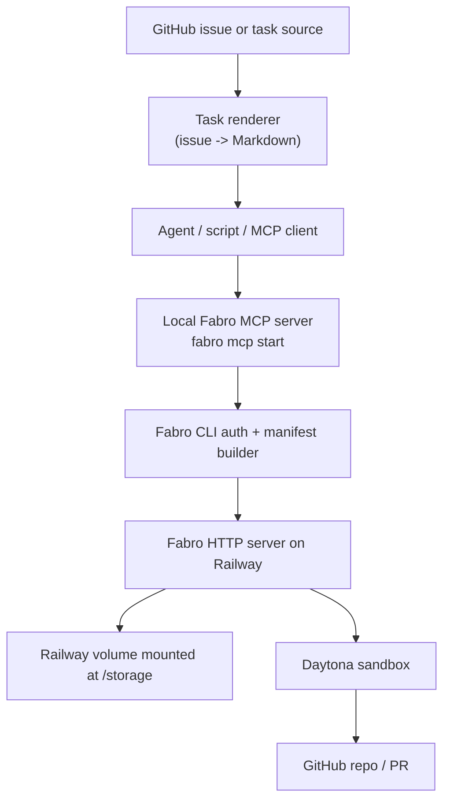

# Fabro Server Setup Plan

## Goal

Set up Fabro as a remote workflow runner with:

- Fabro server hosted on Railway.
- Persistent Fabro server state on a Railway volume.
- Daytona as the default sandbox provider for workflow execution.
- GitHub issue/task handoff into Fabro runs.
- MCP-based delegation so an agent can create, inspect, and manage Fabro runs on the Railway server.

The initial target is a small, working operational loop:

1. A task is represented as Markdown, usually rendered from a GitHub issue.
2. An agent or script submits that Markdown to Fabro as the run goal.
3. Fabro executes the workflow on the Railway server.
4. Fabro creates an isolated Daytona sandbox for the actual agent tools.
5. The run can be observed and controlled through the Fabro web UI, CLI, or MCP tools.

## Current Status

Last updated: 2026-05-18.

The Railway-hosted Fabro server is deployed and healthy:

- Railway project: `fabro-server`
- Public URL: `https://fabro-st.up.railway.app/`
- Fabro server URL: `https://fabro-st.up.railway.app/api/v1`
- Railway volume: mounted at `/storage`
- Railway image: pinned to the last known-good `0.237.0-nightly.0` digest
- Sandbox provider: Daytona
- LLM provider: OpenAI
- GitHub App: `fabro-of-alexandria`
- Web search: Brave Search configured and reachable
- Server version: `0.237.0-nightly.0`
- Local CLI version: `0.237.0-nightly.1` via Homebrew
  `fabro-sh/tap/fabro-nightly`

Current local CLI state:

- `~/.fabro/settings.toml` targets `https://fabro-st.up.railway.app`.
- `fabro workflow list` resolves the checked-in `ax-next-feature` workflow.
- The local client is authenticated to the Railway server as `jessmartin`.
- `fabro doctor` passes all server-side checks and reports one warning:
  version parity. The CLI is `0.237.0-nightly.1`; Railway is still
  `0.237.0-nightly.0`.
- A redeploy to the moving `ghcr.io/fabro-sh/fabro:nightly` image on
  2026-05-18 pulled `0.237.0-nightly.1`, but that build failed to boot against
  the existing `/storage/vaults/default/secrets.json` with
  `unknown variant environment, expected one of token, oauth, file`.
  The service was restored by pinning Railway to the previous working image
  digest:
  `ghcr.io/fabro-sh/fabro@sha256:364eb20687ad2106323d5f85947a2a9aee51ca36590788b29fc911ca2bbdcbe9`.
- Do not unpin Railway back to `:nightly` until Fabro has a vault migration or
  backwards-compatible reader for the `environment` secret variant.
- Temporarily use a matching local `0.237.0-nightly.0` CLI if version parity
  needs to be clean before the server can safely move forward.
- `fabro preflight .fabro/workflows/ax-next-feature/workflow.toml --sandbox
  daytona` passes with repository access, LLM, and GitHub token minting.

Authenticated `fabro doctor` currently passes the operational server checks:

```text
[✓] LLM Providers (1 configured)
[✓] GitHub App (fabro-of-alexandria)
[✓] Sandbox (Daytona configured (fabro-server))
[✓] Web Search (Brave) (configured and reachable)
[✓] Crypto (all configured auth material valid)
[✓] Storage directory (/storage)
```

Current normal Daytona clone-mode status:

- The original Fabro Daytona clone bug is fixed upstream: Daytona now uses
  `/home/daytona/repos` instead of the unwritable `/repos`.
- Railway was redeployed to the current `ghcr.io/fabro-sh/fabro:nightly` image
  and reinstalled against the persistent `/storage` volume.
- GitHub App repository access and GitHub token minting now pass preflight.
- Daytona sandbox creation was blocked by Daytona account storage quota:

  ```text
  Total disk limit exceeded. Maximum allowed: 30GiB.
  Consider archiving your unused Sandboxes to free up available storage.
  ```

- After archiving three old Daytona sandboxes, normal Daytona preflight passes
  against `https://fabro-st.up.railway.app`.
- A normal clone-mode `ax-next-feature` run completed successfully and opened
  PR `#121`: `https://github.com/GetAlexandria/alexandria-internal/pull/121`.
- Current Fabro code creates Daytona sandboxes as non-ephemeral with
  `auto_delete_interval = -1` and relies on Fabro cleanup to delete them.
  Successful cleanup should remove run-owned sandboxes, but interrupted runs,
  crashed workers, and cleanup failures can leave stopped sandboxes consuming
  storage.
- The default Daytona environment did not have the Alexandria toolchain ready:
  the first `validate_cli` pass failed because `pnpm` was missing. The
  `ax-next-feature` workflow now has a `run.prepare` step that calls
  `./scripts/fabro-setup-env`. That script pins pnpm from `package.json` and
  runs `CI=1 HUSKY=0 pnpm install --frozen-lockfile` before workflow stages
  begin.
- Fabro emitted repeated `git_push_failed` warnings for the run branch during
  checkpoints, but final PR creation still succeeded. Investigation showed the
  sandbox `git push` ran the repository's Husky `pre-push` hook after
  `pnpm install`, and the hook failed because `shellcheck` was missing from the
  Daytona image. The root Husky `pre-push` hook and Husky install wiring have
  been removed.
- The remote PR branch was left at the last successfully pushed checkpoint
  (`b3fd97d...`), while Fabro recorded final commit `7a96d74...`. The final
  stored patch matched the PR diff in this run, but later file-changing stages
  could otherwise be omitted from the PR.

Completed setup and smoke-test milestones:

- Run ID: `01KRREHHM3DRA5VNEGSRKKQPMV`
- Run URL: `https://fabro-shfabronightly-production-a5ac.up.railway.app/runs/01KRREHHM3DRA5VNEGSRKKQPMV`
- Result: command and prompt stages completed successfully in a Daytona sandbox.
- Created GitHub issue `#120`, "Add ax2 cat-poem to Alexandria 2 CLI", in
  `getalexandria/alexandria-internal`.
- Created and installed the org-owned GitHub App `getalexandria-fabro2`.
- Verified `fabro preflight` can mint GitHub App credentials for
  `getalexandria/alexandria-internal`.
- Confirmed the Fabro approval gate works in server mode.
- Confirmed a no-clone Daytona workaround run can execute the full workflow:
  scope, approval, implementation, validation, review, handoff, and exit.
- Confirmed a normal clone-mode Daytona run can execute the approval workflow,
  validate the repo, and open a pull request:
  `https://github.com/GetAlexandria/alexandria-internal/pull/121`.

The latest meaningful test run:

- Run ID: `01KRYDWP02GQ00DFQ442EXQTM6`
- Run URL: `https://fabro-st.up.railway.app/runs/01KRYDWP02GQ00DFQ442EXQTM6`
- Result: succeeded.
- Pull request: `https://github.com/GetAlexandria/alexandria-internal/pull/121`
- Cost/duration: 15m 10s, $3.05.
- Important findings: default Daytona image needed a repo bootstrap step, and
  checkpoint run-branch pushes warned with `git_push_failed` because the repo
  hook ran inside Daytona.

Remaining work is now focused on real task delegation:

- Re-test the normal Daytona workflow after the `run.prepare` bootstrap and
  Husky hook removal.
- Configure MCP handoff from an agent to the Railway server.
- Choose the first GitHub issue trigger or bridge.
- Resolve CLI/server version parity after the `0.237.0-nightly.1` vault
  compatibility issue is fixed, or pin the local client to `0.237.0-nightly.0`
  for parity-sensitive checks.
- Implement a scheduled Daytona janitor before allowing unattended
  server-mode runs.
- Decide whether a custom Daytona snapshot or devcontainer should replace the
  current `run.prepare` bootstrap after the workflow proves stable.

## Current Findings

### Daytona Dependency Bootstrap

Run `01KRYDWP02GQ00DFQ442EXQTM6` proved that Daytona can execute the workflow,
but also showed that dependency setup must happen before the first deterministic
command stage.

Observed sequence from the run dump:

- The submitted manifest had `run.prepare.commands = []`.
- The first `validate_cli` command stage failed with `command not found: pnpm`.
- The next implementation pass found Node, npm, Corepack, and Bun already
  present in the Daytona image:
  - Node `v25.9.0`
  - npm `11.12.1`
  - Corepack `0.24.0`
  - Bun `1.3.6`
- `corepack enable && corepack prepare pnpm@10.20.0 --activate` failed because
  Corepack tried to create `/usr/bin/pnpm` and the Daytona user lacked
  permission.
- `npm install -g pnpm@10.20.0` succeeded.
- Running the validation command immediately after installing pnpm still failed
  because workspace binaries such as `eslint` were not installed.
- `pnpm install --frozen-lockfile` hydrated workspace dependencies, after which
  the same validation command passed.

The near-term policy is:

- Treat `run.prepare` as the owner of JavaScript workspace hydration.
- Do not rely on agent stages to install package managers or dependencies
  opportunistically.
- Pin pnpm from the repository `packageManager` value, currently
  `pnpm@10.20.0`, using the repo-owned `./scripts/fabro-setup-env` setup
  script rather than embedding shell bootstrap logic in workflow TOML.
- Run `CI=1 HUSKY=0 pnpm install --frozen-lockfile` before any agent or command
  stage that may call `pnpm`.
- Keep command stages narrow and explicit, for example package-local lint,
  typecheck, and test commands.

System-level tools are a separate layer. If future Fabro workflows need
repo-wide `pnpm run check`, the Daytona image or snapshot should include
`shellcheck` and `shfmt`; those should not be installed ad hoc by every run.
For the current `ax-next-feature` workflow, the root Husky hook has been
removed, so checkpoint pushes no longer depend on `shellcheck`.

### Server Mode

Fabro server mode exposes an HTTP API and web UI. Runs are submitted as self-contained manifests through `POST /api/v1/runs`, then started through `POST /api/v1/runs/{id}/start`. The CLI and MCP server both hide most of that detail by constructing the manifest and calling the API.

Railway is a supported deployment path in Fabro's docs. The expected deployment uses the prebuilt GHCR image and a persistent volume mounted at `/storage`.

### Task Context And Goals

Fabro has several ways to specify the task:

- CLI inline goal: `fabro run workflow.toml --goal "do something"`.
- CLI file goal: `fabro run workflow.toml --goal-file task.md`.
- Run config inline goal:

  ```toml
  [run]
  goal = "Implement the login feature"
  ```

- Run config file goal:

  ```toml
  [run.goal]
  file = "prompts/issue-123.md"
  ```

For MCP-created runs, the current `fabro_run_create` tool accepts a `goal` string, but not a `goal_file` field. That means MCP handoff should initially pass the rendered task Markdown directly as the `goal`.

This is good enough for GitHub issue-sized payloads. It becomes less pleasant if the handoff grows into very large bundles with issue body, long comment history, logs, design docs, and code excerpts. A small future patch can add `goal_file` support to the MCP create tool if needed.

### MCP

Latest Fabro includes a stdio-based Fabro MCP server.

The important architecture is:

```text
Agent or MCP client
  -> local `fabro mcp start` process over stdio
  -> authenticated Fabro CLI/client
  -> Railway Fabro HTTP API
  -> Daytona sandbox per run
```

The MCP server normally runs beside the agent, not on Railway. Railway runs the Fabro HTTP server. The local MCP server reuses normal Fabro CLI server targeting and auth, including `--server`, `[cli.target]`, OAuth refresh, dev-token auth, and local CLI storage.

Fabro MCP tools currently include:

- `fabro_run_create` - create one or more runs, starting by default.
- `fabro_run_search` - search runs.
- `fabro_run_interact` - get, start, message, cancel, archive, unarchive, inspect questions, and answer questions.
- `fabro_run_gather` - wait for runs to reach terminal states.
- `fabro_run_events` - list, inspect, or search run events.

### Automations

Fabro-native server-side automations are planned, but not the first available path. The current practical automation paths are:

- MCP delegation from an existing agent.
- A small GitHub webhook or GitHub Action bridge that renders an issue into Markdown and calls the Fabro CLI/API.
- Later: migrate to Fabro-native `[automations.<id>]` when that server scheduler lands.

### Local Docker + Codex ACP Backend

Localhost Fabro usage should use Docker + Codex ACP only. API-backed Fabro runs
belong on Railway, and the local server defaults to the pre-authenticated ACP
Docker image.

The local-only setup uses a Docker sandbox image that is already authenticated
to a specific Codex account and runs Codex through Fabro's ACP backend. This is
intentionally scoped to a single developer machine. The image should not be
pushed to a registry, shared, or used by the Railway server because it contains
reusable Codex auth material.

Vendored Fabro already has the pieces for this local path:

- `backend="acp"` is a first-class LLM backend.
- ACP stages require an explicit `acp_command`; Fabro does not install ACP
  agents for the workflow.
- ACP uses a stdio command launched inside the active sandbox.
- Docker supports the bidirectional stdio process that ACP needs.
- Daytona does not support ACP yet because its `spawn_stdio_process`
  implementation currently returns `ACP backend requires bidirectional stdio;
  the Daytona sandbox provider does not support it yet`.

The target local architecture is:

```text
local Fabro server
  -> Docker sandbox provider
  -> alexandria/fabro-codex-acp:local-auth image
  -> codex-acp stdio process inside the container
  -> pre-authenticated Codex CLI state under /root/.codex
```

The local image should freeze the toolchain and auth state together:

- Base: Debian/Node image compatible with Docker Desktop on Apple Silicon.
- Tools: Git, SSH client, ripgrep, jq, Python, pnpm `10.20.0`, Bun.
- Agent binaries: pinned `@openai/codex` and pinned Codex ACP adapter.
- Auth state: copied from the local developer's `~/.codex` into
  `/root/.codex` in the final local image.

Preferred build shape:

1. Build an unauthenticated base image from a checked-in Dockerfile, for
   example `alexandria/fabro-codex-acp:local-base`.
2. Create a stopped temporary container from that base image.
3. Copy the host's `~/.codex/auth.json` and any required Codex config into
   `/root/.codex/` in the container.
4. Run `codex login status` or an equivalent non-mutating smoke command inside
   the container.
5. `docker commit` the temporary container as
   `alexandria/fabro-codex-acp:local-auth`.
6. Delete the temporary container.

This avoids checking secrets into the repository or adding them to a Docker
build context. It does still put auth material into the final local Docker
image, which is the desired behavior for this local-only setup.

Checked-in implementation pieces:

- `.fabro/docker/codex-acp.Dockerfile` builds the unauthenticated
  `alexandria/fabro-codex-acp:local-base` image with pinned Codex and
  `codex-acp` binaries.
- `scripts/fabro-build-codex-acp-base` builds the base image.
- `scripts/fabro-build-codex-acp-auth` copies host `~/.codex/auth.json` and
  `~/.codex/config.toml` into a temporary container, verifies
  `codex login status`, and commits
  `alexandria/fabro-codex-acp:local-auth`.
- `.fabro/workflows/ax-next-feature/codex-acp-docker.toml` selects Docker,
  `backend="acp"`, and `acp_command="codex-acp"`.
- `.fabro/workflows/ax-next-feature/workflow-acp.fabro` is the ACP-specific
  graph. It mirrors the normal `ax-next-feature` flow, but omits API-only node
  attributes and uses `acp.command="{{ inputs.acp_command }}"` on ACP agent
  nodes.
- `scripts/fabro-local-codex-acp-run` runs the workflow against the local Fabro
  server and prepares GitHub credentials for the configured server GitHub
  strategy.
- `scripts/fabro-create-pr-from-workflow` lets the ACP graph create a draft
  pull request as an explicit workflow command node. The handoff agent writes
  `/tmp/fabro-pr-title.txt` and `/tmp/fabro-pr-body.md`; the command node pushes
  the current run branch and calls the GitHub API.

The Fabro run config should use Docker and the pre-authenticated image:

```toml
[run.inputs]
agent_backend = "acp"
acp_command = "codex-acp"

[run.sandbox]
provider = "docker"

[run.sandbox.docker]
image = "alexandria/fabro-codex-acp:local-auth"
memory_limit = "6GB"
cpu_quota = 400000

[run.pull_request]
enabled = false
```

The normal `ax-next-feature` graph still templates
`backend="{{ inputs.agent_backend }}"` for API-backed Railway runs. Localhost
uses the separate `workflow-acp.fabro` graph because current Fabro validation
rejects `backend="acp"` on prompt nodes and rejects API-only attributes such as
`provider` and `reasoning_effort` on ACP nodes.

The local ACP graph also creates pull requests inside the graph rather than
through Fabro's post-run `[run.pull_request]` mechanism. This keeps PR authoring
on the ACP/Codex path and leaves the post-run PR generator disabled for the
local ACP config.

Operational guardrails:

- Treat `alexandria/fabro-codex-acp:local-auth` as secret-bearing local state.
- Never push this image to Docker Hub, GHCR, or any shared registry.
- Rebuild the image when rotating or changing the Codex account.
- Keep the unauthenticated base image reproducible and safe to share.
- Prefer a dedicated Codex account for this image if it begins running
  unattended or higher-volume local workflows.

### GitHub App Ownership And Multi-Org Use

Current setup uncovered an important GitHub App limitation for server mode:

- The Fabro install wizard created a personal-owned GitHub App named `fabro-server`.
- The app was private, so GitHub would not allow it to be installed into the
  `GetAlexandria` organization.
- Fabro preflight correctly failed repository access and token minting for
  `getalexandria/alexandria-internal` because the app was not installed for
  that repo owner.
- Current Fabro source hardcodes the generated GitHub App manifest with
  `"public": false`, so new apps created by the installer start private.
- Current Fabro server settings appear to support one active GitHub App config:

  ```toml
  [server.integrations.github]
  strategy = "app"
  app_id = "..."
  client_id = "..."
  slug = "..."
  ```

That means the practical near-term path is to register the GitHub App under the
same owner as the repositories this server should operate on. For the first real
server run, use a `GetAlexandria` org-owned app installed on
`getalexandria/alexandria-internal`.

Feedback to Fabro:

- The installer should explain that private personal apps cannot be installed on
  unrelated organizations, and that app owner choice affects repository access.
- The installer should either allow creating a public app, or explicitly
  recommend org-owned apps when the target repositories live in an org.
- For one server that operates across several orgs, Fabro likely needs either
  public-app support or multiple GitHub App configs with repo-owner-based routing.
- Preflight's remediation URL currently points at an org settings path that can
  404 or dead-end for a private personal app. It should point to the app install
  URL when possible and include a visibility/ownership hint.

Status:

- The server has been migrated from the initial personal `fabro-server` app to
  org-owned `GetAlexandria` GitHub Apps.
- The current active app is `fabro-of-alexandria`.
- `fabro-of-alexandria` is installed on `GetAlexandria/alexandria-internal`.
- Preflight for `getalexandria/alexandria-internal` now passes.
- Local `server.env` should store `GITHUB_APP_PRIVATE_KEY` as base64 or a
  single-line JSON string with escaped `\n` newlines. Raw multi-line PEM values
  do not match Fabro's one-record-per-line env-file format.

Cleanup:

- Delete the abandoned first org app attempt `getalexandria-fabro` from GitHub
  org settings. Its install flow failed before Fabro persisted usable secrets.

### Daytona Built-In Clone Blocker

Resolved upstream in Fabro nightly after 2026-05-16.

Observed failure:

```text
sandbox.git.started branch=main url=https://github.com/getalexandria/alexandria-internal
sandbox.git.failed error="Failed to create Daytona repos root" causes=["HTTP 400"]
run.failed message="Failed to initialize sandbox"
```

Relevant failing run:

- Run ID: `01KRRVB4A47JC9BPSVGC30YEFB`
- Run URL: `https://fabro-shfabronightly-production-a5ac.up.railway.app/runs/01KRRVB4A47JC9BPSVGC30YEFB`

Code inspection pointed to a provider-specific path issue:

- `repos/fabro/lib/crates/fabro-sandbox/src/daytona/mod.rs` sets
  `REPOS_ROOT = "/repos"` in the older version.
- The Daytona clone path calls `fs_svc.create_folder(REPOS_ROOT, None)`.
- SSHing into a live Daytona sandbox showed the `daytona` user cannot create
  `/repos`, but can create `/home/daytona/repos` and `/tmp/...`.

Updated assessment:

- Latest vendored Fabro sets `REPOS_ROOT = "/home/daytona/repos"`.
- GitHub App credential minting works.
- Repository access works.
- Daytona sandbox creation is currently blocked by account disk quota, not the
  old `/repos` path.

Temporary workaround:

- Use a separate config with `[run.clone] enabled = false`.
- Ask the first agent stage to clone the repo into `/home/daytona/workspace`.
- This is useful for testing approval, agent execution, validation, review, and
  handoff, but should not be treated as the final PR-producing setup.

## Desired Architecture



For non-agent automation, the `client -> mcp -> cli` section can be replaced by a script that runs `fabro run ... --goal-file ... --detach` or calls the Fabro HTTP API directly.

## Phase 1: Railway Server

- [x] Deploy the Fabro GHCR image to Railway.
- [x] Use a single replica. Fabro currently assumes one server process owns the storage directory.
- [x] Attach a Railway volume at `/storage`.
- [x] Confirm Railway binds the service to `$PORT`.
- [x] Set required Railway environment variables and server-owned secrets:
  - `SESSION_SECRET`
  - At least one LLM provider key, such as `ANTHROPIC_API_KEY`, `OPENAI_API_KEY`, or `GEMINI_API_KEY`
  - `DAYTONA_API_KEY`
  - `BRAVE_SEARCH_API_KEY`
  - GitHub App secrets if using app mode:
    - `GITHUB_APP_CLIENT_SECRET`
    - `GITHUB_APP_WEBHOOK_SECRET`
    - `GITHUB_APP_PRIVATE_KEY`
- [x] Decide whether to pre-set `FABRO_DEV_TOKEN` or read the generated token from server logs on first boot.
- [x] Open the install URL from Railway logs and complete the web install wizard.
- [x] Confirm `server.web.url` and `server.api.url` use the public Railway URL.
- [x] Confirm the server restarts into normal mode after install.

## Phase 2: Server Defaults

Configure server-side defaults so ordinary runs use Daytona unless overridden.

Candidate `settings.toml` shape:

```toml
_version = 1

[server.listen]
type = "tcp"
address = "0.0.0.0:3000"

[server.web]
enabled = true
url = "https://<railway-service>.up.railway.app"

[server.api]
url = "https://<railway-service>.up.railway.app/api/v1"

[server.auth]
methods = ["dev-token", "github"]

[server.scheduler]
max_concurrent_runs = 2

[run.sandbox]
provider = "daytona"
preserve = false

[run.sandbox.daytona]
auto_stop_interval = 60
network = "allow_all"

[run.sandbox.daytona.labels]
host = "railway"
project = "alexandria"

[run.git.author]
name = "Fabro"
email = "285810526+fabro-of-alexandria[bot]@users.noreply.github.com"
```

Status:

- [x] Daytona is configured and validated by `fabro doctor`.
- [x] OpenAI is configured and validated by `fabro doctor`.
- [x] GitHub App mode is configured and validated by `fabro doctor`.
- [x] Brave Search is configured and validated by `fabro doctor`.
- [ ] Confirm or tune `server.scheduler.max_concurrent_runs`.
- [x] Confirm desired Daytona defaults such as labels, auto-stop interval, and network policy for `ax-next-feature`.
- [x] Confirm run git author defaults for future `ax-next-feature` PR-producing workflows.

If using GitHub App mode for private repos, checkpoint pushing, and PR creation:

```toml
[server.integrations.github]
strategy = "app"
app_id = "<github-app-id>"
client_id = "<github-oauth-client-id>"
slug = "<github-app-slug>"

[server.integrations.github.webhooks]
strategy = "server_url"

[run.integrations.github.permissions]
contents = "write"
pull_requests = "write"
issues = "read"
```

## Phase 3: Local CLI Access

- [x] Install or build a Fabro CLI version matching the server image.
- [x] Point the CLI at Railway:

  ```toml
  [cli.target]
  type = "http"
  url = "https://<railway-service>.up.railway.app"
  ```

- [x] Authenticate this local client with the server:

  ```bash
  fabro auth login --server https://<railway-service>.up.railway.app
  ```

- [x] Verify local workflow discovery:

  ```bash
  fabro workflow list
  ```

- [x] Verify authenticated server diagnostics after login:

  ```bash
  fabro doctor
  ```

  Current result: server-side checks pass; version parity warns until Railway
  is redeployed from `ghcr.io/fabro-sh/fabro:nightly` or the local CLI is
  pinned to the server version.

## Phase 4: First Daytona Run

- [x] Create or select a simple workflow for a smoke run.
- [x] Render a test task Markdown file:

  ```md
  # Test Fabro Run

  Repository: owner/repo
  Source: manual smoke test

  ## Goal

  Make a tiny, safe change and report what changed.
  ```

- [x] Submit the smoke workflow through the CLI:

  ```bash
  fabro run /private/tmp/fabro-smoke/workflow.toml \
    --server https://fabro-shfabronightly-production-a5ac.up.railway.app/api/v1 \
    --detach \
    --json
  ```

- [x] Confirm the run appears in the web UI.
- [x] Confirm a Daytona sandbox is created.
- [x] Confirm logs and events are visible:

  ```bash
  fabro run events <run-id> --server https://<railway-service>.up.railway.app/api/v1
  ```

- [x] Confirm a real issue-fix workflow can read/clone the target repository.
- [x] Confirm a real issue-fix workflow can push a branch or open a PR.
- [x] Confirm the approval workflow works with a real GitHub issue task.
- [x] Confirm a no-clone Daytona workaround can run implementation,
  validation, review, and handoff to completion.
- [x] Re-test normal Daytona clone mode after the upstream `/repos` fix lands.
- [x] Re-test automatic branch and PR creation after normal Daytona clone mode
  works.

## Phase 5: MCP Handoff

Configure the agent's MCP client to launch Fabro locally and target the Railway server.

Commands:

```bash
fabro mcp config --server https://<railway-service>.up.railway.app
fabro mcp init claude --server https://<railway-service>.up.railway.app
```

Equivalent conceptual MCP create payload:

```json
{
  "runs": [
    {
      "workflow": ".fabro/workflows/issue-fix/workflow.toml",
      "cwd": "/path/to/local/repo",
      "goal": "# GitHub Issue #123: Fix billing sync\n\nURL: https://github.com/org/repo/issues/123\nRepository: org/repo\n\n## Issue Body\n\n...\n\n## Acceptance Criteria\n\n...",
      "inputs": {
        "repo": "org/repo",
        "issue_number": 123,
        "issue_url": "https://github.com/org/repo/issues/123"
      },
      "labels": {
        "source": "github-issue",
        "repo": "org/repo",
        "issue": "123"
      },
      "sandbox": "daytona",
      "start": true
    }
  ]
}
```

Validation checklist:

- [x] `fabro mcp config --server ...` emits valid client configuration.
- [x] `fabro mcp start --server ...` initializes over stdio.
- [x] MCP client can list Fabro tools:
  - `fabro_run_create`
  - `fabro_run_events`
  - `fabro_run_gather`
  - `fabro_run_interact`
  - `fabro_run_search`
- [x] `fabro_run_search` can query Railway runs through MCP.
- [x] `fabro_run_create` creates a run on Railway.
  - Validation run: `01KRYH17X83SBYF1PZW49P15S9`
  - Created as `dry_run = true`, `start = false`; then cancelled and archived.
- [ ] The run starts by default.
- [ ] `fabro_run_gather` can wait for completion or timeout.
- [ ] `fabro_run_events` can inspect progress.
- [x] `fabro_run_interact` can cancel and archive a run.
- [ ] `fabro_run_interact` can answer pending questions.

## Phase 6: GitHub Issue Bridge

Start with the simplest reliable bridge. Two viable options:

### Option A: Agent-Driven MCP Handoff

An agent with GitHub access:

1. Reads a GitHub issue.
2. Renders a task Markdown packet.
3. Calls `fabro_run_create` through MCP.
4. Uses `fabro_run_gather` and `fabro_run_events` to monitor progress.

This is the most flexible path and best for human-guided or agent-decided delegation.

### Option B: GitHub Action Or Webhook Bridge

A GitHub Action or tiny service:

1. Triggers on issue label, slash command, or assignment.
2. Renders issue body, selected comments, labels, repo, branch, and acceptance criteria into Markdown.
3. Calls `fabro run ... --goal-file ... --detach` against the Railway server, or calls the HTTP API directly with a manifest.
4. Comments back on the issue with the Fabro run URL.

This is better for deterministic automation.

Suggested first trigger:

- Label: `fabro`
- Optional command comment: `/fabro run .fabro/workflows/issue-fix/workflow.toml`

## Phase 7: Follow-Up Fabro Patch

Add `goal_file` support to the Fabro MCP create tool if the inline Markdown payload starts to feel awkward.

Likely implementation scope in upstream Fabro:

- Add `goal_file: Option<PathBuf>` to `CreateRunSpec` in `fabro-mcp-server`.
- Validate that `goal` and `goal_file` are mutually exclusive.
- Convert `goal_file` into the same file-backed `RunGoalLayer` used by the CLI.
- Add schema tests and MCP integration tests.
- Document the field in `docs/public/agents/mcp.mdx`.

This is not required for the initial setup. It is a quality-of-life patch for larger task packets and file-based audit trails.

## Operational Notes

- Keep secrets out of the goal Markdown. Goals are persisted in manifests/events for reproducibility.
- Keep Railway at one replica.
- Do not run without a `/storage` volume; redeploys would wipe tokens, sessions, run history, and signing keys.
- Prefer GitHub App mode for private repositories, checkpoint pushing, sandbox `GITHUB_TOKEN` injection, and PR creation.
- Use Daytona labels to make sandboxes traceable back to Fabro, Alexandria, and the source issue.
- Set conservative `max_concurrent_runs` until cost and reliability are understood.
- Interim Daytona retention policy:
  - Keep `preserve = false` for ordinary runs.
  - Keep `auto_stop_interval = 60` for `ax-next-feature`.
  - Review the Daytona dashboard before and after live server tests.
  - Archive/delete stopped Fabro-labeled sandboxes older than 24 hours unless
    they are actively being inspected.
  - Keep intentionally preserved debug sandboxes for at most 72 hours.
  - Do not enable unattended issue-triggered runs until a scheduled cleanup
    path or verified Fabro cleanup behavior exists.
- The `ax-next-feature` workflow uses a `run.prepare` step that calls
  `./scripts/fabro-setup-env` to pin pnpm and hydrate workspace dependencies
  with the lockfile before agent and validation stages run.
- The root Husky `pre-push` hook has been removed. Repo-wide checks should stay
  explicit in CI and workflow validation rather than running during Fabro's
  managed checkpoint pushes.
- For Daytona, stopped sandboxes should be reviewed in the Daytona dashboard
  until cleanup behavior is fully understood and configured. Current Fabro
  creates run-owned Daytona sandboxes with `ephemeral = false` and
  `auto_delete_interval = -1`, then deletes them during cleanup. Do not assume
  failed, interrupted, or abandoned runs will always free backing storage.

## Open Questions

- Which workflow should be the default issue-fix workflow?
- Should issue-triggered runs open draft PRs by default?
- What GitHub trigger should launch work first: label, slash command, assignment, or project status?
- Do we want the GitHub bridge to be an external service, a GitHub Action, or a Fabro-native automation later?
- Should the MCP `goal_file` patch be upstreamed before real usage, or only after inline `goal` becomes painful?
- Should Fabro fail PR creation, or at least warn more loudly, when the remote
  PR branch SHA does not match the final recorded run commit?

## References

- Fabro Railway docs: `repos/fabro/docs/public/administration/deploy-railway.mdx`
- Fabro server operations: `repos/fabro/docs/public/reference/server-operations.mdx`
- Fabro server configuration: `repos/fabro/docs/public/administration/server-configuration.mdx`
- Fabro Daytona docs: `repos/fabro/docs/public/integrations/daytona.mdx`
- Fabro run configuration: `repos/fabro/docs/public/execution/run-configuration.mdx`
- Fabro MCP docs: `repos/fabro/docs/public/agents/mcp.mdx`
- Fabro automations plan: `repos/fabro/docs/superpowers/plans/2026-05-11-automations-end-to-end.md`
